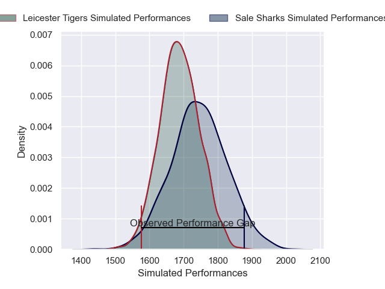
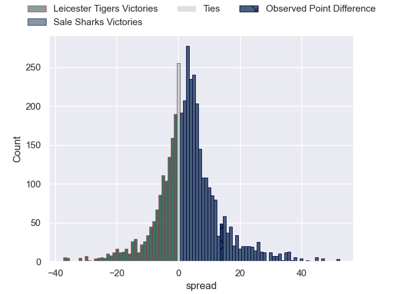
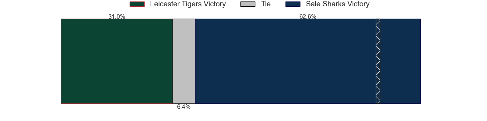
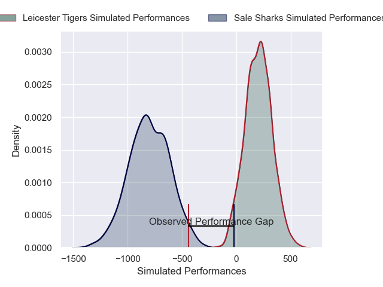
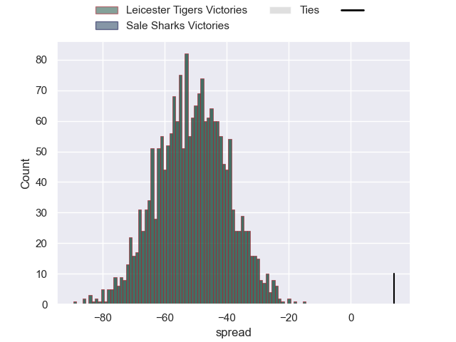

---  
layout: page  
title: Leicester Tigers at Sale Sharks; 25-39  
date: 2024-12-01 18:00:00 -0500  
categories: "Gallagher Premiership 2024" match review  
---
# Leicester Tigers at Sale Sharks; 25-39

# Club Level Predictions

The first set of predictions treats a club as the smallest object, as the club develops its members, organizes a gameplan, and deploys its players as needed for each match. This club model has a prediction of 0.581, which translates to predicting Sale Sharks to win by 2.9.

Our Over/Under is 44.5 - and combined with the spread above, we have a predicted scoreline of 21 to 24

Each club has a rating and a rating deviation (similar to a Glicko rating), and expected performances can be generated. This allows for simulated matches and spreads like the ones below.
## Projected Performances - Club Model

## Projected Spreads - Club Model

## Projected Results - Club Model

# Player Level Predictions

Treating teams instead as an entity made up of the currently active players, I have ratings for each player in an altogether different system. These can be combined to form team ratings once teamsheets are announced, weighting starters a bit higher than the reserves. After the match is played, players can be weighted by their minutes on the field, allowing for an accurate measure of the team's composition. With these compiled team ratings, we can make predictions, measure inaccuracy, and update the individual player ratings.
## Prediction without Player Minutes: Leicester Tigers by 29.2

Leicester Tigers by 42.9 on a neutral pitch

## Projected Performances - Player Model

## Projected Spreads - Player Model

## Projected Results - Player Model

|   Away Minutes | Away Player           |   Away Percentile |   Number |   Home Percentile | Home Player          |   Home Minutes |
|---------------:|:----------------------|------------------:|---------:|------------------:|:---------------------|---------------:|
|             52 | Nicky Smith           |             47.56 |        1 |             88.56 | Bevan Rodd           |             82 |
|             70 | Charlie Clare         |             17.08 |        2 |              2.36 | Luke Cowan-Dickie    |             21 |
|             70 | Charlie Clare         |             17.08 |        2 |              2.36 | Luke Cowan-Dickie    |              9 |
|             70 | Charlie Clare         |             17.08 |        2 |              2.36 | Luke Cowan-Dickie    |             76 |
|             70 | Charlie Clare         |             17.08 |        2 |              2.36 | Luke Cowan-Dickie    |             20 |
|             82 | Joe Heyes             |             81.17 |        3 |             73.66 | Asher Opoku-Fordjour |             20 |
|             30 | George Martin         |             93.73 |        4 |             83.39 | Ernst van Rhyn       |             67 |
|             69 | Tom Manz              |             38.14 |        5 |             35.34 | Hyron Andrews        |             82 |
|             59 | Hanro Liebenberg      |             66.22 |        6 |             99.92 | Tom Curry            |             82 |
|             59 | Hanro Liebenberg      |             66.22 |        6 |             99.92 | Tom Curry            |             52 |
|             59 | Hanro Liebenberg      |             66.22 |        6 |             99.92 | Tom Curry            |             64 |
|             23 | Tommy Reffell         |             31.17 |        7 |             71.96 | Ben Curry            |             82 |
|             18 | Olly Cracknell        |             31.9  |        8 |             90.32 | Daniel du Preez      |             82 |
|             12 | Jack van Poortvliet   |             70.92 |        9 |             61.12 | Gus Warr             |             28 |
|             70 | Handre Pollard        |             87.52 |       10 |             96.3  | George Ford          |             82 |
|             70 | Ollie Hassell-Collins |             64.34 |       11 |             92.79 | Arron Reed           |             54 |
|             70 | Ollie Hassell-Collins |             64.34 |       11 |             92.79 | Arron Reed           |             58 |
|             70 | Ollie Hassell-Collins |             64.34 |       11 |             92.79 | Arron Reed           |             59 |
|             70 | Solomone Kata         |             26.39 |       12 |             60.09 | Luke James           |             36 |
|             21 | Izaia Perese          |             37.04 |       13 |             10.74 | Robert du Preez      |             10 |
|             21 | Izaia Perese          |             37.04 |       13 |             10.74 | Robert du Preez      |             30 |
|             13 | Anthony Watson        |             62.09 |       14 |             59.76 | Tom Roebuck          |             72 |
|             23 | Freddie Steward       |              8.39 |       15 |              6.57 | Joe Carpenter        |             82 |
|             23 | Freddie Steward       |              8.39 |       15 |              6.57 | Joe Carpenter        |             16 |
|             23 | Freddie Steward       |              8.39 |       15 |              6.57 | Joe Carpenter        |             66 |
|             82 | Archie Vanes          |            nan    |       16 |             43.89 | Tadgh McElroy        |             82 |
|             10 | James Cronin          |             82.06 |       17 |             84.33 | Simon McIntyre       |             72 |
|             82 | Dan Cole              |             20.38 |       18 |             15.02 | James Harper         |             82 |
|             54 | Jed Holloway          |             17.88 |       19 |            100    | Jean-Luc du Preez    |             82 |
|             82 | Emeka Ilione          |             73.56 |       20 |            nan    | Tom Burrow           |             73 |
|             54 | Ben Youngs            |             78.85 |       21 |             76.67 | Raffi Quirke         |             82 |
|             82 | Jamie Shillcock       |             65.3  |       22 |             73.57 | Will Addison         |             59 |
|             46 | Will Wand             |            nan    |       23 |              8.02 | Sam Dugdale          |             58 |

