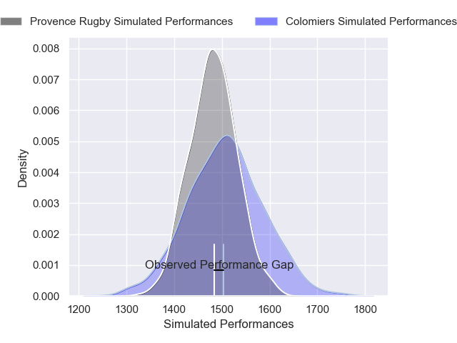
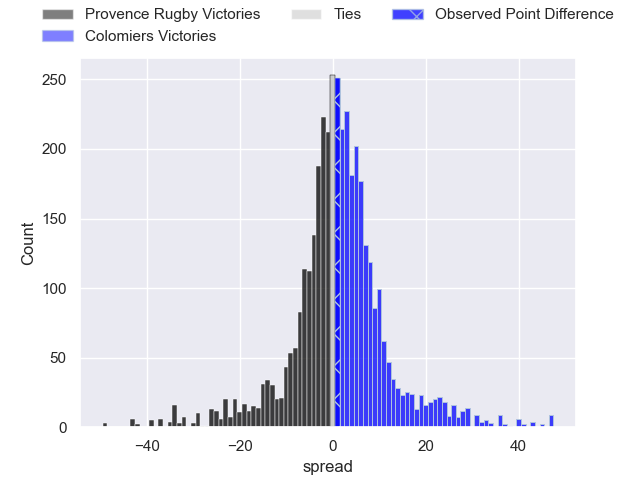
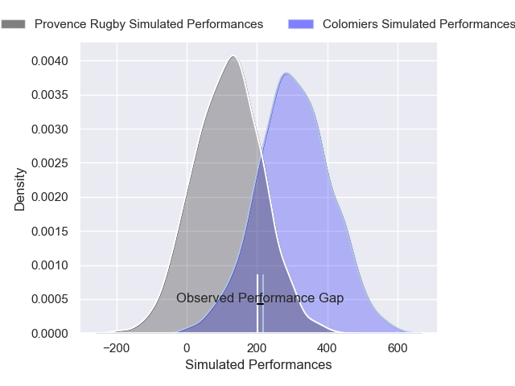
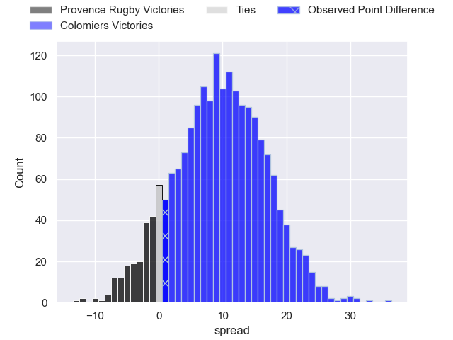
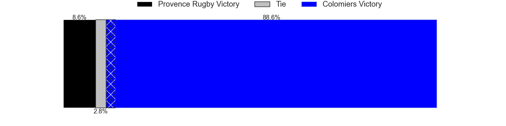

---  
layout: page  
title: Provence Rugby at Colomiers; 30-31  
date: 2024-12-05 18:00:00 -0500  
categories: "Pro D2 2024" match review  
---
# Provence Rugby at Colomiers; 30-31

# Club Level Predictions

The first set of predictions treats a club as the smallest object, as the club develops its members, organizes a gameplan, and deploys its players as needed for each match. This club model has a prediction of 0.535, which translates to predicting Colomiers to win by 1.2.

Our Over/Under is 41.5 - and combined with the spread above, we have a predicted scoreline of 20 to 21

Each club has a rating and a rating deviation (similar to a Glicko rating), and expected performances can be generated. This allows for simulated matches and spreads like the ones below.
## Projected Performances - Club Model

## Projected Spreads - Club Model

## Projected Results - Club Model

# Player Level Predictions

Treating teams instead as an entity made up of the currently active players, I have ratings for each player in an altogether different system. These can be combined to form team ratings once teamsheets are announced, weighting starters a bit higher than the reserves. After the match is played, players can be weighted by their minutes on the field, allowing for an accurate measure of the team's composition. With these compiled team ratings, we can make predictions, measure inaccuracy, and update the individual player ratings.
## Prediction without Player Minutes: Colomiers by 6.3

Provence Rugby by 6.3 on a neutral pitch

## Projected Performances - Player Model

## Projected Spreads - Player Model

## Projected Results - Player Model

|   Away Minutes | Away Player           |   Away Percentile |   Number |   Home Percentile | Home Player               |   Home Minutes |
|---------------:|:----------------------|------------------:|---------:|------------------:|:--------------------------|---------------:|
|             80 | Thomas Vernet         |             75.44 |        1 |             76.71 | Guillaume Tartas          |              6 |
|             50 | Thomas Sauveterre     |             67.6  |        2 |             19.84 | Thomas Larrieu            |             66 |
|             30 | Paul Mallez           |             74.71 |        3 |             71.86 | Michael Simutoga          |             34 |
|             30 | Jérôme Dufour         |             84.3  |        4 |             24.39 | Jean Thomas               |             29 |
|             30 | Izack Rodda           |             81.05 |        5 |             29.82 | Maxime Granouillet        |             50 |
|             30 | Teimana Harrison      |             64.22 |        6 |             26.12 | Anthony Coletta           |             29 |
|             30 | Charly Gambini        |             80.78 |        7 |             70.95 | Aldric Lescure            |             30 |
|             28 | Tornike Jalagonia     |             17.72 |        8 |             12.84 | Caleb Timu                |             46 |
|             80 | Joris Cazenave        |             69.46 |        9 |             22.99 | Ugo Seguela               |             40 |
|             25 | Jimmy Gopperth        |             90    |       10 |             15.4  | Joaquin de la Vega Mendia |             50 |
|             51 | Mathias Colombet      |             58.8  |       11 |             21.58 | Anzelo Tuitavuki          |             50 |
|             66 | Atila Septar          |             72.74 |       12 |             60.91 | Ray Nu'u                  |             80 |
|             66 | Eto Bainivalu         |             38.22 |       13 |              9.41 | Martin Dulon              |             50 |
|             66 | Adrien Lapegue-Lafaye |             22.2  |       14 |             16.58 | Martin Alonso Munoz       |             52 |
|             51 | Thomas Salles         |             78.08 |       15 |             23.65 | Ugo Pacome                |             80 |
|             30 | Joseph Laget          |             34.11 |       16 |             17.54 | Jeremy Bechu              |             50 |
|             30 | Jules Plisson         |             29.6  |       17 |             29.47 | Marco Fepulea'i           |             80 |
|             30 | Julius Nostadt        |             65.01 |       18 |             48.22 | Pablo Dimcheff            |             14 |
|             30 | Léo Drouet            |             69.66 |       19 |             40.02 | Elias El Ansari           |             80 |
|             30 | Arthur Coville        |             11.99 |       20 |             66.49 | Janse Roux                |             30 |
|             30 | Josh Tyrell           |             69.65 |       21 |             82.8  | Vincent Pinto             |             30 |
|             30 | Andres Zafra Tarazona |              3.68 |       22 |             42.33 | Gregoire Bazin            |             21 |
|             30 | Enrique Pieretto      |             39.72 |       23 |            nan    | Arthur Diaz               |             80 |

