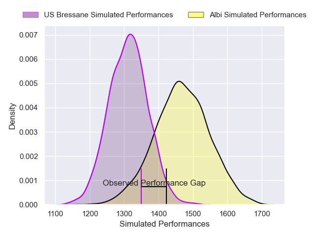
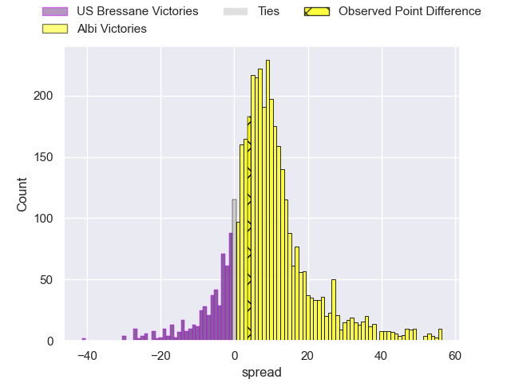
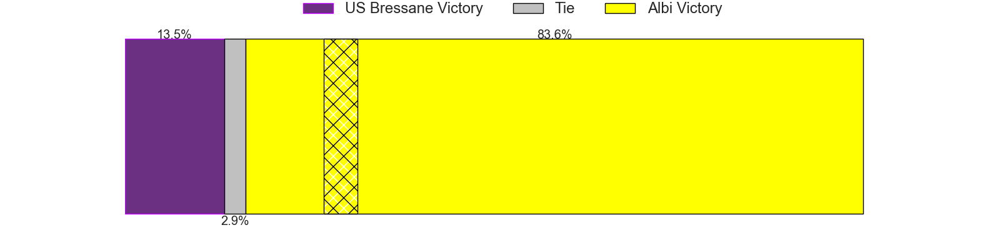
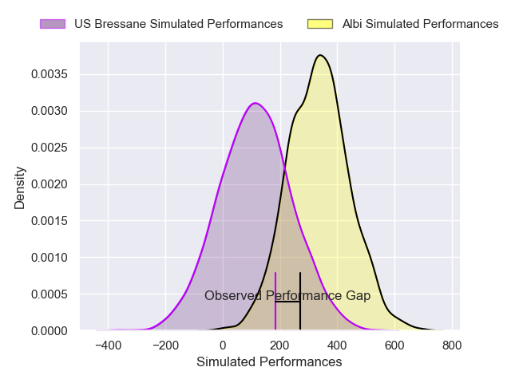
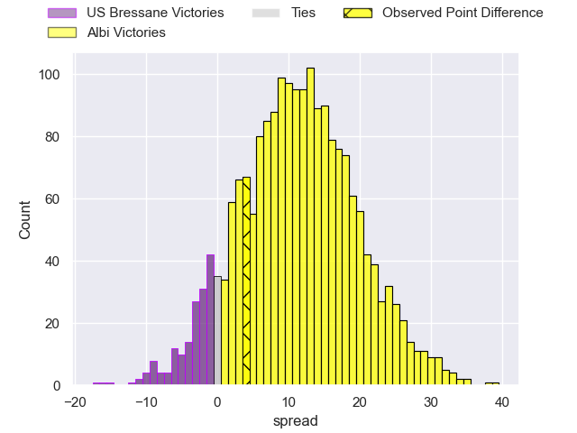
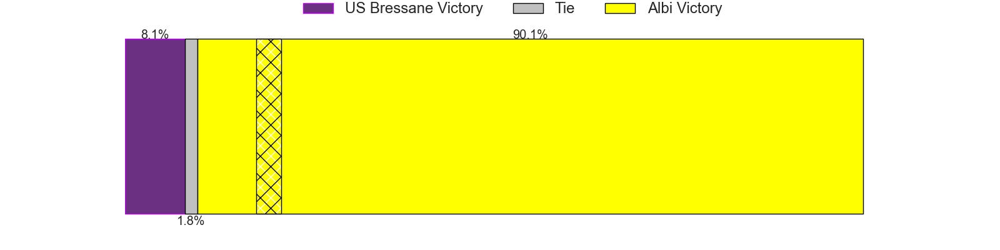

---  
layout: page  
title: US Bressane at Albi; 22-26  
date: 2024-12-06 18:00:00 -0500  
categories: "Nationale 2024" match review  
---
# US Bressane at Albi; 22-26

# Club Level Predictions

The first set of predictions treats a club as the smallest object, as the club develops its members, organizes a gameplan, and deploys its players as needed for each match. This club model has a prediction of 0.708, which translates to predicting Albi to win by 7.8.

Our Over/Under is 39.5 - and combined with the spread above, we have a predicted scoreline of 16 to 24

Each club has a rating and a rating deviation (similar to a Glicko rating), and expected performances can be generated. This allows for simulated matches and spreads like the ones below.
## Projected Performances - Club Model

## Projected Spreads - Club Model

## Projected Results - Club Model

# Player Level Predictions

Treating teams instead as an entity made up of the currently active players, I have ratings for each player in an altogether different system. These can be combined to form team ratings once teamsheets are announced, weighting starters a bit higher than the reserves. After the match is played, players can be weighted by their minutes on the field, allowing for an accurate measure of the team's composition. With these compiled team ratings, we can make predictions, measure inaccuracy, and update the individual player ratings.
## Prediction without Player Minutes: Albi by 17.3

Albi by 6.0 on a neutral pitch

## Projected Performances - Player Model

## Projected Spreads - Player Model

## Projected Results - Player Model

|   Away Minutes | Away Player          |   Away Percentile |   Number |   Home Percentile | Home Player         |   Home Minutes |
|---------------:|:---------------------|------------------:|---------:|------------------:|:--------------------|---------------:|
|             80 | Vazha Kapanadze      |             60.58 |        1 |             72.65 | Antoine Soave       |             33 |
|              5 | Clement Jullien      |             85.56 |        2 |             24.58 | Arthur Castant      |             33 |
|             31 | Atonio Ulutuipalelei |             28.89 |        3 |             31.39 | Esteban Talalua     |             33 |
|             28 | Quentin Witt         |             12.95 |        4 |             67.07 | Yanis Horvat        |             17 |
|              6 | Victor Fromenteze    |              1.48 |        5 |             75.67 | Jonathan Kpoku      |              5 |
|             13 | Loic Baradel         |             85.47 |        6 |             15.81 | Ianis Ponsole       |             28 |
|             48 | Thomas Déliance      |             70.26 |        7 |             80.85 | Simon Meka          |             40 |
|             80 | Nicolas Tachat       |             37.94 |        8 |             69.43 | Camille Jarreau     |             24 |
|             62 | Jeremy Valencot      |             78.04 |        9 |             85.1  | Gilen Queheille     |             48 |
|             80 | Nathan Azais         |             38.08 |       10 |             73.35 | Thibault Olender    |             24 |
|             80 | Élie De Fleurian     |             57.52 |       11 |             78.53 | Kamilieni Raivono   |             28 |
|             58 | Benjamin Doy         |             44.92 |       12 |             70.43 | Victorien Jacomme   |             27 |
|             80 | Joe Margetts         |             50.66 |       13 |             81.26 | Baptiste Couchinave |             80 |
|             80 | Thibaut Perrette     |             54.42 |       14 |             70.47 | Simon Hartmann      |             18 |
|             40 | Florent Massip       |             81.68 |       15 |             56.96 | Téo Dospital        |             80 |
|             27 | Florian Burlet       |             44.96 |       16 |             20.63 | Kevin Tougne        |             80 |
|             23 | Louis Dasalmartini   |             46.08 |       17 |             22.58 | Reinach Venter      |             80 |
|             80 | Erich de Jager       |             40.25 |       18 |             48.99 | Thomas Cretu        |             75 |
|             34 | Grégoire Demangel    |             63.25 |       19 |             30.5  | Dion Evrard Oulai   |             49 |
|             80 | Pierre Reynaud       |             55.98 |       20 |             20.26 | Mattéo Coustalat    |             80 |
|             52 | Wael May             |             74.59 |       21 |             90.22 | Théo Vidal          |             63 |
|             80 | Nicolas Faure        |              6.25 |       22 |             24.65 | Victor Pisano       |             75 |
|             74 | Fred Zeilinga        |             88.79 |       23 |             19.21 | Leo Treilles        |             34 |

