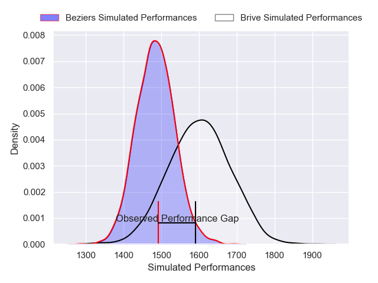
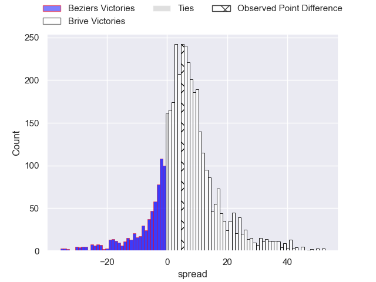
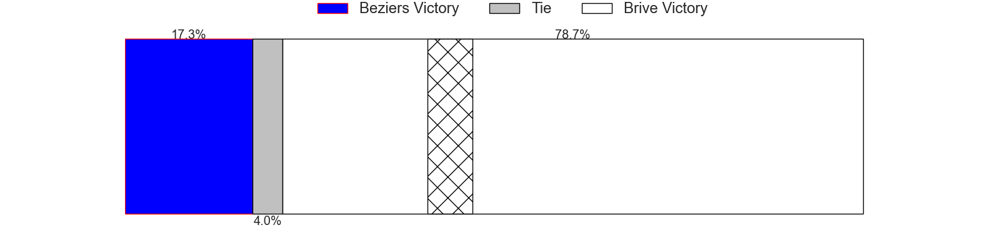
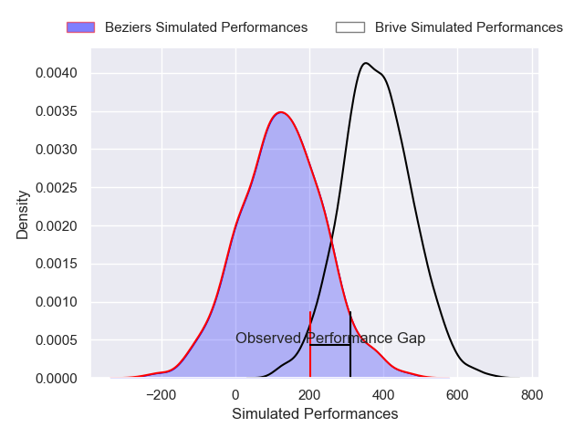
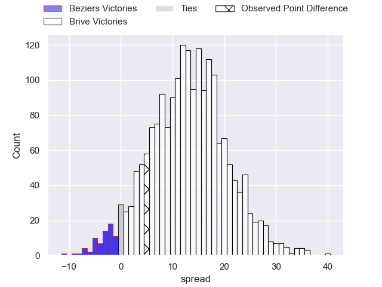
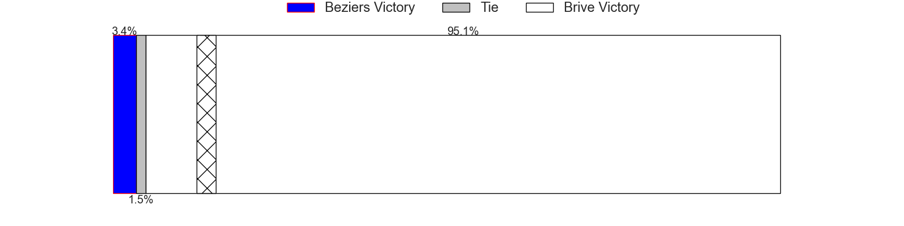

---  
layout: page  
title: Beziers at Brive; 10-15  
date: 2024-12-06 18:00:00 -0500  
categories: "Pro D2 2024" match review  
---
# Beziers at Brive; 10-15

# Club Level Predictions

The first set of predictions treats a club as the smallest object, as the club develops its members, organizes a gameplan, and deploys its players as needed for each match. This club model has a prediction of 0.66, which translates to predicting Brive to win by 5.8.

Our Over/Under is 50.5 - and combined with the spread above, we have a predicted scoreline of 22 to 28

Each club has a rating and a rating deviation (similar to a Glicko rating), and expected performances can be generated. This allows for simulated matches and spreads like the ones below.
## Projected Performances - Club Model

## Projected Spreads - Club Model

## Projected Results - Club Model

# Player Level Predictions

Treating teams instead as an entity made up of the currently active players, I have ratings for each player in an altogether different system. These can be combined to form team ratings once teamsheets are announced, weighting starters a bit higher than the reserves. After the match is played, players can be weighted by their minutes on the field, allowing for an accurate measure of the team's composition. With these compiled team ratings, we can make predictions, measure inaccuracy, and update the individual player ratings.
## Prediction without Player Minutes: Brive by 16.2

Brive by 3.2 on a neutral pitch

## Projected Performances - Player Model

## Projected Spreads - Player Model

## Projected Results - Player Model

|   Away Minutes | Away Player                 |   Away Percentile |   Number |   Home Percentile | Home Player           |   Home Minutes |
|---------------:|:----------------------------|------------------:|---------:|------------------:|:----------------------|---------------:|
|             28 | Marco Trauth                |             73.98 |        1 |             18.63 | Simon-Pierre Chauvac  |             80 |
|             45 | Jose Luis Gonzalez          |             84.32 |        2 |             29.83 | Lucas da Silva        |             80 |
|             80 | Yannick Arroyo              |             73.55 |        3 |             13.62 | Marcel van der Merwe  |             80 |
|             35 | Cam Dodson                  |             63.61 |        4 |             90.06 | Asier Usarraga        |             28 |
|             46 | Pierre Gayraud              |             41.57 |        5 |             87.99 | Sitaleki Timani       |             80 |
|             61 | Clement Doumenc             |             87.91 |        6 |             74.87 | Retief Marais         |             19 |
|             80 | Gillian Benoy               |             23.33 |        7 |             95.88 | Courtney Lawes        |             19 |
|             64 | Sias Koen                   |             65.57 |        8 |             53.57 | Taniela Sadrugu       |             19 |
|             80 | Samuel Marques              |             81.06 |        9 |             73.03 | Leo Carbonneau        |             13 |
|             14 | Charly Malie                |             25.3  |       10 |             78.49 | Curwin Bosch          |             80 |
|             14 | Aminiasi Tuimaba            |             81.93 |       11 |             86.56 | Erwan Dridi           |             80 |
|             14 | Taleta Tupuola              |             25.8  |       12 |             94.01 | Sam Johnson           |             40 |
|             14 | Taylor Gontineac            |             82.61 |       13 |             52.37 | Georges Shvelidze     |             52 |
|             38 | Watisoni Votu               |             78.69 |       14 |             11.97 | Thomas Zenon          |             47 |
|             40 | Victor Dreuille             |             15.17 |       15 |             63.8  | Mathis Ferté          |             22 |
|             80 | Otonuku Jr Pauta            |             67.92 |       16 |             17.17 | Hugo Verdu            |             34 |
|             48 | Gabin Lorre                 |             77.88 |       17 |              6.66 | Konstantin Mikautadze |             34 |
|             23 | Francisco Fernandes Moreira |             19.18 |       18 |             44.54 | Timilai Rokoduru      |             27 |
|             61 | Christian Judge             |             48.5  |       19 |            nan    | Henzo Kiteau          |             18 |
|             28 | Yanis Boulassel             |             20.4  |       20 |            nan    | Nathan Fraissenon     |             21 |
|             64 | Baptiste Abescat-Leroy      |             68.87 |       21 |             45.21 | Benjamin Boudou       |             13 |
|             64 | Damien Añon                 |             71.75 |       22 |             59.01 | Samuel Maximin        |             13 |
|             64 | Shahn Eru                   |              3.11 |       23 |             45.74 | Loan Lavergne         |             35 |

