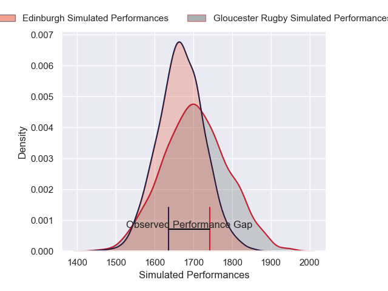
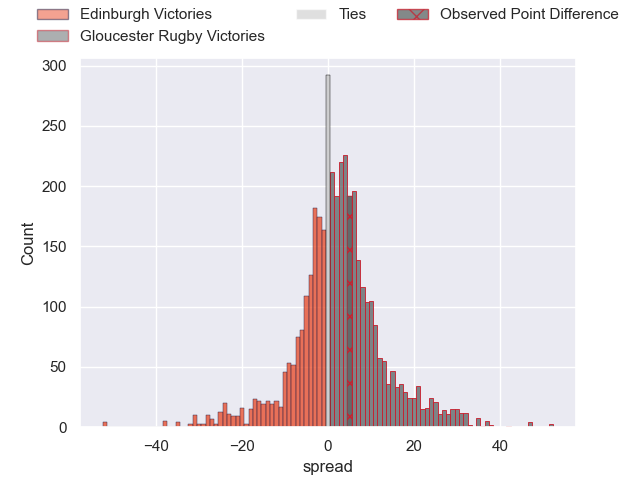
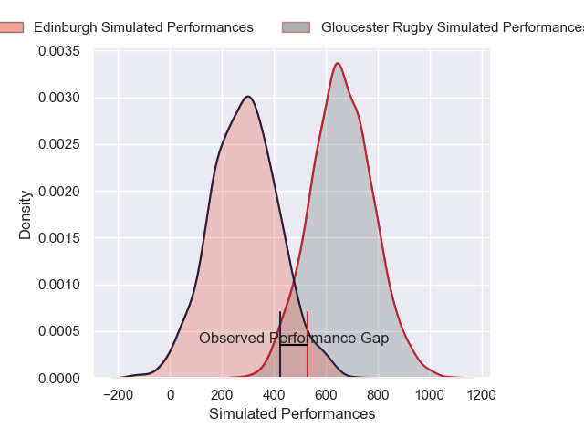
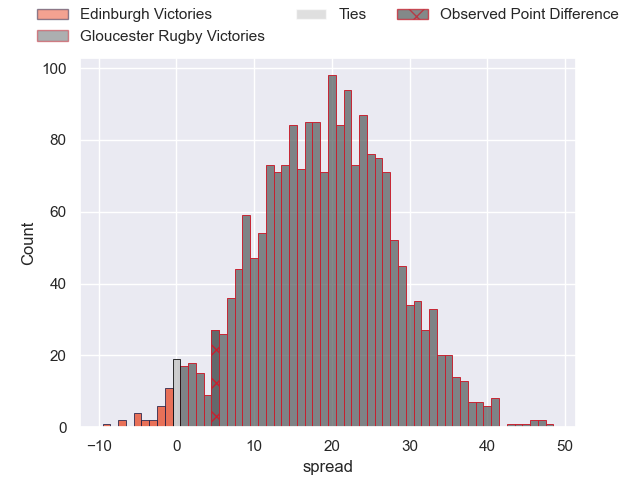

---  
layout: page  
title: Edinburgh at Gloucester Rugby; 10-15  
date: 2024-12-06 18:00:00 -0500  
categories: "European Rugby Challenge Cup 2024" match review  
---
# Edinburgh at Gloucester Rugby; 10-15

# Club Level Predictions

The first set of predictions treats a club as the smallest object, as the club develops its members, organizes a gameplan, and deploys its players as needed for each match. This club model has a prediction of 0.552, which translates to predicting Gloucester Rugby to win by 1.8.

Our Over/Under is 49.5 - and combined with the spread above, we have a predicted scoreline of 24 to 25

Each club has a rating and a rating deviation (similar to a Glicko rating), and expected performances can be generated. This allows for simulated matches and spreads like the ones below.
## Projected Performances - Club Model

## Projected Spreads - Club Model

## Projected Results - Club Model

# Player Level Predictions

Treating teams instead as an entity made up of the currently active players, I have ratings for each player in an altogether different system. These can be combined to form team ratings once teamsheets are announced, weighting starters a bit higher than the reserves. After the match is played, players can be weighted by their minutes on the field, allowing for an accurate measure of the team's composition. With these compiled team ratings, we can make predictions, measure inaccuracy, and update the individual player ratings.
## Prediction without Player Minutes: Gloucester Rugby by 20.3

Gloucester Rugby by 4.5 on a neutral pitch

## Projected Performances - Player Model

## Projected Spreads - Player Model

## Projected Results - Player Model

|   Away Minutes | Away Player      |   Away Percentile |   Number |   Home Percentile | Home Player       |   Home Minutes |
|---------------:|:-----------------|------------------:|---------:|------------------:|:------------------|---------------:|
|             80 | Boan Venter      |             34.66 |        1 |             79.9  | Val Rapava-Ruskin |             84 |
|             40 | Patrick Harrison |             17.67 |        2 |             70.2  | Seb Blake         |             15 |
|             46 | Paul Hill        |             89.12 |        3 |             81.63 | Kirill Gotovtsev  |             26 |
|             60 | Marshall Sykes   |             89.23 |        4 |             36.84 | Arthur Clark      |             81 |
|             84 | Sam Skinner      |             87.66 |        5 |             91.05 | Matias Alemanno   |             24 |
|             81 | Tom Dodd         |             62.99 |        6 |             39.83 | Freddie Thomas    |             29 |
|             29 | Freddy Douglas   |             52.99 |        7 |             19.23 | Lewis Ludlow      |             84 |
|             55 | Magnus Bradbury  |             68.88 |        8 |             79.74 | Ruan Ackermann    |             80 |
|             80 | Charlie Shiel    |             61.7  |        9 |             65.38 | Caolan Englefield |             84 |
|             81 | Ross Thompson    |             85.17 |       10 |             75.55 | Gareth Anscombe   |             84 |
|              0 | Nathan Sweeney   |             47.4  |       11 |             84.11 | Josh Hathaway     |             84 |
|             19 | Mosese Tuipulotu |             25.52 |       12 |             82.58 | Max Llewellyn     |             47 |
|             80 | Matt Currie      |             87.38 |       13 |             41.15 | Chris Harris      |             11 |
|             29 | Ross McCann      |             56.59 |       14 |             94.34 | Christian Wade    |             40 |
|             81 | Wes Goosen       |             93.59 |       15 |             84.07 | Santiago Carreras |             57 |
|             12 | Dave Cherry      |             43.01 |       16 |             90.48 | Jack Singleton    |             65 |
|             34 | Mikey Jones      |            nan    |       17 |             20.15 | Ciaran Knight     |             56 |
|             84 | D'Arcy Rae       |             50.42 |       18 |            nan    | Afolabi Fasogbon  |             51 |
|             84 | Rob Carmichael   |            nan    |       19 |             38.72 | Harry Taylor      |             63 |
|             52 | Liam McConnell   |            nan    |       20 |             98.71 | Albert Tuisue     |             80 |
|             81 | Conor McAlpine   |            nan    |       21 |             56.73 | Charlie Chapman   |             40 |
|             62 | Ben Healy        |             80.96 |       22 |             88.42 | William Butler    |             81 |
|             74 | James Lang       |             87.18 |       23 |             77.29 | George Barton     |             80 |

