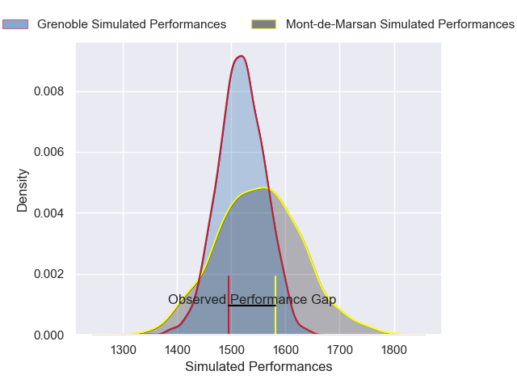
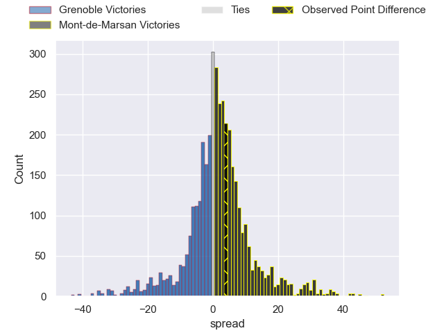
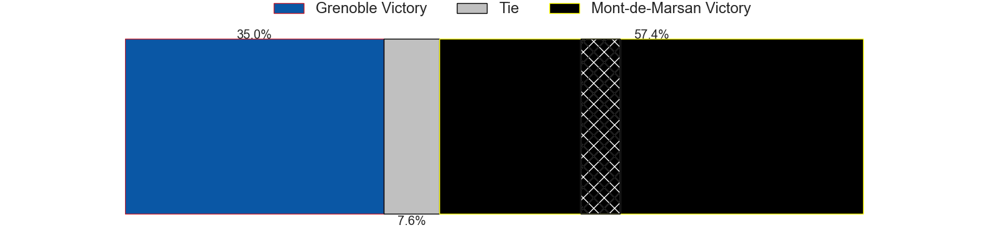
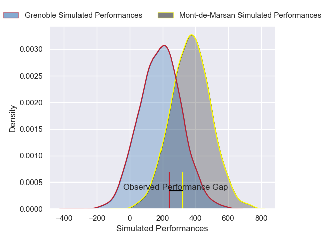
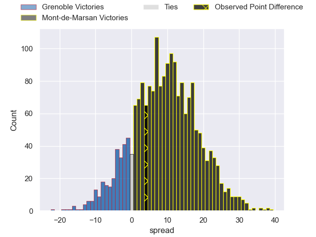
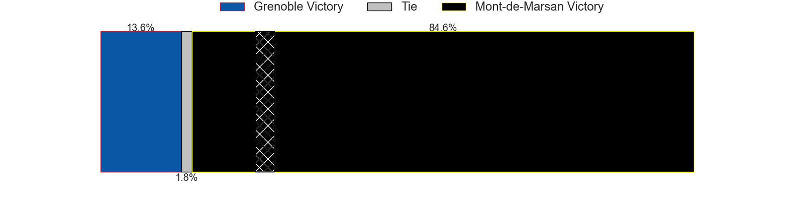

---  
layout: page  
title: Grenoble at Mont-de-Marsan; 26-30  
date: 2024-12-06 18:00:00 -0500  
categories: "Pro D2 2024" match review  
---
# Grenoble at Mont-de-Marsan; 26-30

# Club Level Predictions

The first set of predictions treats a club as the smallest object, as the club develops its members, organizes a gameplan, and deploys its players as needed for each match. This club model has a prediction of 0.549, which translates to predicting Mont-de-Marsan to win by 1.7.

Our Over/Under is 47.5 - and combined with the spread above, we have a predicted scoreline of 23 to 24

Each club has a rating and a rating deviation (similar to a Glicko rating), and expected performances can be generated. This allows for simulated matches and spreads like the ones below.
## Projected Performances - Club Model

## Projected Spreads - Club Model

## Projected Results - Club Model

# Player Level Predictions

Treating teams instead as an entity made up of the currently active players, I have ratings for each player in an altogether different system. These can be combined to form team ratings once teamsheets are announced, weighting starters a bit higher than the reserves. After the match is played, players can be weighted by their minutes on the field, allowing for an accurate measure of the team's composition. With these compiled team ratings, we can make predictions, measure inaccuracy, and update the individual player ratings.
## Prediction without Player Minutes: Mont-de-Marsan by 8.7

Grenoble by 4.4 on a neutral pitch

## Projected Performances - Player Model

## Projected Spreads - Player Model

## Projected Results - Player Model

|   Away Minutes | Away Player        |   Away Percentile |   Number |   Home Percentile | Home Player           |   Home Minutes |
|---------------:|:-------------------|------------------:|---------:|------------------:|:----------------------|---------------:|
|             11 | Tommy Raynaud      |             78.59 |        1 |             71.29 | Luka Goginava         |             80 |
|             49 | Lilian Rossi       |             58.4  |        2 |             12.63 | Florian Dufour        |             29 |
|             80 | Cody Thomas        |             62.34 |        3 |             16.84 | Anthony Alves         |             26 |
|             22 | Thomas Ployet      |             59.44 |        4 |             69.14 | Jules Dussutour       |             22 |
|             47 | Giorgi Javakhia    |             89.86 |        5 |             74.87 | Romain Durand         |             40 |
|             24 | Antonin Berruyer   |             78.53 |        6 |             37.14 | Waël Ponpon           |             80 |
|             75 | Victor Guillaumond |             67.8  |        7 |             77.68 | Raphaël Robic         |             29 |
|             17 | Hanru Sirgel       |             89.48 |        8 |             93.4  | Ioane Iashagashvili   |             80 |
|             80 | Barnabe Couilloud  |             18.15 |        9 |             30.47 | Nicolas Darquier      |             58 |
|             80 | Marc Palmier       |             15.86 |       10 |             65.26 | Willie du Plessis     |             63 |
|             56 | Kaminieli Rasaku   |             75.63 |       11 |             86.59 | Pierre Sayerse        |             25 |
|             80 | Romain Trouilloud  |             66.47 |       12 |             65.69 | Nacani Wakaya         |             80 |
|             80 | Gerswin Mouton     |             76.97 |       13 |             17.78 | Gatien Masse          |             80 |
|             80 | Wilfried Hulleu    |             82.15 |       14 |             51.95 | Alexandre de Nardi    |             68 |
|             33 | Hugo Trouilloud    |             64.99 |       15 |             22.53 | Yoann Laousse Azpiazu |             80 |
|             21 | Julien Heriteau    |             66.28 |       16 |             27.09 | Yann Brethous         |             12 |
|             80 | Sam Davies         |             84.94 |       17 |             31.12 | Baptiste Canut        |             55 |
|             31 | Bastien Soury      |             57.94 |       18 |             11.23 | Mike Faleafa          |             69 |
|             80 | Eli Eglaine        |             36.06 |       19 |              5.39 | Luka Begic            |             80 |
|             21 | Ryno Pieterse      |             71.52 |       20 |             16.73 | Jean-Luc Innocente    |              5 |
|             21 | Camille Baz Marcos |            nan    |       21 |             75.09 | Gheorghe Gajion       |             80 |
|             80 | Théo Lavoine       |            nan    |       22 |             15.06 | Patricio Fernandez    |             80 |
|            nan | nan                |            nan    |       23 |             34.01 | Semi Lagivala         |             15 |

