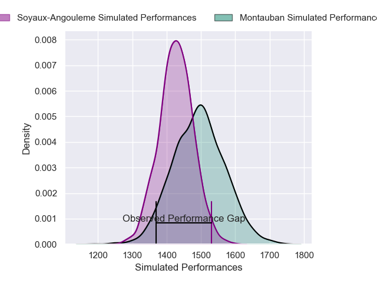
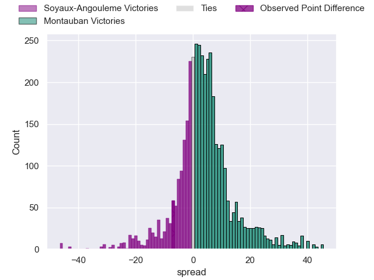
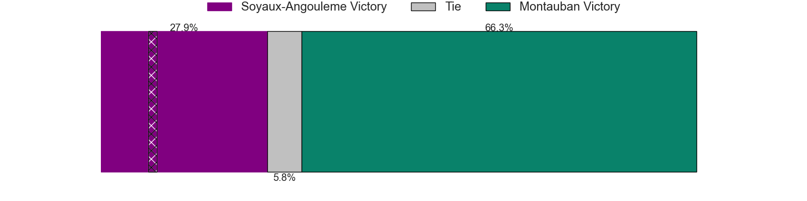
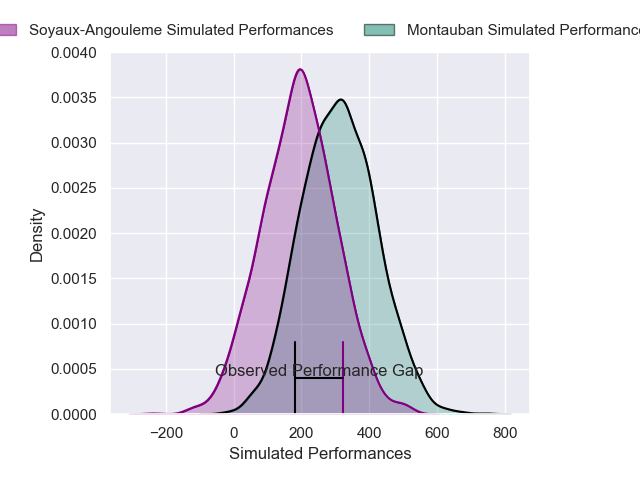
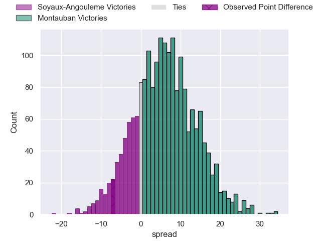
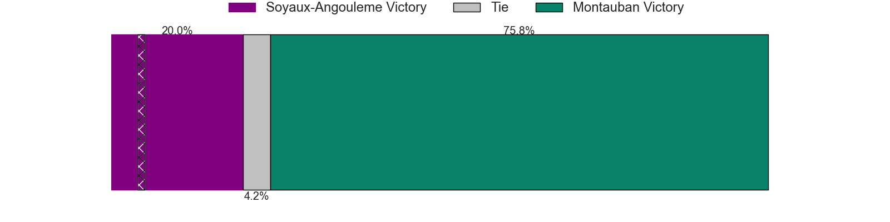

---  
layout: page  
title: Soyaux-Angouleme at Montauban; 27-20  
date: 2024-12-06 18:00:00 -0500  
categories: "Pro D2 2024" match review  
---
# Soyaux-Angouleme at Montauban; 27-20

# Club Level Predictions

The first set of predictions treats a club as the smallest object, as the club develops its members, organizes a gameplan, and deploys its players as needed for each match. This club model has a prediction of 0.595, which translates to predicting Montauban to win by 3.4.

Our Over/Under is 48.5 - and combined with the spread above, we have a predicted scoreline of 23 to 26

Each club has a rating and a rating deviation (similar to a Glicko rating), and expected performances can be generated. This allows for simulated matches and spreads like the ones below.
## Projected Performances - Club Model

## Projected Spreads - Club Model

## Projected Results - Club Model

# Player Level Predictions

Treating teams instead as an entity made up of the currently active players, I have ratings for each player in an altogether different system. These can be combined to form team ratings once teamsheets are announced, weighting starters a bit higher than the reserves. After the match is played, players can be weighted by their minutes on the field, allowing for an accurate measure of the team's composition. With these compiled team ratings, we can make predictions, measure inaccuracy, and update the individual player ratings.
## Prediction without Player Minutes: Montauban by 2.5

Soyaux-Angouleme by 8.6 on a neutral pitch

## Projected Performances - Player Model

## Projected Spreads - Player Model

## Projected Results - Player Model

|   Away Minutes | Away Player        |   Away Percentile |   Number |   Home Percentile | Home Player       |   Home Minutes |
|---------------:|:-------------------|------------------:|---------:|------------------:|:------------------|---------------:|
|             80 | Paul Tailhades     |             75.27 |        1 |             17    | Lucas Seyrolle    |             47 |
|             58 | Motu Matu'u        |             11.37 |        2 |              8.76 | Jeremie Maurouard |             33 |
|             80 | Yassine Boutemane  |             64.03 |        3 |             14.39 | Luka Azariashvili |             64 |
|             40 | Léo Labarthe       |             60.3  |        4 |              7.82 | Tjuee Uanivi      |             35 |
|             80 | Sikeli Nabou       |             85.14 |        5 |             16.85 | Lewis Bean        |             35 |
|             80 | Matt Beukeboom     |             27.52 |        6 |             18.46 | Karl Wilkins      |             80 |
|             80 | Germain Burgaud    |             85.9  |        7 |             61.11 | Kyllian Ringuet   |             51 |
|             46 | Alexander Masibaka |             82.32 |        8 |             18.05 | Tyrone Viiga      |             39 |
|             40 | Manu Saubusse      |             72.28 |        9 |             53.04 | Mael Castel       |             30 |
|             61 | Ben Botica         |             88.58 |       10 |             79.16 | Jérôme Bosviel    |             28 |
|             20 | Nathan Farissier   |             54.19 |       11 |             16.43 | Josua Vici        |             24 |
|             31 | George Tilsley     |             92.94 |       12 |             80.79 | Simon Renda       |             24 |
|             31 | Ledua Mau          |             93.6  |       13 |             26.55 | JT Jackson        |             80 |
|             31 | Jules Dubecq       |             82.64 |       14 |             93.18 | Stephane Ahmed    |             80 |
|             31 | Pete Lydon         |             87.55 |       15 |             86.63 | Baptiste Mouchous |             65 |
|             38 | Georgy Balakarev   |             59.87 |       16 |             27.82 | Thomas Bue        |             49 |
|             32 | Patxi Bidart       |             78.34 |       17 |             53.46 | Ru-Hann Greyling  |             25 |
|             32 | Seydou Diakité     |             64.33 |       18 |             69.44 | Tietie Tuimauga   |             40 |
|             21 | Maxence Lemardelet |             78.71 |       19 |              8.95 | Victor Moreaux    |             16 |
|             19 | Hubert Texier      |             42.65 |       20 |              9.4  | Frédéric Quercy   |             80 |
|             80 | Lucas Zamora       |             49.52 |       21 |             57.61 | Noa Kanika        |             80 |
|             16 | Mathis Lafon       |             56.31 |       22 |             47.09 | Thomas Fortunel   |             80 |
|             23 | Eoghan Barrett     |             72.4  |       23 |             47.91 | Romain Fonnicola  |             49 |

