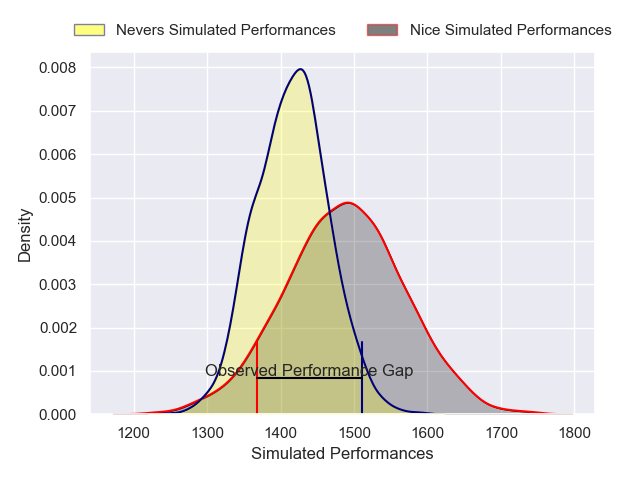
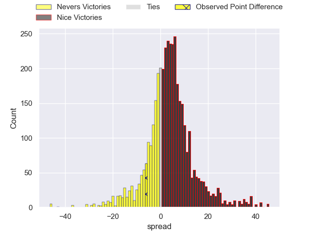
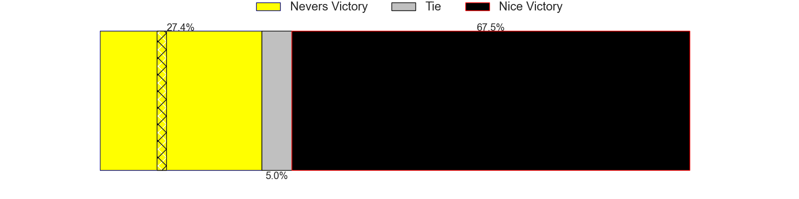
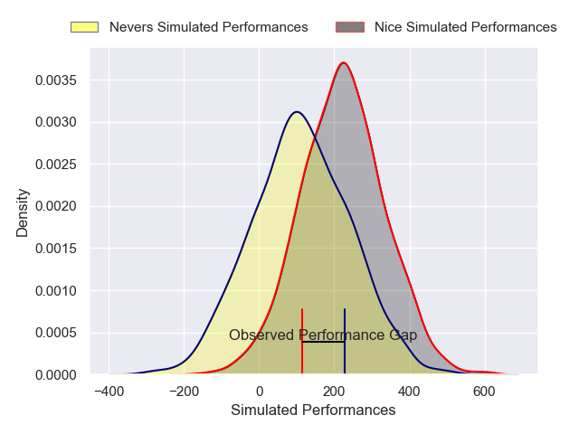
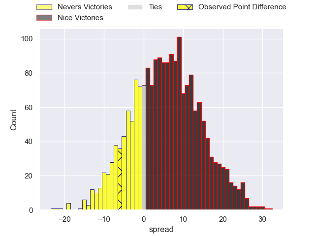
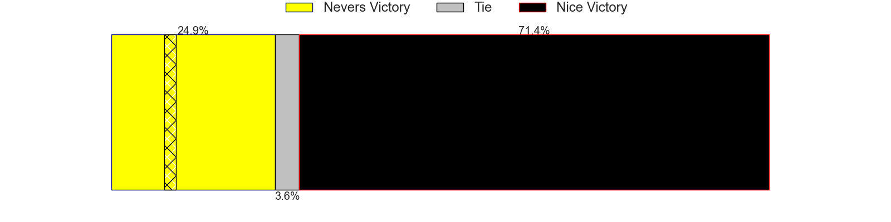

---  
layout: page  
title: Nevers at Nice; 32-26  
date: 2024-12-06 18:00:00 -0500  
categories: "Pro D2 2024" match review  
---
# Nevers at Nice; 32-26

# Club Level Predictions

The first set of predictions treats a club as the smallest object, as the club develops its members, organizes a gameplan, and deploys its players as needed for each match. This club model has a prediction of 0.594, which translates to predicting Nice to win by 3.4.

Our Over/Under is 48.5 - and combined with the spread above, we have a predicted scoreline of 22 to 26

Each club has a rating and a rating deviation (similar to a Glicko rating), and expected performances can be generated. This allows for simulated matches and spreads like the ones below.
## Projected Performances - Club Model

## Projected Spreads - Club Model

## Projected Results - Club Model

# Player Level Predictions

Treating teams instead as an entity made up of the currently active players, I have ratings for each player in an altogether different system. These can be combined to form team ratings once teamsheets are announced, weighting starters a bit higher than the reserves. After the match is played, players can be weighted by their minutes on the field, allowing for an accurate measure of the team's composition. With these compiled team ratings, we can make predictions, measure inaccuracy, and update the individual player ratings.
## Prediction without Player Minutes: Nice by 6.9

Nice by 3.5 on a neutral pitch

## Projected Performances - Player Model

## Projected Spreads - Player Model

## Projected Results - Player Model

|   Away Minutes | Away Player                |   Away Percentile |   Number |   Home Percentile | Home Player              |   Home Minutes |
|---------------:|:---------------------------|------------------:|---------:|------------------:|:-------------------------|---------------:|
|             40 | Tornike Mataradze          |             38.91 |        1 |             19.06 | Facundo Gigena           |              9 |
|             80 | Efi Ma'afu                 |             59.06 |        2 |             87.67 | Sione Anga'aelangi       |             71 |
|             28 | Cleopas Kundiona           |             31.09 |        3 |             48.81 | Nicolas Ciancio          |             31 |
|             80 | Maxence Barjaud            |             87.12 |        4 |              5.79 | Thibault Rey             |             49 |
|             47 | Kevin Noah                 |             27.57 |        5 |             87.47 | Martin Freytes           |             27 |
|             40 | Luka Plataret              |             78.13 |        6 |             70.93 | Arthur Vignolles         |             37 |
|             66 | Julien Kazubek             |             77.44 |        7 |              8.23 | Bastien Berenguel        |             27 |
|             66 | Jason-Colin Fraser         |             95.3  |        8 |             25.74 | Ramiha Tarrel Tia Smiler |             80 |
|             66 | Hugo Bouyssou              |              5.94 |        9 |             68.86 | Jules Solinas            |             39 |
|             80 | Shaun Reynolds             |             32.07 |       10 |             29.08 | Romain Riguet            |             40 |
|             80 | Arthur Mathiron            |             37.53 |       11 |             86.72 | Andrzej Charlat          |             51 |
|             66 | Noa Pommelet               |             56.23 |       12 |             13.24 | Tom Daly                 |             80 |
|             80 | Paula Walisolio            |             49.95 |       13 |             80.77 | Nathan Courtade          |             43 |
|             34 | Johan Georg Wasserman      |             67.26 |       14 |             67.34 | Christian Erasmus        |             31 |
|             49 | Tom Deleuze                |             13.53 |       15 |             60.33 | Paul Auradou             |             29 |
|             49 | Ugo Vignolles              |             27.05 |       16 |             60.56 | Mathis Viard             |             80 |
|             65 | Lasha Jaiani               |             79.08 |       17 |             70.62 | Sunia Vola               |             25 |
|             80 | Rudy Derrieux              |             79.03 |       18 |             95.71 | Louis Suaud              |             42 |
|             53 | Simon Tarel                |             23.6  |       19 |             28.35 | Clément Chartier         |             31 |
|             80 | Jean-Maxence Jules-Rosette |             45.05 |       20 |             31.3  | Matéo Jeune Joly         |             80 |
|             31 | Lasha Pkhakadze            |            nan    |       21 |             93.57 | Jordan Taufua            |             80 |
|             80 | Kamaliele Tufele           |             68.85 |       22 |             18.27 | Luvuyo Pupuma            |             65 |
|             25 | Steven David               |             69.57 |       23 |             58.3  | Sacha Idoumi             |             80 |

