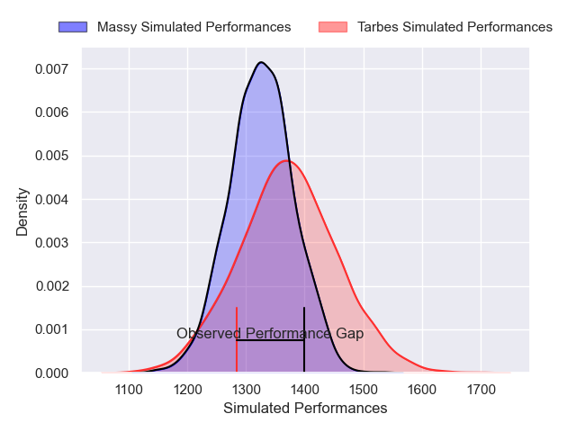
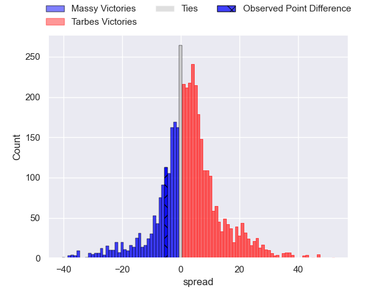
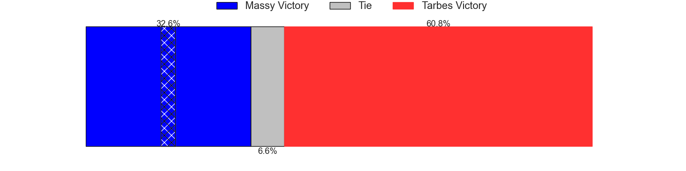
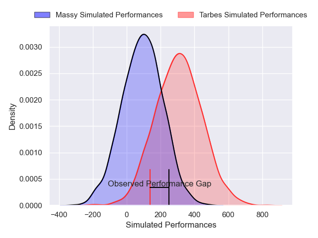
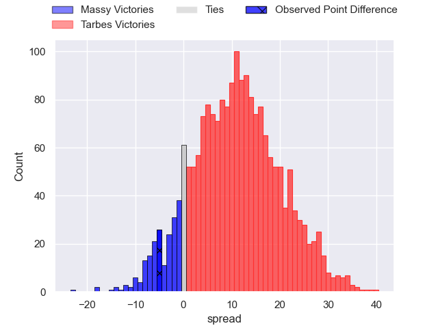
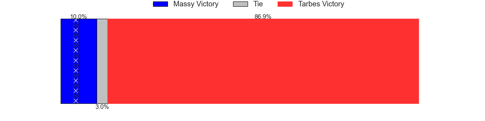

---  
layout: page  
title: Massy at Tarbes; 27-22  
date: 2024-12-06 18:00:00 -0500  
categories: "Nationale 2024" match review  
---
# Massy at Tarbes; 27-22

# Club Level Predictions

The first set of predictions treats a club as the smallest object, as the club develops its members, organizes a gameplan, and deploys its players as needed for each match. This club model has a prediction of 0.564, which translates to predicting Tarbes to win by 2.3.

Our Over/Under is 45.5 - and combined with the spread above, we have a predicted scoreline of 22 to 24

Each club has a rating and a rating deviation (similar to a Glicko rating), and expected performances can be generated. This allows for simulated matches and spreads like the ones below.
## Projected Performances - Club Model

## Projected Spreads - Club Model

## Projected Results - Club Model

# Player Level Predictions

Treating teams instead as an entity made up of the currently active players, I have ratings for each player in an altogether different system. These can be combined to form team ratings once teamsheets are announced, weighting starters a bit higher than the reserves. After the match is played, players can be weighted by their minutes on the field, allowing for an accurate measure of the team's composition. With these compiled team ratings, we can make predictions, measure inaccuracy, and update the individual player ratings.
## Prediction without Player Minutes: Tarbes by 8.0

Massy by 2.7 on a neutral pitch

## Projected Performances - Player Model

## Projected Spreads - Player Model

## Projected Results - Player Model

|   Away Minutes | Away Player            |   Away Percentile |   Number |   Home Percentile | Home Player        |   Home Minutes |
|---------------:|:-----------------------|------------------:|---------:|------------------:|:-------------------|---------------:|
|             56 | Siegfried Fisi'ihoi    |             41.5  |        1 |             15.22 | Ximun Bessonart    |             80 |
|             52 | Pierre Trassoudaine    |             93.39 |        2 |             15.36 | Vincent Dolier     |             24 |
|             67 | Nolan Pienaar          |             49.05 |        3 |             27.11 | Luka Vea           |             80 |
|             64 | Saba Pesvianidze       |             92.53 |        4 |             18.16 | Léo Saint-Guilhem  |             56 |
|             61 | Andrei Mahu            |             22.94 |        5 |             75.85 | Baptiste Peytavi   |             29 |
|             80 | Giani Gamba            |             67.78 |        6 |             98.38 | Alexis Armary      |             80 |
|             46 | Clément Vidoni         |             22.65 |        7 |             29.49 | Jules Bousquet     |             53 |
|             80 | Alexandre Loubiere     |             94.84 |        8 |              0.74 | Filipe Manu        |             17 |
|             80 | Lucas Rubio            |             32.21 |        9 |              5.77 | Thomas Millet      |             80 |
|             56 | Gonzalo Lopez Bontempo |              2.61 |       10 |             15.83 | Alexandre Perez    |             23 |
|             24 | Alex Preira            |             66.36 |       11 |             61.55 | Osea Waqaninavatu  |             45 |
|             29 | Luca Mignot            |             76.46 |       12 |              3.3  | Savenaca Rawaca    |             80 |
|             29 | Tom Cusson             |              7.25 |       13 |              6.78 | Johan Paulet       |             80 |
|             65 | Ilian El Yahyaoui      |             62.95 |       14 |             73.02 | Clement Latorre    |             80 |
|             22 | Martin Carre           |             64.47 |       15 |             42.12 | Amona Artaud       |             80 |
|             57 | Fernandez Correa       |             12.6  |       16 |             47.86 | Enzo Baggiani      |             52 |
|             80 | Adrien Sonzogni        |             51.15 |       17 |            nan    | Lasha Mirtskhulava |             80 |
|             55 | Nicolas Ferrer         |             69.62 |       18 |             62.67 | Florian Lamothe    |             80 |
|             57 | Koen Bloemen           |             14.07 |       19 |             39.01 | Mathieu Soufflet   |             46 |
|             53 | Diego Pinheiro Ruiz    |             52.91 |       20 |             17.68 | Joeli Matalaweru   |             80 |
|             52 | Julien Blanc           |             67.31 |       21 |             31.73 | Mickael Thébault   |             80 |
|             34 | Giorgi Gogoladze       |             47.05 |       22 |             11.49 | Maile Mamao        |             80 |
|             56 | Alexandre Borie        |             28.75 |       23 |             36.81 | Kevin Lhomy        |             80 |

