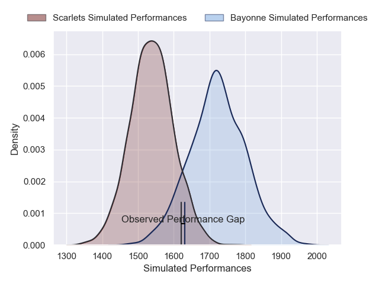
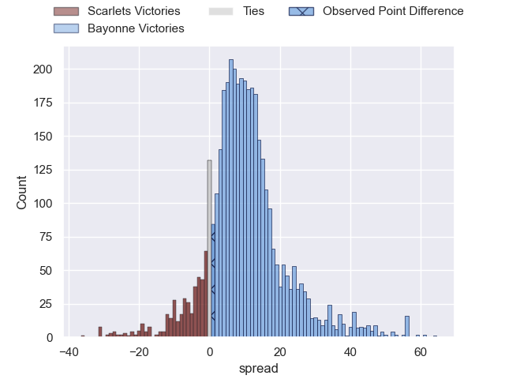
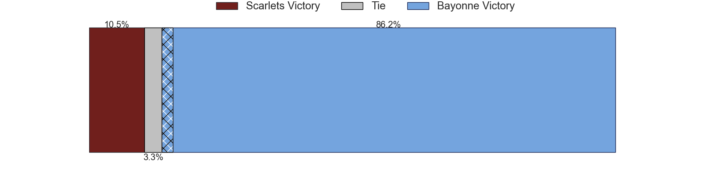
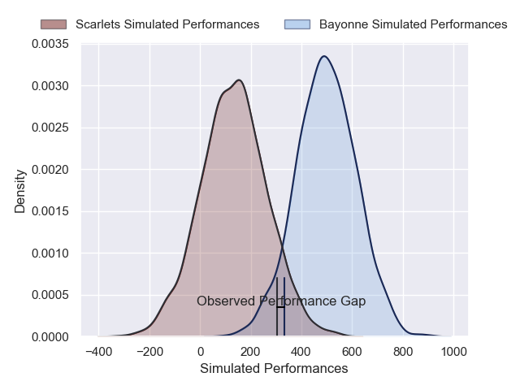
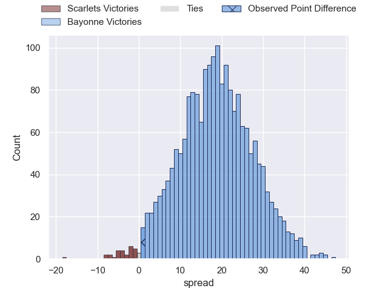
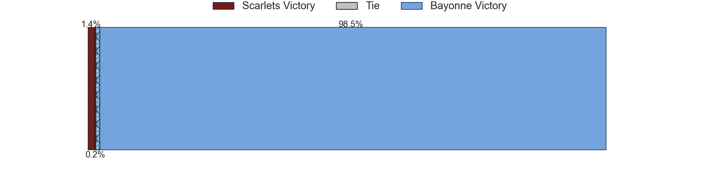

---  
layout: page  
title: Scarlets at Bayonne; 16-17  
date: 2024-12-07 18:00:00 -0500  
categories: "European Rugby Challenge Cup 2024" match review  
---
# Scarlets at Bayonne; 16-17

# Club Level Predictions

The first set of predictions treats a club as the smallest object, as the club develops its members, organizes a gameplan, and deploys its players as needed for each match. This club model has a prediction of 0.737, which translates to predicting Bayonne to win by 9.1.

Our Over/Under is 45.5 - and combined with the spread above, we have a predicted scoreline of 18 to 27

Each club has a rating and a rating deviation (similar to a Glicko rating), and expected performances can be generated. This allows for simulated matches and spreads like the ones below.
## Projected Performances - Club Model

## Projected Spreads - Club Model

## Projected Results - Club Model

# Player Level Predictions

Treating teams instead as an entity made up of the currently active players, I have ratings for each player in an altogether different system. These can be combined to form team ratings once teamsheets are announced, weighting starters a bit higher than the reserves. After the match is played, players can be weighted by their minutes on the field, allowing for an accurate measure of the team's composition. With these compiled team ratings, we can make predictions, measure inaccuracy, and update the individual player ratings.
## Prediction without Player Minutes: Bayonne by 26.7

Bayonne by 13.3 on a neutral pitch

## Projected Performances - Player Model

## Projected Spreads - Player Model

## Projected Results - Player Model

|   Away Minutes | Away Player      |   Away Percentile |   Number |   Home Percentile | Home Player             |   Home Minutes |
|---------------:|:-----------------|------------------:|---------:|------------------:|:------------------------|---------------:|
|             30 | Kemsley Mathias  |             83.21 |        1 |             33.21 | Martin Villar           |             83 |
|             58 | Shaun Evans      |              8.01 |        2 |             91.83 | Lucas Martin            |             26 |
|             51 | Sam Wainwright   |             63.46 |        3 |             17.2  | Pieter Scholtz          |             83 |
|             81 | Alex Craig       |             72.57 |        4 |             95.33 | Denis Marchois          |             22 |
|             30 | Jac Price        |              4.85 |        5 |              7.32 | Veikoso Poloniati       |             83 |
|             81 | Jarrod Taylor    |             63.88 |        6 |             97.7  | Rodrigo Bruni           |             65 |
|             81 | Dan Davis        |             87.56 |        7 |             78.28 | Baptiste Heguy          |             83 |
|             41 | Vaea Fifita      |             95.54 |        8 |             55.79 | Uzair Cassiem           |             59 |
|             40 | Efan Jones       |             59.16 |        9 |             22.2  | Guillaume Rouet         |             16 |
|             58 | Ioan Lloyd       |             11.85 |       10 |             81.73 | Camille Lopez           |             83 |
|             83 | Ellis Mee        |             32.41 |       11 |             77.32 | Mateo Carreras          |             16 |
|             63 | Eddie James      |             27.6  |       12 |             98.25 | Manu Tuilagi            |             32 |
|             81 | Joe Roberts      |             34.4  |       13 |             34.79 | Guillaume Martocq       |             81 |
|             81 | Tom Rogers       |             62.99 |       14 |             69.81 | Nadir Megdoud           |              9 |
|             14 | Ioan Nicholas    |             11.55 |       15 |             18.25 | Cheikh Tiberghien       |             58 |
|             53 | Isaac Young      |            nan    |       16 |            nan    | Torsten van Jaarsveld   |             27 |
|             28 | Sam O'Connor     |            nan    |       17 |             88.02 | Andy Bordelai           |              0 |
|             81 | Archer Holz      |            nan    |       18 |             44.25 | Pascal Cotet            |             83 |
|             81 | Sam Lousi        |             88.27 |       19 |             94.53 | Baptiste Chouzenoux     |             67 |
|             81 | Max Douglas      |             89.33 |       20 |             89.95 | Giovanni Habel-Kueffner |             22 |
|             61 | Archie Hughes    |             19.61 |       21 |             44.41 | Baptiste Germain        |             55 |
|             51 | Charlie Titcombe |            nan    |       22 |             73.29 | Joris Segonds           |             81 |
|             40 | Macs Page        |             25.56 |       23 |             16.7  | Tom Spring              |             81 |

