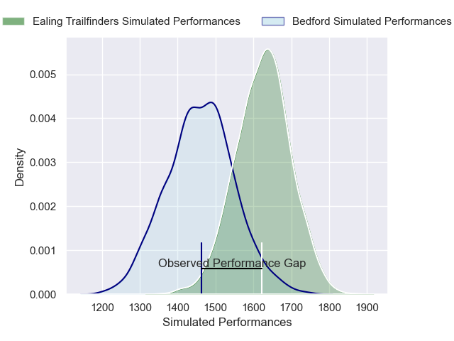
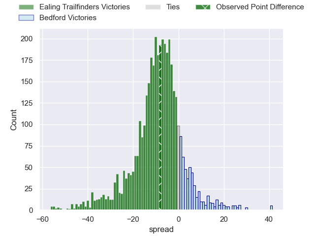
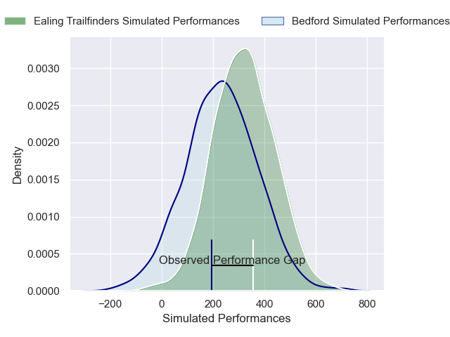
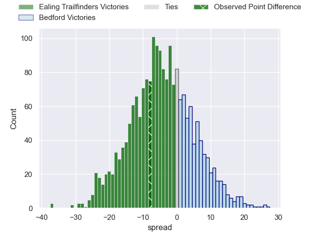

---  
layout: page  
title: Ealing Trailfinders at Bedford; 25-17  
date: 2024-12-07 18:00:00 -0500  
categories: "RFU Championship 2024" match review  
---
# Ealing Trailfinders at Bedford; 25-17

# Club Level Predictions

The first set of predictions treats a club as the smallest object, as the club develops its members, organizes a gameplan, and deploys its players as needed for each match. This club model has a prediction of 0.284, which translates to predicting Ealing Trailfinders to win by 8.3.

Our Over/Under is 49.5 - and combined with the spread above, we have a predicted scoreline of 29 to 21

Each club has a rating and a rating deviation (similar to a Glicko rating), and expected performances can be generated. This allows for simulated matches and spreads like the ones below.
## Projected Performances - Club Model

## Projected Spreads - Club Model

## Projected Results - Club Model

# Player Level Predictions

Treating teams instead as an entity made up of the currently active players, I have ratings for each player in an altogether different system. These can be combined to form team ratings once teamsheets are announced, weighting starters a bit higher than the reserves. After the match is played, players can be weighted by their minutes on the field, allowing for an accurate measure of the team's composition. With these compiled team ratings, we can make predictions, measure inaccuracy, and update the individual player ratings.
## Prediction without Player Minutes: Ealing Trailfinders by 8.5

Ealing Trailfinders by 13.1 on a neutral pitch

## Projected Performances - Player Model

## Projected Spreads - Player Model

## Projected Results - Player Model

|   Away Minutes | Away Player          |   Away Percentile |   Number |   Home Percentile | Home Player             |   Home Minutes |
|---------------:|:---------------------|------------------:|---------:|------------------:|:------------------------|---------------:|
|             33 | Lefty Zigiriadis     |             82.4  |        1 |             43.94 | Joey Conway             |             69 |
|             29 | Matthew Cornish      |             74.35 |        2 |             32.72 | Johnny Stewart          |             80 |
|             11 | George Davis         |             73.01 |        3 |             76.81 | Oisin Heffernan         |             80 |
|             22 | David Douglas Bridge |             20.59 |        4 |             67.16 | Ed Prowse               |             80 |
|             22 | Daniel Cutmore       |             91.23 |        5 |             43.96 | Rory Ward               |             70 |
|             80 | Rob Farrar           |             86.24 |        6 |              9.91 | Luke Frost              |             80 |
|             70 | Jordy Reid           |             75.73 |        7 |             14.87 | Joe Howard              |             80 |
|             80 | Ryan Smid            |             98.9  |        8 |              7.37 | Freddie Tuilagi         |             80 |
|             29 | Craig Hampson        |             83.01 |        9 |             90.38 | Alex Day                |             80 |
|             80 | Dan Jones            |             76.95 |       10 |             85.77 | William Maisey          |             80 |
|             17 | Tom Collins          |             96.59 |       11 |             71.63 | Alfie Garside           |             51 |
|             80 | Jordan Holgate       |             83.05 |       12 |             65.44 | Michael Le Bourgeois    |             80 |
|             80 | Reuben Bird-Tulloch  |             77.87 |       13 |             59.89 | Lucas Titherington      |             34 |
|             80 | Angus Kernohan       |             90.93 |       14 |             77.83 | Matt Worley             |             40 |
|             40 | Tobi Wilson          |             78.02 |       15 |             22.89 | Louis James             |             80 |
|             61 | Kyle John Whyte      |             72.77 |       16 |             34.07 | Jamie Jack              |             46 |
|             80 | Matas Jurevicius     |             25.89 |       17 |             66.82 | Tommy Herman            |             63 |
|             58 | Sean Lonsdale        |             37.45 |       18 |             52.5  | Beltus Nonleh           |             80 |
|             67 | Lloyd Williams       |             88.94 |       19 |             31.8  | George Smith            |             80 |
|            nan | nan                  |            nan    |       20 |             76.07 | Jac Arthur              |             33 |
|            nan | nan                  |            nan    |       21 |            nan    | Jonny Weimann           |             80 |
|            nan | nan                  |            nan    |       22 |             13.75 | Josh Matavesi           |             80 |
|            nan | nan                  |            nan    |       23 |             73.15 | George Makepeace-Cubitt |             12 |

