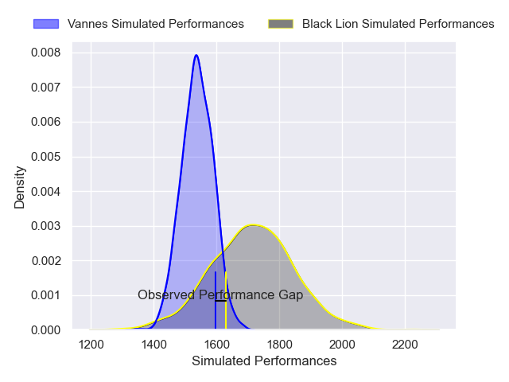
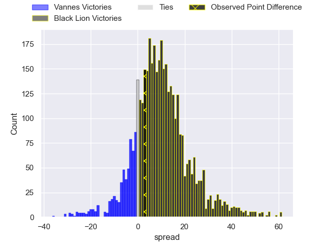
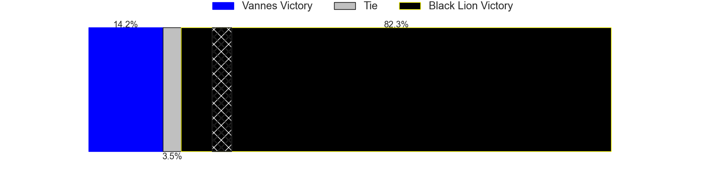
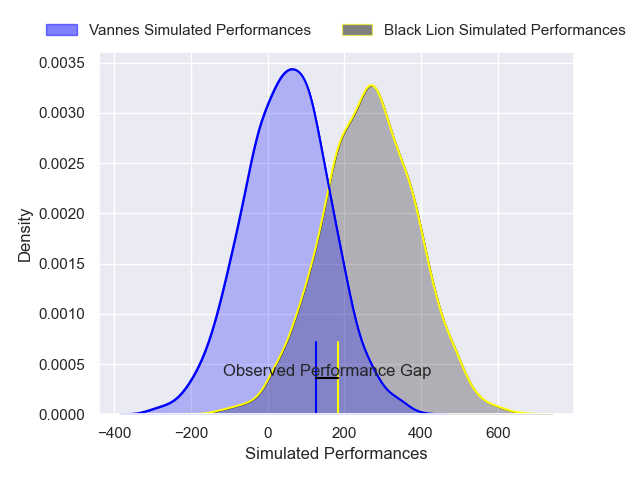
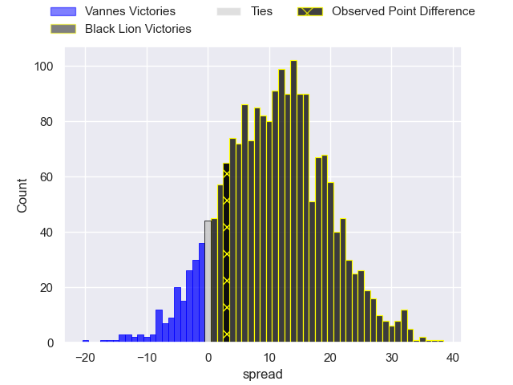
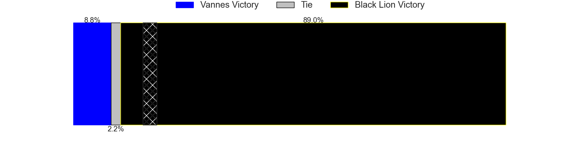

---  
layout: page  
title: Vannes at Black Lion; 19-22  
date: 2024-12-07 18:00:00 -0500  
categories: "European Rugby Challenge Cup 2024" match review  
---
# Vannes at Black Lion; 19-22

# Club Level Predictions

The first set of predictions treats a club as the smallest object, as the club develops its members, organizes a gameplan, and deploys its players as needed for each match. This club model has a prediction of 0.733, which translates to predicting Black Lion to win by 8.9.

Our Over/Under is 47.5 - and combined with the spread above, we have a predicted scoreline of 19 to 28

Each club has a rating and a rating deviation (similar to a Glicko rating), and expected performances can be generated. This allows for simulated matches and spreads like the ones below.
## Projected Performances - Club Model

## Projected Spreads - Club Model

## Projected Results - Club Model

# Player Level Predictions

Treating teams instead as an entity made up of the currently active players, I have ratings for each player in an altogether different system. These can be combined to form team ratings once teamsheets are announced, weighting starters a bit higher than the reserves. After the match is played, players can be weighted by their minutes on the field, allowing for an accurate measure of the team's composition. With these compiled team ratings, we can make predictions, measure inaccuracy, and update the individual player ratings.
## Prediction without Player Minutes: Black Lion by 12.8

Black Lion by 10.4 on a neutral pitch

## Projected Performances - Player Model

## Projected Spreads - Player Model

## Projected Results - Player Model

|   Away Minutes | Away Player              |   Away Percentile |   Number |   Home Percentile | Home Player             |   Home Minutes |
|---------------:|:-------------------------|------------------:|---------:|------------------:|:------------------------|---------------:|
|             59 | Hugo Djehi               |             63.02 |        1 |             42.27 | Vasil Kakovin           |             55 |
|             55 | Pat Leafa                |             78.65 |        2 |             45.93 | Shalva Mamukashvili     |              0 |
|             11 | Simon Bourgeois          |             42.39 |        3 |             43.04 | Giorgi Chkhartishvili   |             40 |
|             30 | Christiaan van der Merwe |              6.69 |        4 |             88.27 | Mikheil Babunashvili    |              0 |
|             16 | Timothe Mezou            |             70.46 |        5 |             40.66 | Lado Chachanidze        |             18 |
|             81 | Jean-Maurice Decubber    |             58.29 |        6 |             58.55 | Sandro Mamamtavrishvili |             16 |
|             81 | Simon Augry              |             15.56 |        7 |             81.11 | Giorgi Tsutskiridze     |             83 |
|             81 | Kitione Kamikamica       |             80.85 |        8 |             50.83 | Luka Ivanishvili        |             83 |
|             22 | Stephen Varney           |              4.81 |        9 |             43.27 | Tengiz Peranidze        |             26 |
|             30 | Thibault Debaes          |             54.31 |       10 |             90.58 | Luka Matkava            |              8 |
|             30 | Thibault Debaes          |             54.31 |       10 |             90.58 | Luka Matkava            |             25 |
|             81 | Enzo Benmegal            |             56.74 |       11 |             91.94 | Sandro Todua            |             51 |
|             56 | Alex Arrate              |              6.31 |       12 |             34.09 | Ioane Metreveli         |             83 |
|             26 | Robin Taccola            |             79.38 |       13 |             37.95 | Tornike Kakhoidze       |             83 |
|             27 | Theo Bastardie           |             82.4  |       14 |             86.51 | Aka Tabutsadze          |             57 |
|             22 | Massimo Ortolan          |             45.97 |       15 |             35.53 | Luka Tsirekidze         |             83 |
|             81 | Louis-Marie Suta         |            nan    |       16 |            nan    | Irakli Kvatadze         |             40 |
|             55 | Thomas Moukoro           |             21.64 |       17 |            nan    | Dato Abdushelishvili    |             51 |
|             83 | Matthieu Uhila           |            nan    |       18 |            nan    | Bachuki Tchumbadze      |             81 |
|             83 | Matteo Desjeux           |             12.77 |       19 |            nan    | Demur Epremidze         |             83 |
|             30 | Leon Boulier             |             34.27 |       20 |            nan    | Giorgi Sinauridze       |             83 |
|             12 | Jean Cotarmanac'h        |            nan    |       21 |            nan    | Davit Khuroshvili       |             61 |
|             40 | Tani Vili                |             31.17 |       22 |             84.84 | Demur Tapladze          |             83 |
|             22 | Pagakalasio Tafili       |             81.75 |       23 |            nan    | Amiran Shvangiradze     |             67 |

