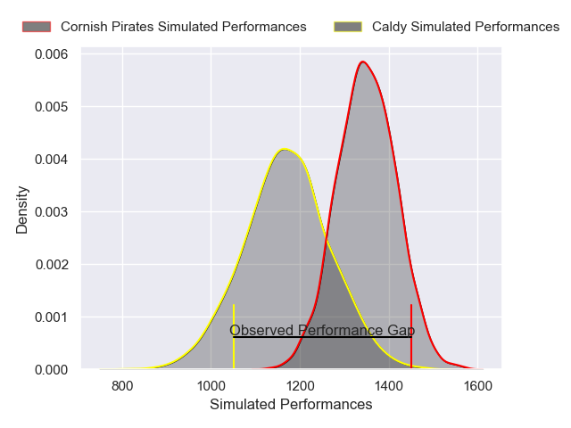
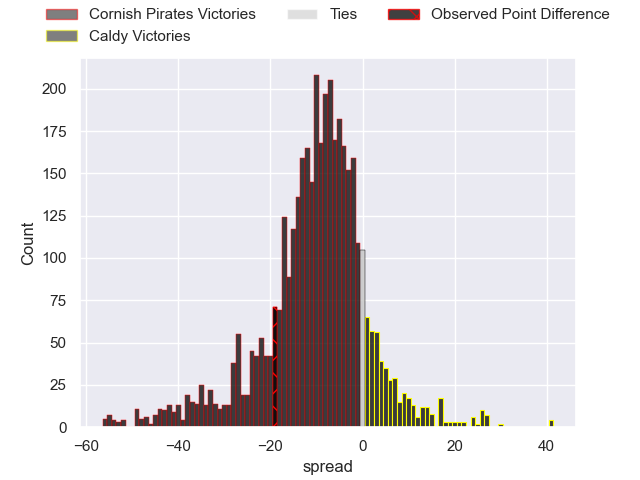
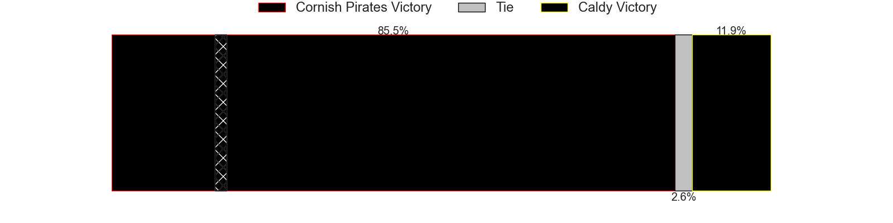
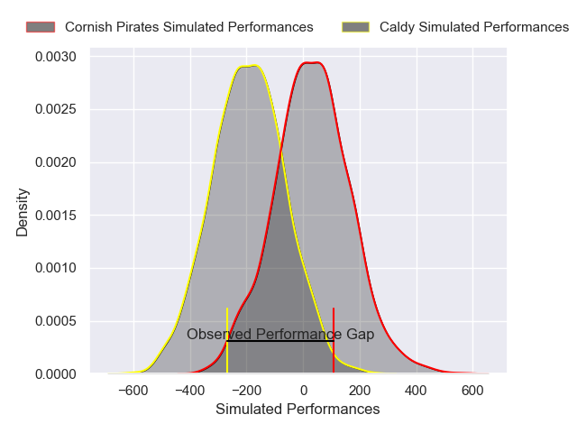
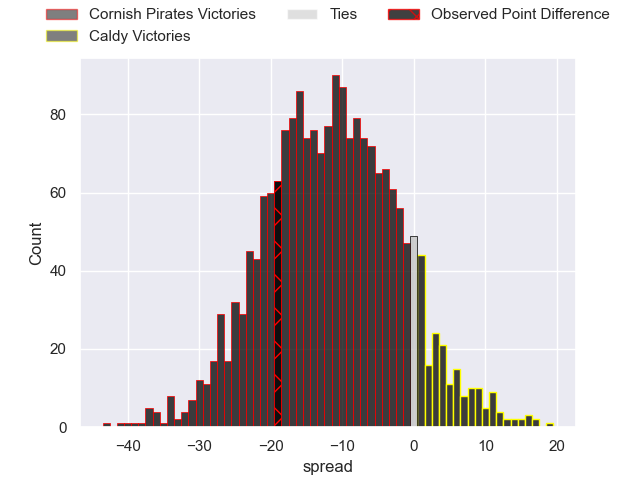
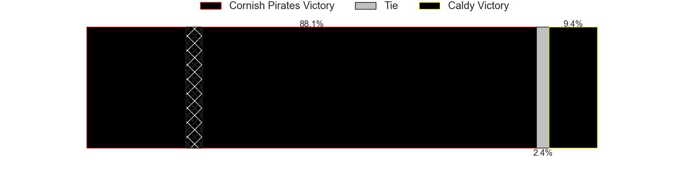

---  
layout: page  
title: Cornish Pirates at Caldy; 22-3  
date: 2024-12-07 18:00:00 -0500  
categories: "RFU Championship 2024" match review  
---
# Cornish Pirates at Caldy; 22-3

# Club Level Predictions

The first set of predictions treats a club as the smallest object, as the club develops its members, organizes a gameplan, and deploys its players as needed for each match. This club model has a prediction of 0.272, which translates to predicting Cornish Pirates to win by 8.7.

Our Over/Under is 48.5 - and combined with the spread above, we have a predicted scoreline of 29 to 20

Each club has a rating and a rating deviation (similar to a Glicko rating), and expected performances can be generated. This allows for simulated matches and spreads like the ones below.
## Projected Performances - Club Model

## Projected Spreads - Club Model

## Projected Results - Club Model

# Player Level Predictions

Treating teams instead as an entity made up of the currently active players, I have ratings for each player in an altogether different system. These can be combined to form team ratings once teamsheets are announced, weighting starters a bit higher than the reserves. After the match is played, players can be weighted by their minutes on the field, allowing for an accurate measure of the team's composition. With these compiled team ratings, we can make predictions, measure inaccuracy, and update the individual player ratings.
## Prediction without Player Minutes: Cornish Pirates by 11.3

Cornish Pirates by 14.0 on a neutral pitch

## Projected Performances - Player Model

## Projected Spreads - Player Model

## Projected Results - Player Model

|   Away Minutes | Away Player       |   Away Percentile |   Number |   Home Percentile | Home Player          |   Home Minutes |
|---------------:|:------------------|------------------:|---------:|------------------:|:---------------------|---------------:|
|             40 | Billy Young       |             23.01 |        1 |             17.73 | Adam Aigbokhae       |             65 |
|             80 | Harry Hocking     |             53.62 |        2 |              7.55 | Matt Gallagher       |             81 |
|             32 | Jay Tyack         |             61.21 |        3 |             27.16 | Monty Weatherby      |             80 |
|             25 | Charlie Rice      |             11.73 |        4 |             25.04 | Freddie Stevenson    |             80 |
|             80 | Matt Cannon       |             19.84 |        5 |              9.26 | Joe Sproston         |             80 |
|             63 | Josh King         |             69.93 |        6 |              8.86 | Sam Olyott           |             80 |
|             80 | Will Gibson       |             78.71 |        7 |             56.39 | Tristan Woodman      |             17 |
|             80 | Hugh Bokenham     |             57.93 |        8 |              5.35 | Josiah Dickinson     |              2 |
|             18 | Cam Jones         |             13.29 |        9 |              7.29 | Ollie Wynn           |             66 |
|             20 | Bruce Houston     |             72.49 |       10 |              1.61 | Lewis Barker         |             80 |
|             80 | Matthew McNab     |             19.23 |       11 |              8.2  | Michael Cartmill     |             60 |
|             80 | Harry Yates       |             53.45 |       12 |              7.19 | Connor Wilkinson     |             60 |
|             80 | Charlie McCaig    |             25.07 |       13 |             14.58 | Rekeiti Ma'asi-White |             80 |
|             80 | Arthur Relton     |             69.27 |       14 |             12.11 | Nick Royle           |             49 |
|             65 | Will Trewin       |             70.76 |       15 |              7.45 | Michael Barlow       |             65 |
|             58 | Oisin Michel      |            nan    |       16 |             16.61 | Nathan Rushton       |             55 |
|             25 | Sol Moody         |             11.86 |       17 |              4.01 | Oliver Hearn         |             32 |
|             23 | James French      |             61.45 |       18 |             23.49 | Ryan Higginson       |             23 |
|             32 | Lewis Pearson     |             76.46 |       19 |             56.15 | Will Riley           |             80 |
|             80 | Tomiwa Agbongbon  |             24.53 |       20 |              6.98 | Callum Ridgway       |             80 |
|             80 | Dan HIscocks      |              6.16 |       21 |             24.96 | Joseph Murray        |             57 |
|             57 | Chester Ribbons   |            nan    |       22 |              0.97 | Sam Bedlow           |             64 |
|             48 | Iwan Price-Thomas |              7.82 |       23 |             11.36 | Matt Kilcourse       |             66 |

