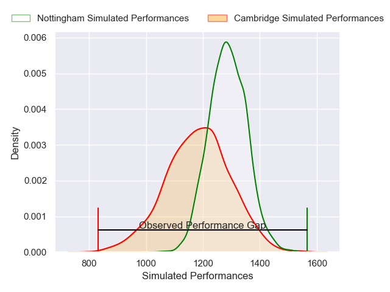
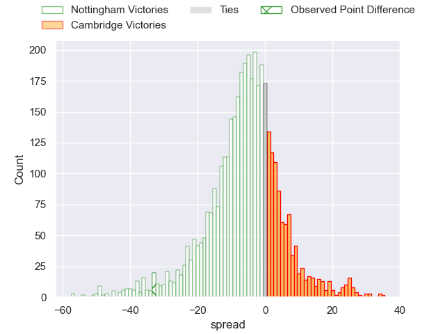
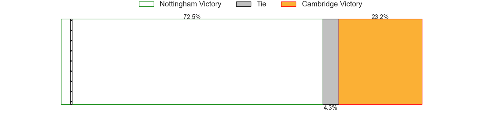
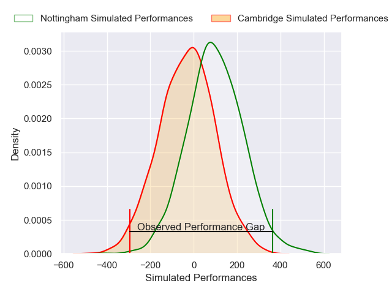
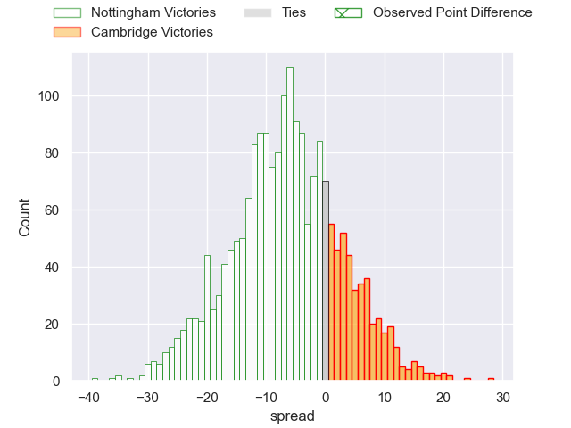
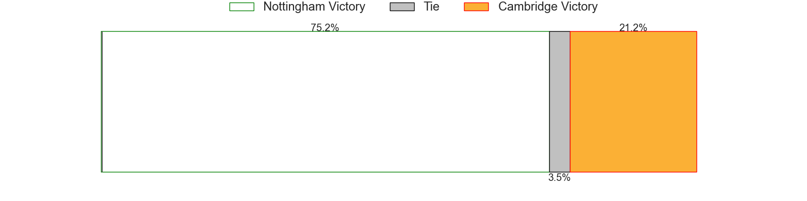

---  
layout: page  
title: Nottingham at Cambridge; 43-10  
date: 2024-12-07 18:00:00 -0500  
categories: "RFU Championship 2024" match review  
---
# Nottingham at Cambridge; 43-10

# Club Level Predictions

The first set of predictions treats a club as the smallest object, as the club develops its members, organizes a gameplan, and deploys its players as needed for each match. This club model has a prediction of 0.356, which translates to predicting Nottingham to win by 5.3.

Our Over/Under is 54.5 - and combined with the spread above, we have a predicted scoreline of 30 to 24

Each club has a rating and a rating deviation (similar to a Glicko rating), and expected performances can be generated. This allows for simulated matches and spreads like the ones below.
## Projected Performances - Club Model

## Projected Spreads - Club Model

## Projected Results - Club Model

# Player Level Predictions

Treating teams instead as an entity made up of the currently active players, I have ratings for each player in an altogether different system. These can be combined to form team ratings once teamsheets are announced, weighting starters a bit higher than the reserves. After the match is played, players can be weighted by their minutes on the field, allowing for an accurate measure of the team's composition. With these compiled team ratings, we can make predictions, measure inaccuracy, and update the individual player ratings.
## Prediction without Player Minutes: Nottingham by 7.2

Nottingham by 9.7 on a neutral pitch

## Projected Performances - Player Model

## Projected Spreads - Player Model

## Projected Results - Player Model

|   Away Minutes | Away Player          |   Away Percentile |   Number |   Home Percentile | Home Player          |   Home Minutes |
|---------------:|:---------------------|------------------:|---------:|------------------:|:---------------------|---------------:|
|             16 | Kai Owen             |             42.41 |        1 |             31.49 | Sebastian Brownhill  |             80 |
|             16 | Jack Dickinson       |             67.8  |        2 |             10.17 | Benjamin Brownlie    |             80 |
|             32 | Ale Loman            |             84.76 |        3 |             16.9  | Billy Walker         |             80 |
|             80 | Jack Shine           |             75.31 |        4 |             12.7  | George Bretag-Norris |             80 |
|             80 | Sebastien Ferreira   |              8.55 |        5 |             19.66 | Iestyn Rees          |             80 |
|             60 | Sam Green            |             31.77 |        6 |             33.56 | Kayde Sylvester      |             71 |
|             80 | Jacob Wright         |             54.09 |        7 |              8.69 | Ben Adams            |             80 |
|             64 | James Cherry         |             83.07 |        8 |             16.58 | Jack Bartlett        |             70 |
|             80 | Will Yarnell         |             63.53 |        9 |             64.18 | Ruaridh Dawson       |             10 |
|             48 | Gwyn Parks           |             12.85 |       10 |             13.65 | Louis Grimoldby      |              9 |
|             80 | Harry Graham         |             79.62 |       11 |             35.4  | William Glister      |             14 |
|             80 | Kegan Christian-Goss |             71.82 |       12 |             11.56 | Matthew Hema         |             80 |
|             66 | Jack Stapley         |              2.14 |       13 |              1.55 | Sam Hanks            |             55 |
|             29 | David Williams       |             50.65 |       14 |             22.99 | Josef Green          |             55 |
|             14 | Ryan Olowofela       |             68.34 |       15 |              2.98 | Elias Caven          |             80 |
|             80 | Harry Clayton        |             85.52 |       16 |            nan    | Ollie Scola          |             80 |
|             80 | Dan Richardson       |             80.55 |       17 |              7.4  | Morgan Veness        |             48 |
|             68 | Lewis Chessum        |            nan    |       18 |              8.77 | Jared Cardew         |             20 |
|             58 | Charlie Bemand       |            nan    |       19 |             34.4  | Archie Benson        |             78 |
|             80 | Jai Johal            |             60.44 |       20 |            nan    | Jimmy Thompson       |             75 |
|            nan | nan                  |            nan    |       21 |             13.04 | Joseph Tarrant       |             12 |
|            nan | nan                  |            nan    |       22 |             17.55 | Josh Skelcey         |             40 |

