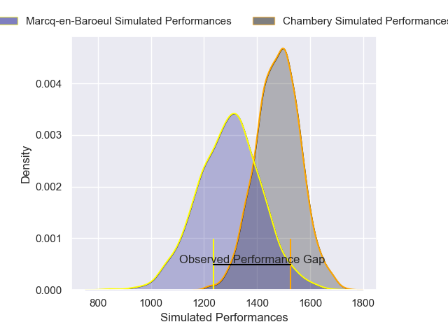
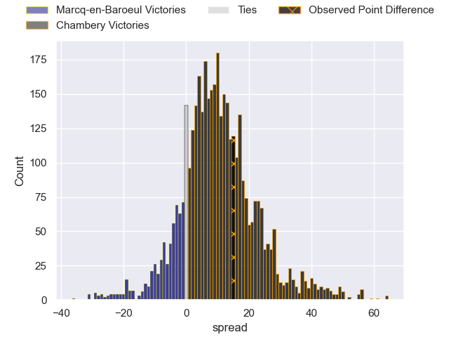
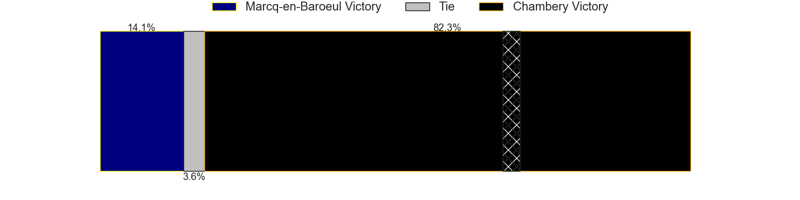
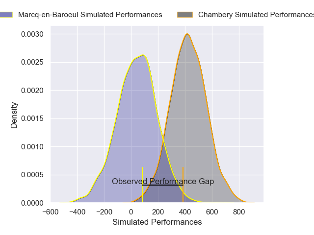
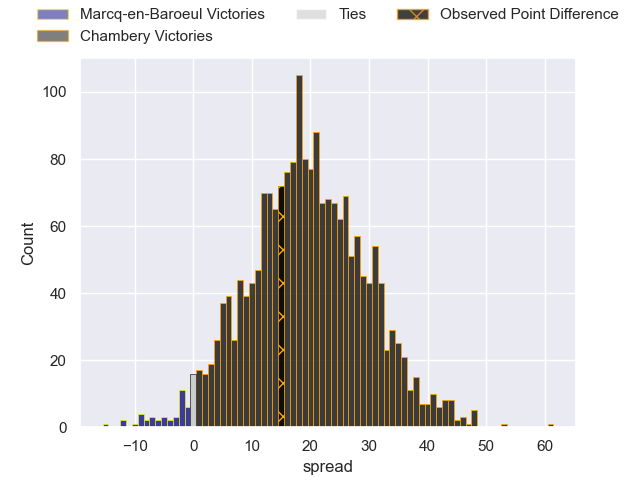
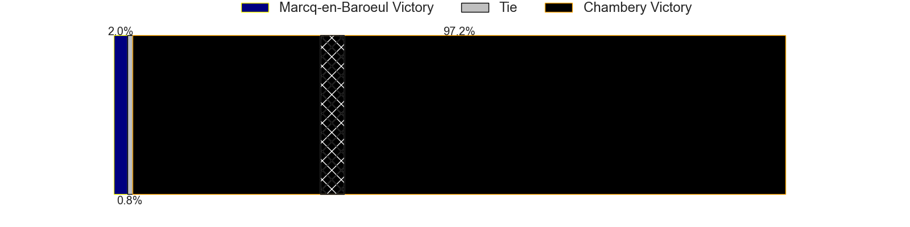

---  
layout: page  
title: Marcq-en-Baroeul at Chambery; 6-21  
date: 2024-12-07 18:00:00 -0500  
categories: "Nationale 2024" match review  
---
# Marcq-en-Baroeul at Chambery; 6-21

# Club Level Predictions

The first set of predictions treats a club as the smallest object, as the club develops its members, organizes a gameplan, and deploys its players as needed for each match. This club model has a prediction of 0.729, which translates to predicting Chambery to win by 9.2.

Our Over/Under is 36.5 - and combined with the spread above, we have a predicted scoreline of 13 to 23

Each club has a rating and a rating deviation (similar to a Glicko rating), and expected performances can be generated. This allows for simulated matches and spreads like the ones below.
## Projected Performances - Club Model

## Projected Spreads - Club Model

## Projected Results - Club Model

# Player Level Predictions

Treating teams instead as an entity made up of the currently active players, I have ratings for each player in an altogether different system. These can be combined to form team ratings once teamsheets are announced, weighting starters a bit higher than the reserves. After the match is played, players can be weighted by their minutes on the field, allowing for an accurate measure of the team's composition. With these compiled team ratings, we can make predictions, measure inaccuracy, and update the individual player ratings.
## Prediction without Player Minutes: Chambery by 19.1

Chambery by 15.6 on a neutral pitch

## Projected Performances - Player Model

## Projected Spreads - Player Model

## Projected Results - Player Model

|   Away Minutes | Away Player                  |   Away Percentile |   Number |   Home Percentile | Home Player          |   Home Minutes |
|---------------:|:-----------------------------|------------------:|---------:|------------------:|:---------------------|---------------:|
|             80 | Charles-Édouard Ekwah Elimby |             28.11 |        1 |             77.7  | Enzo Segui           |             64 |
|             80 | Joseph Reynaud               |             66.56 |        2 |             94.45 | Yan Tabarot          |             80 |
|             80 | Lewys Jones                  |             66.01 |        3 |             52.37 | Osman Dimen          |             30 |
|             80 | Lucio Anconetani             |             36.16 |        4 |             55.2  | Fabien Witz          |             80 |
|             80 | Maselino Paulino             |              1.41 |        5 |             55.03 | Corentin Astier      |             80 |
|             80 | Thomas Simonet               |             32.54 |        6 |             93.1  | Jean-Baptiste Grenod |             63 |
|             80 | Cedric Yonkeu                |             35.35 |        7 |             88.67 | Matheo Triki         |             26 |
|             80 | Maxime Danton                |             67.56 |        8 |             60.78 | Taniela Matakaiongo  |             58 |
|             33 | Dylan Nocete                 |             50.24 |        9 |             63.05 | Mateo Guerret        |             40 |
|             80 | Paul Decavel                 |             39.36 |       10 |             52.01 | Thibault Moreno      |             70 |
|             34 | Mathias Ortiz                |             54.02 |       11 |             70.57 | Arthur Nennig        |             25 |
|             12 | Louis Decavel                |             54.81 |       12 |             83.97 | Bastien Reymond      |             12 |
|             56 | Hugo Detre                   |             11.66 |       13 |             45    | Maewen Sao           |             80 |
|             22 | Dany Antunes                 |             14.56 |       14 |             82.3  | Paul Altier          |             52 |
|             22 | Dany Antunes                 |             14.56 |       14 |             82.3  | Paul Altier          |             80 |
|             61 | Clement Unique               |             41.71 |       15 |             66.85 | Thomas Hecquet       |             47 |
|             80 | Eli Serra-Miglietti          |             25.39 |       16 |             81.61 | Lasha Tabidze        |             80 |
|             80 | Mark Erasmus                 |             37.41 |       17 |             63.46 | Joseph Exshaw        |             80 |
|             68 | Victor-Fy Balas Burel        |             39.98 |       18 |             60.45 | Youenn Floch         |             80 |
|             80 | Arthur Bruges                |             65.42 |       19 |             75.38 | Colin Lebian         |             56 |
|             52 | Nino Maso                    |             45.15 |       20 |             63.13 | Enzo Marzocca        |             56 |
|             54 | Aurélien Carvalho            |             57.75 |       21 |             88.67 | Nugzar Somkhishvili  |             49 |
|             80 | Geoffrey Cazanave            |             25.93 |       22 |            nan    | Alessio Caiolo       |             60 |
|             80 | Mateo Saint-Germain          |             22.65 |       23 |             53.75 | Pierre-Nicolas Dance |             24 |

