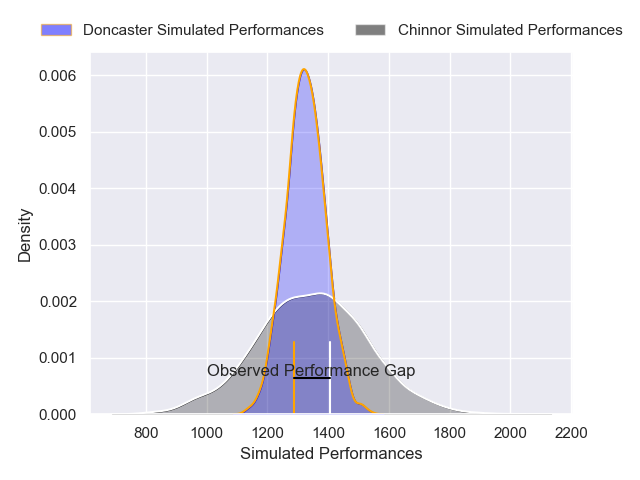
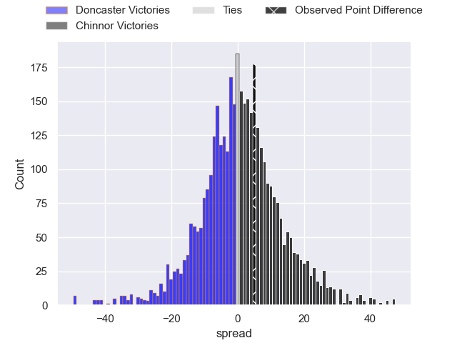
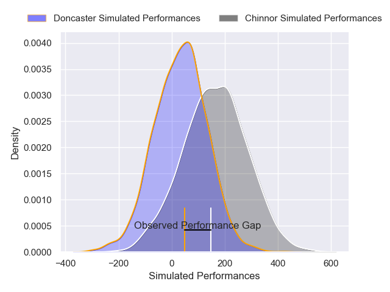
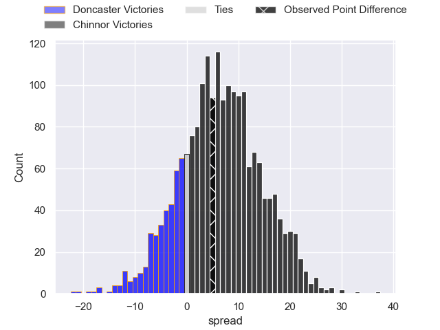

---  
layout: page  
title: Doncaster at Chinnor; 13-18  
date: 2024-12-07 18:00:00 -0500  
categories: "RFU Championship 2024" match review  
---
# Doncaster at Chinnor; 13-18

# Club Level Predictions

The first set of predictions treats a club as the smallest object, as the club develops its members, organizes a gameplan, and deploys its players as needed for each match. This club model has a prediction of 0.527, which translates to predicting Chinnor to win by 1.0.

Our Over/Under is 60.5 - and combined with the spread above, we have a predicted scoreline of 30 to 31

Each club has a rating and a rating deviation (similar to a Glicko rating), and expected performances can be generated. This allows for simulated matches and spreads like the ones below.
## Projected Performances - Club Model

## Projected Spreads - Club Model

## Projected Results - Club Model

# Player Level Predictions

Treating teams instead as an entity made up of the currently active players, I have ratings for each player in an altogether different system. These can be combined to form team ratings once teamsheets are announced, weighting starters a bit higher than the reserves. After the match is played, players can be weighted by their minutes on the field, allowing for an accurate measure of the team's composition. With these compiled team ratings, we can make predictions, measure inaccuracy, and update the individual player ratings.
## Prediction without Player Minutes: Chinnor by 2.8

Chinnor by 0.6 on a neutral pitch

## Projected Performances - Player Model

## Projected Spreads - Player Model

## Projected Results - Player Model

|   Away Minutes | Away Player       |   Away Percentile |   Number |   Home Percentile | Home Player           |   Home Minutes |
|---------------:|:------------------|------------------:|---------:|------------------:|:----------------------|---------------:|
|             53 | Andrew Turner     |             48.75 |        1 |             33.11 | Keston Lines          |             17 |
|             80 | George Roberts    |             16.59 |        2 |             95.59 | Alun Walker           |             27 |
|             80 | Joe Jones         |             55.77 |        3 |             48.26 | Rob Hardwick          |             80 |
|             80 | Ben Murphy        |              8.21 |        4 |             13.92 | Scott Hall            |             34 |
|             14 | Josh Williams     |             78.39 |        5 |             40.62 | Alfie North           |             80 |
|             29 | Thom Smith        |              7.55 |        6 |             63.04 | Harry Dugmore         |             80 |
|             80 | Rhys Tait         |             41.6  |        7 |             46.74 | George Richard Stokes |             80 |
|             29 | Morgan Strong     |             81.57 |        8 |             72.7  | Willie Ryan           |             80 |
|             80 | Alex Dolly        |             70.95 |        9 |             89.57 | Luke Carter           |             80 |
|             27 | Russell Bennett   |             90.64 |       10 |             75.1  | George Worboys        |             35 |
|             73 | Jordan Olowofela  |             32.51 |       11 |             47.26 | Kieran Goss           |             80 |
|             67 | Connor Edwards    |              6.18 |       12 |             31.4  | Epi Rokodrava         |             80 |
|             27 | Zach Kerr         |             28.5  |       13 |             32.85 | Grant Hughes          |             66 |
|              8 | Semesa Rokoduguni |             89.03 |       14 |             39.31 | Ryan Crowley          |             63 |
|             27 | Telusa Veainu     |             99.09 |       15 |             28.7  | William Feeney        |             80 |
|             27 | Archie Smeaton    |             24.87 |       16 |             45.89 | Charlie Irvine        |             80 |
|            nan | nan               |            nan    |       17 |            nan    | Will Cave             |              5 |

