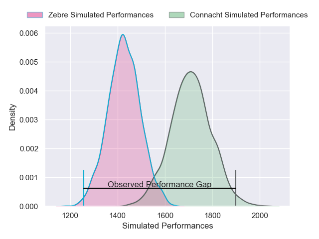
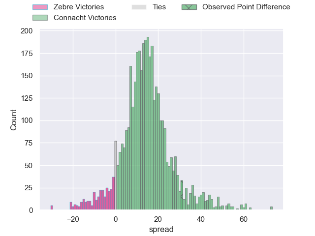
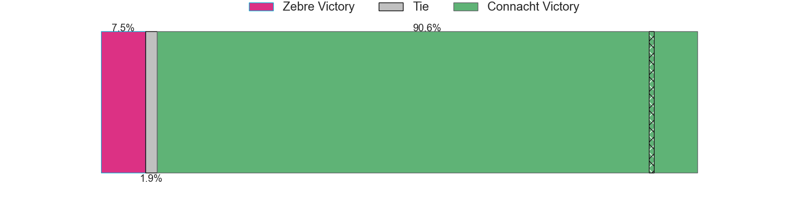
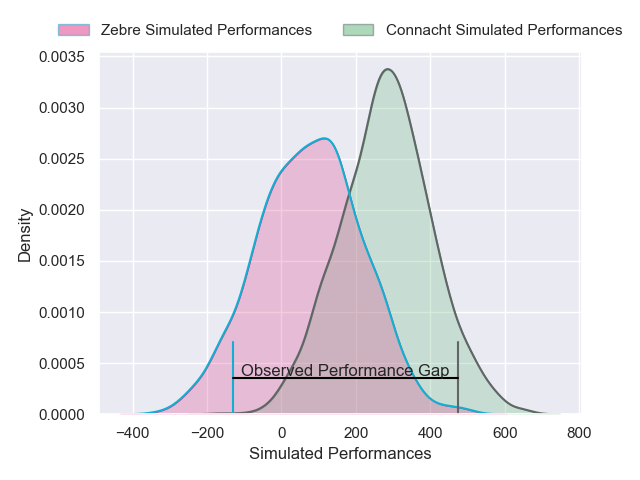
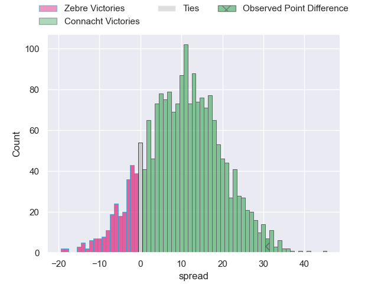
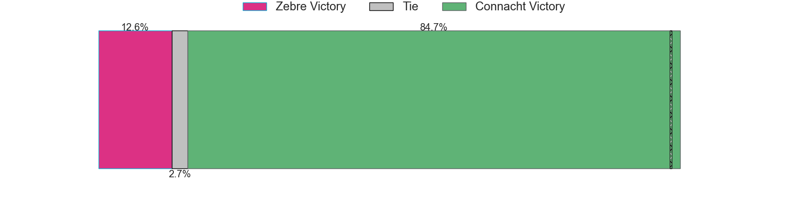

---  
layout: page  
title: Zebre at Connacht; 12-43  
date: 2024-12-07 18:00:00 -0500  
categories: "European Rugby Challenge Cup 2024" match review  
---
# Zebre at Connacht; 12-43

# Club Level Predictions

The first set of predictions treats a club as the smallest object, as the club develops its members, organizes a gameplan, and deploys its players as needed for each match. This club model has a prediction of 0.831, which translates to predicting Connacht to win by 14.2.

Our Over/Under is 49.5 - and combined with the spread above, we have a predicted scoreline of 18 to 32

Each club has a rating and a rating deviation (similar to a Glicko rating), and expected performances can be generated. This allows for simulated matches and spreads like the ones below.
## Projected Performances - Club Model

## Projected Spreads - Club Model

## Projected Results - Club Model

# Player Level Predictions

Treating teams instead as an entity made up of the currently active players, I have ratings for each player in an altogether different system. These can be combined to form team ratings once teamsheets are announced, weighting starters a bit higher than the reserves. After the match is played, players can be weighted by their minutes on the field, allowing for an accurate measure of the team's composition. With these compiled team ratings, we can make predictions, measure inaccuracy, and update the individual player ratings.
## Prediction without Player Minutes: Connacht by 11.0

Connacht by 2.6 on a neutral pitch

## Projected Performances - Player Model

## Projected Spreads - Player Model

## Projected Results - Player Model

|   Away Minutes | Away Player         |   Away Percentile |   Number |   Home Percentile | Home Player           |   Home Minutes |
|---------------:|:--------------------|------------------:|---------:|------------------:|:----------------------|---------------:|
|             81 | Paolo Buonfiglio    |             36.6  |        1 |             47.39 | Jordan Duggan         |             82 |
|             81 | Luca Bigi           |             78.27 |        2 |             16.8  | Dylan Tierney-Martin  |             82 |
|             81 | Muhamed Hasa        |             25.44 |        3 |             32.68 | Jack Aungier          |             21 |
|             57 | Matteo Canali       |             94.8  |        4 |             33.33 | Darragh Murray        |             45 |
|             81 | Leonard Krumov      |              9.52 |        5 |             60.14 | Oisin Dowling         |             15 |
|             82 | Giacomo Milano      |             52.47 |        6 |             91.48 | Josh Murphy           |             81 |
|             24 | Bautista Stavile    |             27.34 |        7 |             45.74 | Shamus Hurley-Langton |             12 |
|             82 | Giacomo Ferrari     |             24.78 |        8 |             11.94 | Paul Boyle            |             81 |
|             81 | Thomas Dominguez    |             24.31 |        9 |             38.09 | Caolin Blade          |             57 |
|             81 | Giacomo Da Re       |             15.26 |       10 |             93.98 | Jack Carty            |             57 |
|             81 | Simone Gesi         |             22.45 |       11 |             95.63 | Santiago Cordero      |             81 |
|             60 | Enrico Lucchin      |             54.91 |       12 |              2.72 | Cathal Forde          |             81 |
|             24 | Filippo Drago       |             28.67 |       13 |             47.42 | David Hawkshaw        |             51 |
|             54 | Filippo Bozzoni     |             40.77 |       14 |             57.78 | Chay Mullins          |             82 |
|             66 | Giovanni Montemauri |              6.89 |       15 |             66.48 | Shane Jennings        |             81 |
|              7 | Giampietro Ribaldi  |             27.58 |       16 |            nan    | Eoin de Buitlear      |             27 |
|             60 | Luca Rizzoli        |             76.39 |       17 |            nan    | Temi Lasisi           |             22 |
|             75 | Matteo Nocera       |             21.89 |       18 |            nan    | Fiachna Barrett       |             53 |
|             35 | Rusiate Nasove      |            nan    |       19 |            nan    | David O'Connor        |             58 |
|             47 | Luca Andreani       |            nan    |       20 |            nan    | Oisin McCormack       |              0 |
|             82 | Alessandro Fusco    |              8.59 |       21 |             50.08 | Matthew Devine        |             69 |
|             35 | Iacopo Bianchi      |             11.75 |       22 |            nan    | Sean Naughton         |             59 |
|             29 | Scott Gregory       |             68.22 |       23 |             12.34 | Byron Ralston         |             81 |

