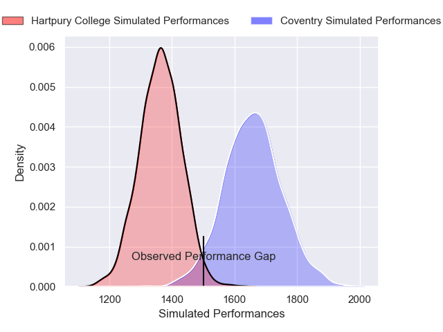
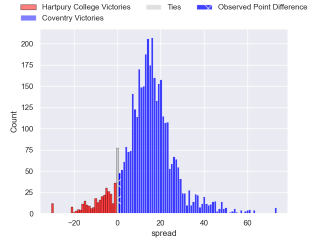
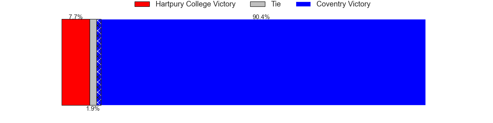
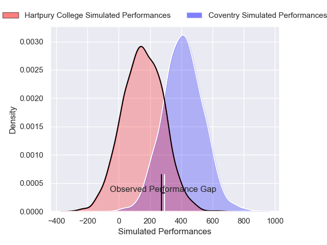
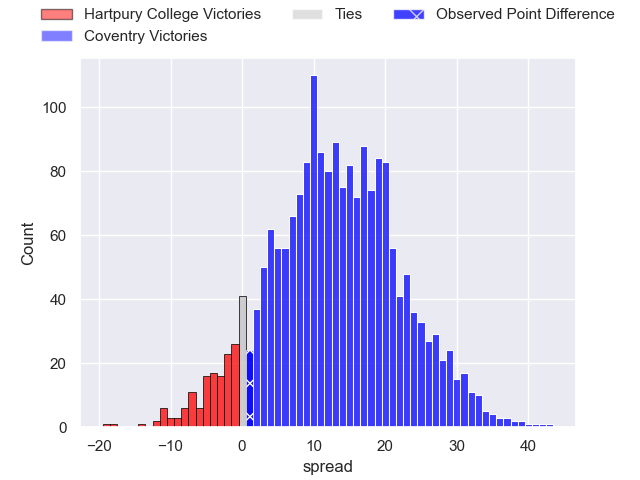
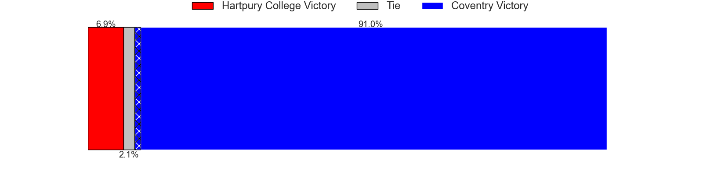

---  
layout: page  
title: Hartpury College at Coventry; 13-14  
date: 2024-12-07 18:00:00 -0500  
categories: "RFU Championship 2024" match review  
---
# Hartpury College at Coventry; 13-14

# Club Level Predictions

The first set of predictions treats a club as the smallest object, as the club develops its members, organizes a gameplan, and deploys its players as needed for each match. This club model has a prediction of 0.839, which translates to predicting Coventry to win by 14.6.

Our Over/Under is 46.5 - and combined with the spread above, we have a predicted scoreline of 16 to 30

Each club has a rating and a rating deviation (similar to a Glicko rating), and expected performances can be generated. This allows for simulated matches and spreads like the ones below.
## Projected Performances - Club Model

## Projected Spreads - Club Model

## Projected Results - Club Model

# Player Level Predictions

Treating teams instead as an entity made up of the currently active players, I have ratings for each player in an altogether different system. These can be combined to form team ratings once teamsheets are announced, weighting starters a bit higher than the reserves. After the match is played, players can be weighted by their minutes on the field, allowing for an accurate measure of the team's composition. With these compiled team ratings, we can make predictions, measure inaccuracy, and update the individual player ratings.
## Prediction without Player Minutes: Coventry by 18.3

Coventry by 14.7 on a neutral pitch

## Projected Performances - Player Model

## Projected Spreads - Player Model

## Projected Results - Player Model

|   Away Minutes | Away Player           |   Away Percentile |   Number |   Home Percentile | Home Player          |   Home Minutes |
|---------------:|:----------------------|------------------:|---------:|------------------:|:---------------------|---------------:|
|             80 | Aristot Benz-Salomon  |             83.29 |        1 |             88.05 | Toby Trinder         |             80 |
|             66 | Ethan Hunt            |             65.44 |        2 |             90.63 | Jordon Poole         |             80 |
|             80 | Jonathan Benz-Salomon |             79.37 |        3 |             84.24 | Matt Johnson         |             75 |
|             80 | Cameron Cobbett       |             27.63 |        4 |             89.83 | James Tyas           |             80 |
|             51 | Jack Davies           |             77.93 |        5 |             86.62 | Obinna Nkwocha       |             15 |
|             80 | Samuel Lewis          |             45.64 |        6 |             76.32 | Matt Kvesic          |             58 |
|             80 | Harry Short           |             78.55 |        7 |             43.85 | Aaron Hinkley        |             65 |
|             80 | Tom Cowan             |             84.71 |        8 |             99.82 | Senitiki Nayalo      |             18 |
|             80 | Michael Austin        |             60.9  |        9 |             79.81 | Josh Barton          |             73 |
|             80 | Harry Bazalgette      |             86.97 |       10 |             68.94 | Tommy Mathews        |             80 |
|             62 | Jack Johnson          |             71.86 |       11 |             94.65 | James Martin         |             18 |
|             80 | Robbie Smith          |             17.51 |       12 |             80.7  | Thomas Hitchcock     |             49 |
|             80 | Josiah Edwards-Giraud |             58.47 |       13 |             49.72 | Dafydd-Rhys Tiueti   |             75 |
|             80 | Oliver Holliday       |             44.81 |       14 |             83.26 | Ryan Hutler          |             81 |
|             58 | Alex Morgan           |             56.41 |       15 |             40.66 | Liam Richman         |             80 |
|             55 | Archie McArthur       |             49.76 |       16 |             28.66 | Jevaughn Warren      |             80 |
|             14 | William Crane         |             38.4  |       17 |            nan    | Will Biggs           |             80 |
|              5 | Joe Rees              |             12.72 |       18 |             35.02 | Eliot Salt           |             80 |
|             14 | Dale Lemon            |             59.51 |       19 |             27.8  | Rhys Anstey          |             10 |
|              5 | Haari Beddall         |             28.12 |       20 |             64.46 | Chester Owen         |             10 |
|             14 | Rory Taylor           |             78.56 |       21 |             77.9  | Daniel Okeke         |             10 |
|            nan | nan                   |            nan    |       22 |             75.64 | Will Lane            |             62 |
|            nan | nan                   |            nan    |       23 |             26.43 | David Opoku-Fordjour |             20 |

