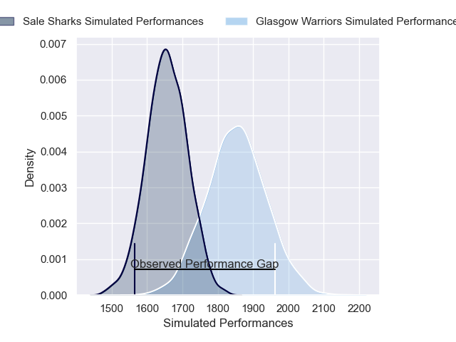
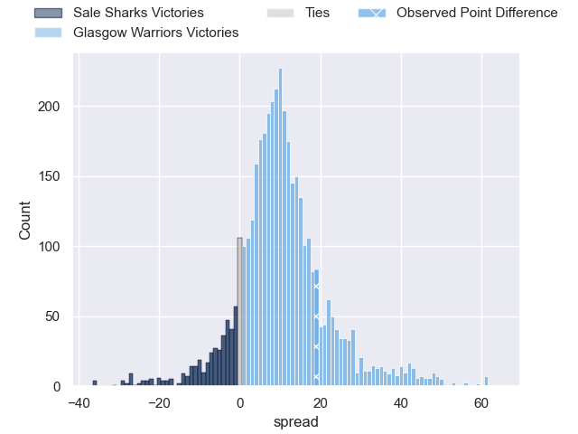
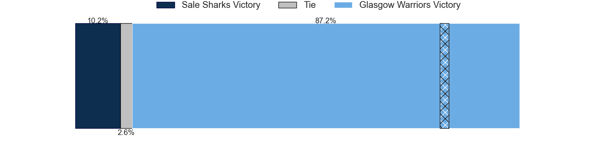
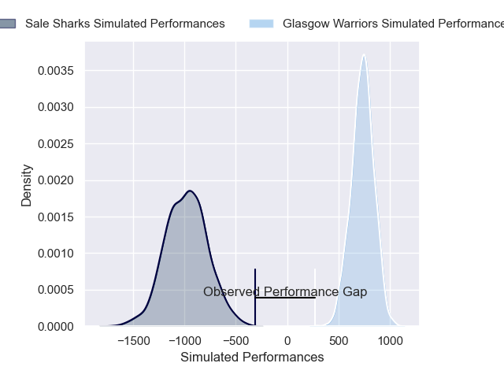
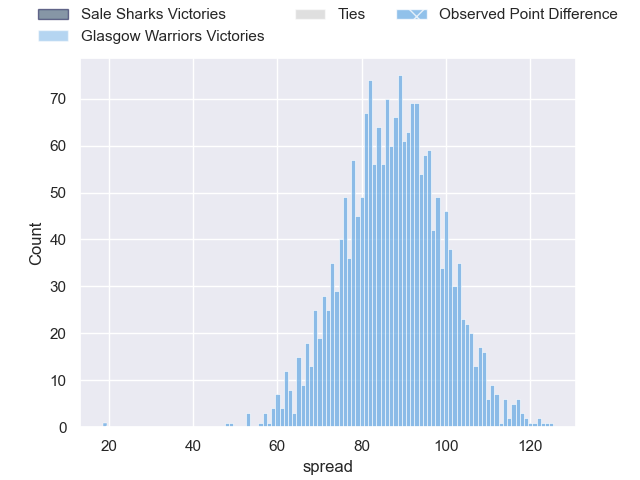

---  
layout: page  
title: Sale Sharks at Glasgow Warriors; 19-38  
date: 2024-12-07 18:00:00 -0500  
categories: "European Rugby Champions Cup 2024" match review  
---
# Sale Sharks at Glasgow Warriors; 19-38

# Club Level Predictions

The first set of predictions treats a club as the smallest object, as the club develops its members, organizes a gameplan, and deploys its players as needed for each match. This club model has a prediction of 0.75, which translates to predicting Glasgow Warriors to win by 9.7.

Our Over/Under is 34.5 - and combined with the spread above, we have a predicted scoreline of 12 to 22

Each club has a rating and a rating deviation (similar to a Glicko rating), and expected performances can be generated. This allows for simulated matches and spreads like the ones below.
## Projected Performances - Club Model

## Projected Spreads - Club Model

## Projected Results - Club Model

# Player Level Predictions

Treating teams instead as an entity made up of the currently active players, I have ratings for each player in an altogether different system. These can be combined to form team ratings once teamsheets are announced, weighting starters a bit higher than the reserves. After the match is played, players can be weighted by their minutes on the field, allowing for an accurate measure of the team's composition. With these compiled team ratings, we can make predictions, measure inaccuracy, and update the individual player ratings.
## Prediction without Player Minutes: Glasgow Warriors by 61.6

Glasgow Warriors by 52.0 on a neutral pitch

## Projected Performances - Player Model

## Projected Spreads - Player Model

## Projected Results - Player Model

|   Away Minutes | Away Player          |   Away Percentile |   Number |   Home Percentile | Home Player           |   Home Minutes |
|---------------:|:---------------------|------------------:|---------:|------------------:|:----------------------|---------------:|
|             82 | Bevan Rodd           |             89.21 |        1 |             90.98 | Jamie Bhatti          |             27 |
|             60 | Tadgh McElroy        |             61.33 |        2 |             72.57 | Gregor Hiddleston     |             73 |
|             64 | Asher Opoku-Fordjour |             83.69 |        3 |             91.93 | Zander Fagerson       |             81 |
|             82 | Ernst van Rhyn       |             85.01 |        4 |             31.75 | Olujare Oguntibeju    |             81 |
|             18 | Hyron Andrews        |             18.08 |        5 |             99.56 | Scott Cummings        |             81 |
|             21 | Jean-Luc du Preez    |             98.72 |        6 |             96.51 | Matt Fagerson         |             67 |
|             49 | Tom Curry            |            100    |        7 |             93.95 | Rory Darge            |              8 |
|             21 | Tom Curry            |            100    |        7 |             93.95 | Rory Darge            |              8 |
|             80 | Tom Curry            |            100    |        7 |             93.95 | Rory Darge            |              8 |
|             81 | Tom Curry            |            100    |        7 |             93.95 | Rory Darge            |              8 |
|             81 | Daniel du Preez      |             89.66 |        8 |             98.22 | Henco Venter          |             55 |
|             22 | Gus Warr             |             70.34 |        9 |             99.84 | George Horne          |             81 |
|             61 | Robert du Preez      |             51.81 |       10 |             61.45 | Tom Jordan            |             60 |
|             36 | Arron Reed           |             75.17 |       11 |             89.27 | Kyle Rowe             |             14 |
|             46 | Arron Reed           |             75.17 |       11 |             89.27 | Kyle Rowe             |             14 |
|             66 | Arron Reed           |             75.17 |       11 |             89.27 | Kyle Rowe             |             14 |
|             18 | Arron Reed           |             75.17 |       11 |             89.27 | Kyle Rowe             |             14 |
|             61 | Sam Bedlow           |              0.97 |       12 |             90.96 | Sione Tuipulotu       |             81 |
|             81 | Sam Bedlow           |              0.97 |       12 |             90.96 | Sione Tuipulotu       |             81 |
|             52 | Sam Bedlow           |              0.97 |       12 |             90.96 | Sione Tuipulotu       |             81 |
|             50 | Luke James           |             72.3  |       13 |             81.73 | Huw Jones             |             63 |
|             23 | Will Addison         |             82.91 |       14 |             98.62 | Sebastian Cancelliere |             22 |
|              0 | Joe Carpenter        |             97.58 |       15 |             81.19 | Josh McKay            |             24 |
|             81 | Joe Carpenter        |             97.58 |       15 |             81.19 | Josh McKay            |             24 |
|             67 | Joe Carpenter        |             97.58 |       15 |             81.19 | Josh McKay            |             24 |
|             60 | Harry Thompson       |            nan    |       16 |             73.5  | Johnny Matthews       |             27 |
|             60 | Simon McIntyre       |             86.3  |       17 |             74.91 | Rory Sutherland       |             52 |
|             82 | James Harper         |             20.82 |       18 |             64.18 | Sam Talakai           |             40 |
|             60 | Ben Bamber           |              5.2  |       19 |             78.92 | Alex Samuel           |             52 |
|             35 | Jonny Hill           |             13.76 |       20 |             41.6  | Angus Fraser          |             10 |
|             82 | Raffi Quirke         |             75.69 |       21 |            nan    | Jack Mann             |             20 |
|             22 | Tom Curtis           |            nan    |       22 |             93.84 | Jamie Dobie           |             81 |
|             14 | Sam Dugdale          |              8.6  |       23 |             82.93 | Duncan Weir           |             28 |

