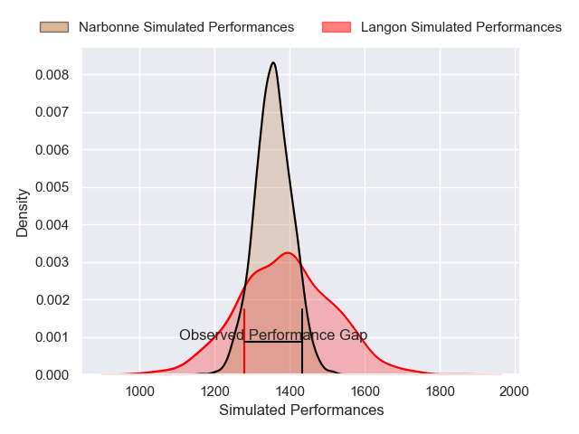
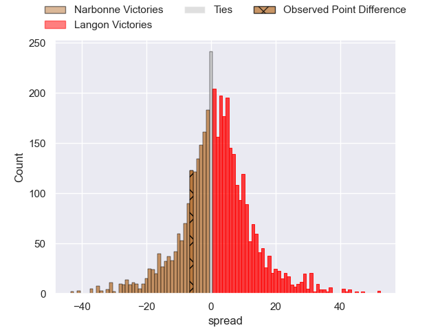
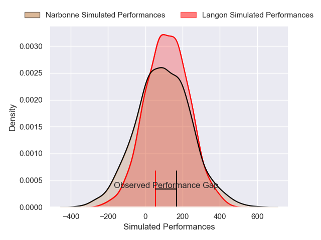
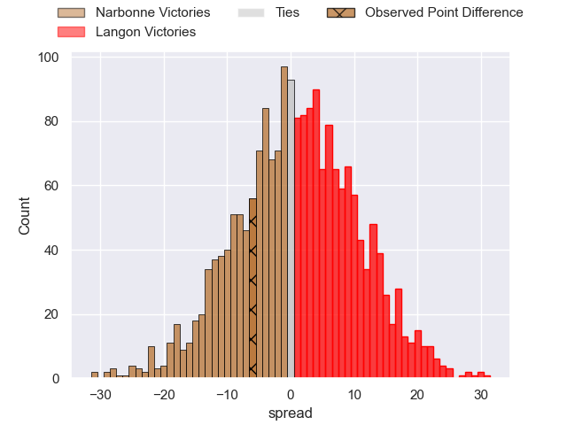
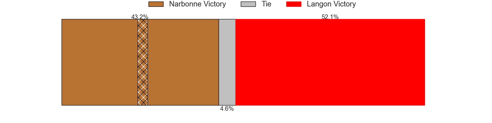

---  
layout: page  
title: Narbonne at Langon; 20-14  
date: 2024-12-07 18:00:00 -0500  
categories: "Nationale 2024" match review  
---
# Narbonne at Langon; 20-14

# Club Level Predictions

The first set of predictions treats a club as the smallest object, as the club develops its members, organizes a gameplan, and deploys its players as needed for each match. This club model has a prediction of 0.541, which translates to predicting Langon to win by 1.4.

Our Over/Under is 37.5 - and combined with the spread above, we have a predicted scoreline of 18 to 20

Each club has a rating and a rating deviation (similar to a Glicko rating), and expected performances can be generated. This allows for simulated matches and spreads like the ones below.
## Projected Performances - Club Model

## Projected Spreads - Club Model

## Projected Results - Club Model

# Player Level Predictions

Treating teams instead as an entity made up of the currently active players, I have ratings for each player in an altogether different system. These can be combined to form team ratings once teamsheets are announced, weighting starters a bit higher than the reserves. After the match is played, players can be weighted by their minutes on the field, allowing for an accurate measure of the team's composition. With these compiled team ratings, we can make predictions, measure inaccuracy, and update the individual player ratings.
## Prediction without Player Minutes: Langon by 1.7

Narbonne by 0.6 on a neutral pitch

## Projected Performances - Player Model

## Projected Spreads - Player Model

## Projected Results - Player Model

|   Away Minutes | Away Player               |   Away Percentile |   Number |   Home Percentile | Home Player                    |   Home Minutes |
|---------------:|:--------------------------|------------------:|---------:|------------------:|:-------------------------------|---------------:|
|             49 | Gregory Fichten           |             20.93 |        1 |             48.34 | Lucas Hernandez                |             35 |
|             80 | Gabriel Atlan             |             74.19 |        2 |              7.68 | Maxime Gau                     |             80 |
|              1 | Jérémy Boyadjis           |             68.19 |        3 |             29.43 | Loïc Clave                     |             31 |
|             45 | Darrell Dyer              |             92.01 |        4 |             36.58 | Thomas Geffré                  |             14 |
|             64 | Leva Fifita               |             13.55 |        5 |             85.58 | Kemueli Lavetanakoroi          |             80 |
|             79 | Thibault Clauzade         |             85.98 |        6 |             56.32 | Meryll Ech Chalka Roumazeilles |             49 |
|             80 | Paul Belzons              |             19.06 |        7 |             52.48 | Thomas Bishop                  |             19 |
|             80 | Charles Malet             |              2.95 |        8 |             31.68 | Thomas Mendy                   |             31 |
|             70 | Pierrick Nova             |             52.4  |        9 |             33.65 | Paul Castera                   |             19 |
|             80 | Gilles Bosch              |             14.43 |       10 |             12.22 | Vincent Debladis               |             56 |
|             80 | Clément Clavières         |             55.43 |       11 |             30.39 | Quentin Lefort                 |             80 |
|             80 | Parataiso Silafai-Lea'ana |             69.96 |       12 |             74.58 | Sionasa Vunisa                 |             35 |
|             56 | Peter Betham              |             98.31 |       13 |             43.97 | Adriu Naiyaga Naivuwai         |              1 |
|             45 | Pierre-Hugo Ducom         |             13.88 |       14 |             74.57 | Thomas Wallraf                 |             56 |
|             80 | Thibault Santoro          |             32.97 |       15 |             39.56 | Nathan Gagnac                  |             80 |
|             80 | Théo Castinel             |             72.71 |       16 |             29.37 | Ratu Nailoma Vatubua           |             80 |
|             80 | Mohammed Loukia           |             22.41 |       17 |             47.16 | Julien Graffouillère           |             64 |
|             56 | Adam Moulahya             |            nan    |       18 |             33.53 | Emiliano Coria Marchetti       |             80 |
|             61 | Marius Antonescu          |             13.73 |       19 |             64.12 | Helmi Mimouna                  |             80 |
|             80 | Dennis Visser             |             41.44 |       20 |             27.37 | Isikili Seva Davetawalu        |             24 |
|             61 | Tom Chauvet               |             32.46 |       21 |              6.08 | Thomas De Molder               |             46 |
|             24 | Pierre Nueno              |             14.03 |       22 |             45.19 | Baptiste Tisne Cardeneau       |             64 |
|             68 | Grégoire Labit            |            nan    |       23 |             36.45 | Baptiste Castanier             |             46 |

