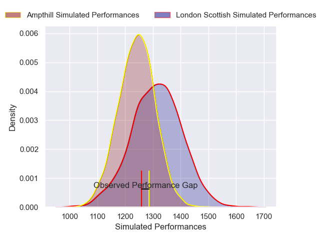
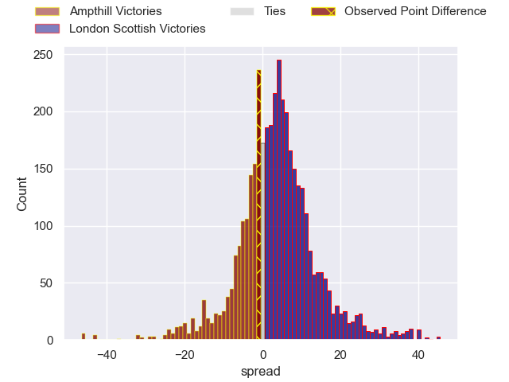
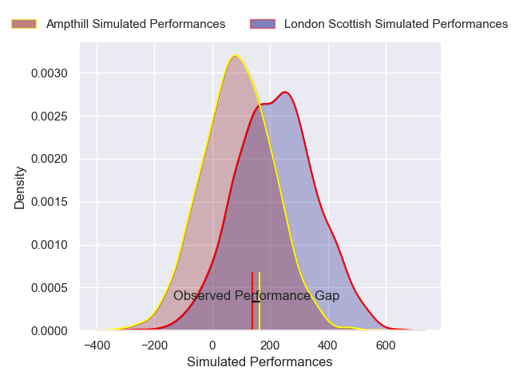
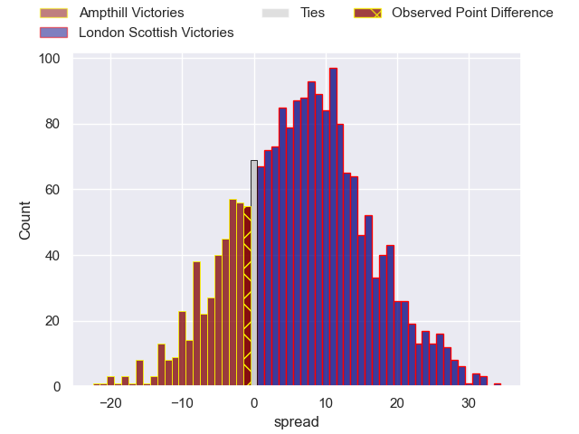

---  
layout: page  
title: Ampthill at London Scottish; 15-14  
date: 2024-12-07 18:00:00 -0500  
categories: "RFU Championship 2024" match review  
---
# Ampthill at London Scottish; 15-14

# Club Level Predictions

The first set of predictions treats a club as the smallest object, as the club develops its members, organizes a gameplan, and deploys its players as needed for each match. This club model has a prediction of 0.598, which translates to predicting London Scottish to win by 3.5.

Our Over/Under is 53.5 - and combined with the spread above, we have a predicted scoreline of 25 to 28

Each club has a rating and a rating deviation (similar to a Glicko rating), and expected performances can be generated. This allows for simulated matches and spreads like the ones below.
## Projected Performances - Club Model

## Projected Spreads - Club Model

## Projected Results - Club Model

# Player Level Predictions

Treating teams instead as an entity made up of the currently active players, I have ratings for each player in an altogether different system. These can be combined to form team ratings once teamsheets are announced, weighting starters a bit higher than the reserves. After the match is played, players can be weighted by their minutes on the field, allowing for an accurate measure of the team's composition. With these compiled team ratings, we can make predictions, measure inaccuracy, and update the individual player ratings.
## Prediction without Player Minutes: London Scottish by 2.9

Ampthill by 1.6 on a neutral pitch

## Projected Performances - Player Model

## Projected Spreads - Player Model

## Projected Results - Player Model

|   Away Minutes | Away Player                 |   Away Percentile |   Number |   Home Percentile | Home Player          |   Home Minutes |
|---------------:|:----------------------------|------------------:|---------:|------------------:|:---------------------|---------------:|
|             80 | Richard Barrington          |             64.08 |        1 |             26.57 | Tom Osborne          |             69 |
|             31 | Luke Thompson               |             43.23 |        2 |             54.03 | Austin Wallis        |             14 |
|             12 | James Johnston              |             20.1  |        3 |             13.19 | Ashley Challenger    |             58 |
|             40 | Kennedy Sylvester           |             51.51 |        4 |             25.67 | Matt Wilkinson       |             58 |
|             47 | Aidan King                  |             28.09 |        5 |             76.84 | Harry Browne         |             80 |
|             65 | Max Eke                     |             50.09 |        6 |             18.18 | Will Trenholm        |             46 |
|             80 | Reggie Hammick              |             60.81 |        7 |             39.62 | Bailey Ransom        |             61 |
|             31 | Nathan Michelow             |             85.39 |        8 |             31.83 | Zach Carr            |             58 |
|              5 | Roan Frostwick              |             22.47 |        9 |             13.32 | Jonny Law            |             80 |
|             80 | Josh Barton                 |             20.32 |       10 |             26.1  | Alexander Lloyd-Seed |             58 |
|             80 | Brandon Jackson-Richards    |             69.73 |       11 |              9.42 | Noah Ferdinand       |             47 |
|             51 | Fraser James Kevin Strachan |             83.57 |       12 |             63.86 | Ben Waghorn          |             80 |
|             62 | Max Clark                   |             87.83 |       13 |             90.43 | Sean Kerr            |             80 |
|             70 | Sione Va'enuku              |             35.68 |       14 |             55.6  | Hayden Hyde          |             65 |
|             65 | Angus Hall                  |             70.93 |       15 |             56.49 | Cameron Anderson     |             80 |
|             60 | Harrison Courtney           |             59.38 |       16 |            nan    | Archie Stanley       |             80 |
|             22 | James Isaacs                |             56.47 |       17 |             36.23 | Calum Scott          |             62 |
|             25 | James Flynn                 |             13.38 |       18 |             33.35 | Caleb Ashworth       |             80 |
|             22 | Lekima Ravuvu               |             25.57 |       19 |             55.32 | Jake Spurway         |             51 |
|             80 | Sid Blackmore               |             30.1  |       20 |             13.72 | Ioan Rhys Davies     |             58 |
|             49 | Rory Morgan                 |             22.15 |       21 |             70.19 | Roma Zheng           |             75 |
|             80 | Evan Mitchell               |             14.26 |       22 |             27.69 | Tom Wilstead         |             75 |
|            nan | nan                         |            nan    |       23 |             84.79 | Will Brown           |             80 |

