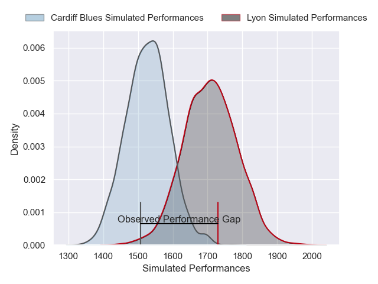
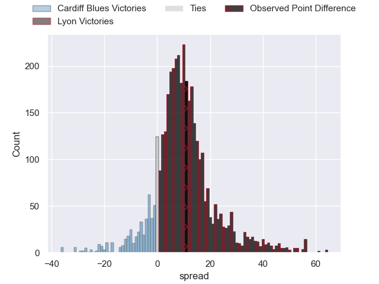
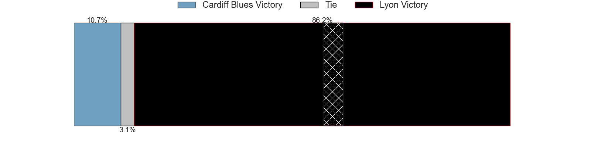
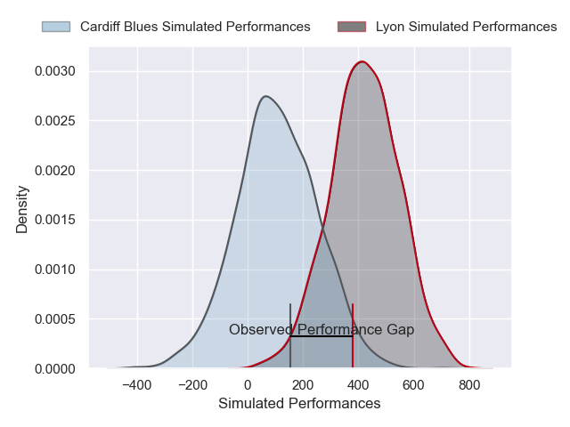
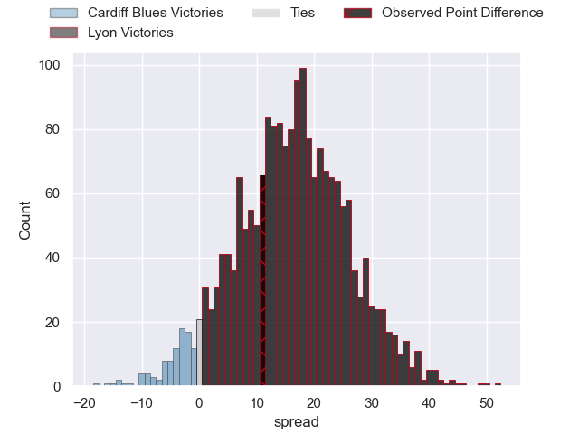
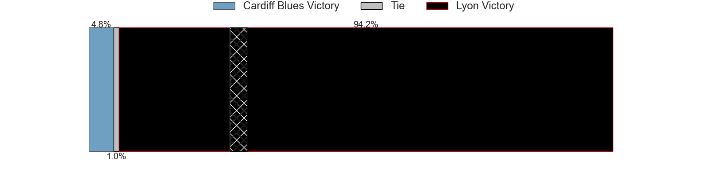

---  
layout: page  
title: Cardiff Blues at Lyon; 26-37  
date: 2024-12-07 18:00:00 -0500  
categories: "European Rugby Challenge Cup 2024" match review  
---
# Cardiff Blues at Lyon; 26-37

# Club Level Predictions

The first set of predictions treats a club as the smallest object, as the club develops its members, organizes a gameplan, and deploys its players as needed for each match. This club model has a prediction of 0.736, which translates to predicting Lyon to win by 9.1.

Our Over/Under is 49.5 - and combined with the spread above, we have a predicted scoreline of 20 to 29

Each club has a rating and a rating deviation (similar to a Glicko rating), and expected performances can be generated. This allows for simulated matches and spreads like the ones below.
## Projected Performances - Club Model

## Projected Spreads - Club Model

## Projected Results - Club Model

# Player Level Predictions

Treating teams instead as an entity made up of the currently active players, I have ratings for each player in an altogether different system. These can be combined to form team ratings once teamsheets are announced, weighting starters a bit higher than the reserves. After the match is played, players can be weighted by their minutes on the field, allowing for an accurate measure of the team's composition. With these compiled team ratings, we can make predictions, measure inaccuracy, and update the individual player ratings.
## Prediction without Player Minutes: Lyon by 14.7

Lyon by 2.2 on a neutral pitch

## Projected Performances - Player Model

## Projected Spreads - Player Model

## Projected Results - Player Model

|   Away Minutes | Away Player        |   Away Percentile |   Number |   Home Percentile | Home Player          |   Home Minutes |
|---------------:|:-------------------|------------------:|---------:|------------------:|:---------------------|---------------:|
|             24 | Danny Southworth   |             41.7  |        1 |             22.36 | Hamza Kaabeche       |             70 |
|             51 | Evan Lloyd         |             11.25 |        2 |             20.65 | Yanis Charcosset     |             81 |
|             82 | Rhys Litterick     |             26.04 |        3 |             57.71 | Cedate Gomes Sa      |             49 |
|             59 | Seb Davies         |             16.67 |        4 |             25.66 | Killian Geraci       |             81 |
|             82 | Teddy Williams     |             12.17 |        5 |             73.72 | Alban Roussel        |             81 |
|             64 | Alex Mann          |             10.48 |        6 |             61.58 | Dylan Cretin         |             68 |
|             64 | Dan Thomas         |             11.93 |        7 |             32.71 | Marvin Okuya         |             22 |
|             81 | Alun Lawrence      |             85.03 |        8 |             14.26 | Maxime Gouzou        |             22 |
|             26 | Ellis Bevan        |             32.9  |        9 |             82.5  | Charlie Cassang      |              7 |
|             81 | Tinus de Beer      |             45.18 |       10 |              3.41 | Martin Meliande      |             21 |
|             81 | Gabriel Hamer-Webb |             82.99 |       11 |             84.29 | Vincent Rattez       |             59 |
|             81 | Steffan Emanuel    |             46.55 |       12 |              4.08 | Josiah Maraku        |             68 |
|             82 | Rey Lee-Lo         |             86.2  |       13 |             62.29 | Alfred Parisien      |             51 |
|             71 | Josh Adams         |             82.76 |       14 |             32.8  | Ethan Dumortier      |             72 |
|             19 | Jacob Beetham      |             16.76 |       15 |             82.5  | Davit Niniashvili    |             81 |
|             19 | Jacob Beetham      |             16.76 |       15 |             82.5  | Davit Niniashvili    |             75 |
|             81 | Dafydd Hughes      |             16.33 |       16 |            nan    | Baptiste Narmand     |             62 |
|             81 | Rhys Barratt       |            nan    |       17 |             24.44 | Jerome Rey           |             49 |
|             61 | Will Davies-King   |             28    |       18 |             30.01 | Jermaine Ainsley     |             22 |
|             81 | Josh McNally       |             78.31 |       19 |             88.77 | Arno Botha           |             49 |
|             13 | Thomas Young       |             86.54 |       20 |             61.32 | Beka Shvangiradze    |             41 |
|             64 | Johan Mulder       |            nan    |       21 |            nan    | Esteban Gonzalez     |             81 |
|             59 | Callum Sheedy      |             88.55 |       22 |             37.43 | Alexandre Tchaptchet |             71 |
|             81 | Harri Millard      |             10.73 |       23 |            nan    | Thibaut Regard       |             59 |

