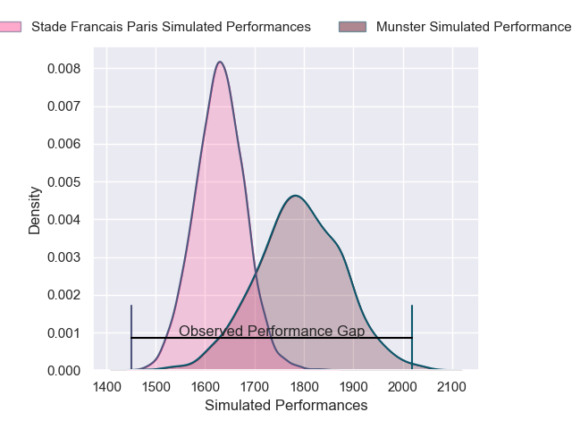
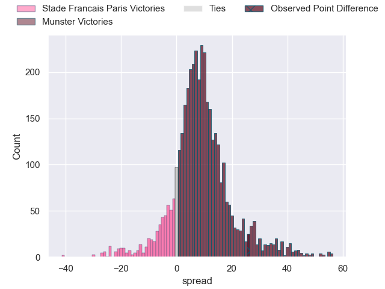
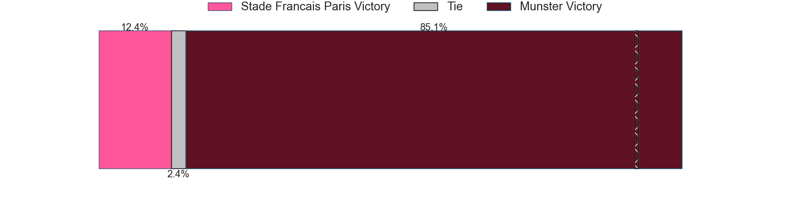
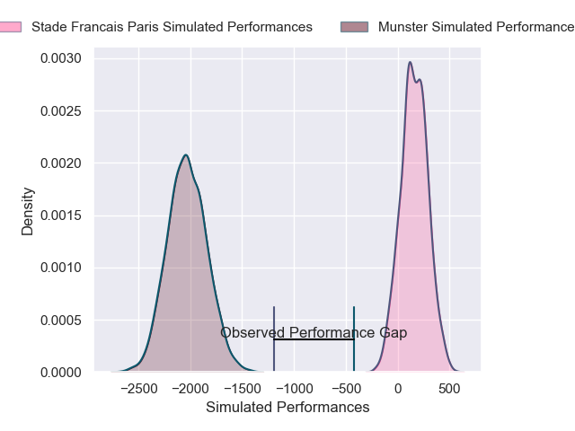
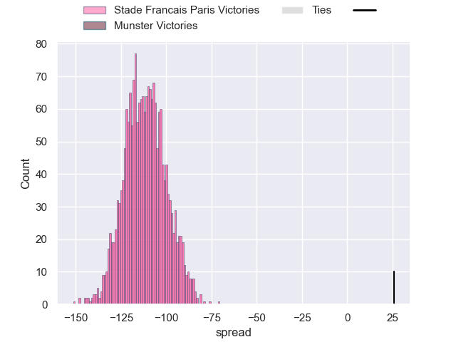

---  
layout: page  
title: Stade Francais Paris at Munster; 7-33  
date: 2024-12-07 18:00:00 -0500  
categories: "European Rugby Champions Cup 2024" match review  
---
# Stade Francais Paris at Munster; 7-33

# Club Level Predictions

The first set of predictions treats a club as the smallest object, as the club develops its members, organizes a gameplan, and deploys its players as needed for each match. This club model has a prediction of 0.716, which translates to predicting Munster to win by 8.1.

Our Over/Under is 42.5 - and combined with the spread above, we have a predicted scoreline of 17 to 26

Each club has a rating and a rating deviation (similar to a Glicko rating), and expected performances can be generated. This allows for simulated matches and spreads like the ones below.
## Projected Performances - Club Model

## Projected Spreads - Club Model

## Projected Results - Club Model

# Player Level Predictions

Treating teams instead as an entity made up of the currently active players, I have ratings for each player in an altogether different system. These can be combined to form team ratings once teamsheets are announced, weighting starters a bit higher than the reserves. After the match is played, players can be weighted by their minutes on the field, allowing for an accurate measure of the team's composition. With these compiled team ratings, we can make predictions, measure inaccuracy, and update the individual player ratings.
## Prediction without Player Minutes: Stade Francais Paris by 30.5

Stade Francais Paris by 40.3 on a neutral pitch

## Projected Performances - Player Model

## Projected Spreads - Player Model

## Projected Results - Player Model

|   Away Minutes | Away Player              |   Away Percentile |   Number |   Home Percentile | Home Player      |   Home Minutes |
|---------------:|:-------------------------|------------------:|---------:|------------------:|:-----------------|---------------:|
|             81 | Clement Castets          |             43.06 |        1 |             96.14 | Dian Bleuler     |             21 |
|             81 | Clement Castets          |             43.06 |        1 |             96.14 | Dian Bleuler     |             20 |
|             81 | Clement Castets          |             43.06 |        1 |             96.14 | Dian Bleuler     |             81 |
|             81 | Clement Castets          |             43.06 |        1 |             96.14 | Dian Bleuler     |             56 |
|             11 | Lucas Peyresblanques     |             21.26 |        2 |             83.98 | Diarmuid Barron  |             29 |
|             25 | Francisco Gomez Kodela   |             86.12 |        3 |             15.3  | John Ryan        |             81 |
|             25 | Francisco Gomez Kodela   |             86.12 |        3 |             15.3  | John Ryan        |             70 |
|             25 | Francisco Gomez Kodela   |             86.12 |        3 |             15.3  | John Ryan        |             48 |
|             25 | Francisco Gomez Kodela   |             86.12 |        3 |             15.3  | John Ryan        |             56 |
|             29 | Pierre-Henri Azagoh      |             84.39 |        4 |             81.48 | Evan O'Connell   |             81 |
|             25 | Baptiste Pesenti         |             65.17 |        5 |             59.17 | Fineen Wycherley |             70 |
|             25 | Pierre Huguet            |             16.87 |        6 |             94.97 | Peter O'Mahony   |             77 |
|             77 | Ryan Chapuis             |             24.19 |        7 |             89.78 | Alex Kendellen   |             77 |
|             52 | Yoan Tanga               |             45.99 |        8 |             54.9  | Gavin Coombes    |             23 |
|             81 | Thibaut Motassi          |             10.86 |        9 |              4.21 | Craig Casey      |             14 |
|             60 | Zack Henry               |             64.46 |       10 |              5.22 | Jack Crowley     |             70 |
|             21 | Samuel Ezeala            |             17.39 |       11 |             25.21 | Thaakir Abrahams |             25 |
|             69 | Pierre Boudehent         |             30.22 |       12 |             94.27 | Alex Nankivell   |             62 |
|             25 | Joe Marchant             |             31.58 |       13 |             12.44 | Tom Farrell      |              5 |
|             81 | Charles Laloi            |             19.69 |       14 |             89.66 | Calvin Nash      |             56 |
|             56 | Joe Jonas                |             28.12 |       15 |             59.22 | Shane Daly       |             70 |
|             56 | Joe Jonas                |             28.12 |       15 |             59.22 | Shane Daly       |             55 |
|             56 | Joe Jonas                |             28.12 |       15 |             59.22 | Shane Daly       |             18 |
|             56 | Luka Petriashvili        |            nan    |       16 |             19.11 | Niall Scannell   |             55 |
|             81 | Moses Alo-Emile          |             48.22 |       17 |            nan    | Kieran Ryan      |             81 |
|             81 | Paul Alo-Emile           |             80.43 |       18 |             87.6  | Stephen Archer   |             81 |
|             81 | Setareki Turagacoke      |             60.85 |       19 |             88.93 | Tadhg Beirne     |             70 |
|             81 | Andy Timo                |             17.29 |       20 |             10.82 | John Hodnett     |             64 |
|             46 | Juan Martin Scelzo       |             36.72 |       21 |            nan    | Paddy Patterson  |             77 |
|             52 | Louis Foursans-Bourdette |             20.48 |       22 |             21.89 | Billy Burns      |             62 |
|             81 | Louis Carbonel           |             63.05 |       23 |             38.07 | Jack O'Donoghue  |             80 |

