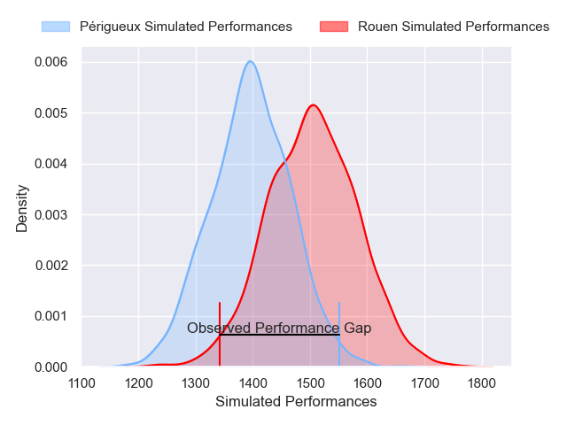
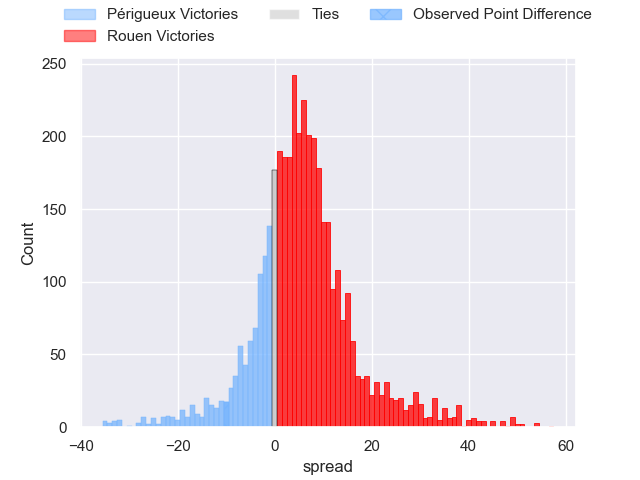
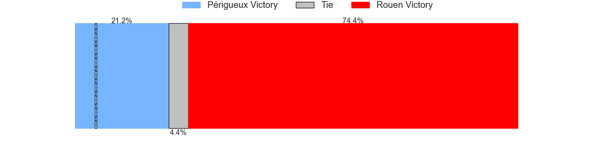
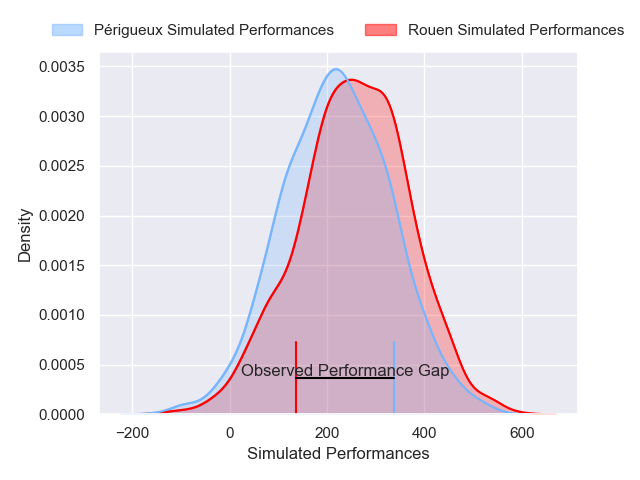
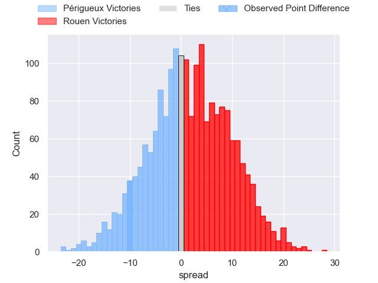

---  
layout: page  
title: Perigueux at Rouen; 19-9  
date: 2024-12-07 18:00:00 -0500  
categories: "Nationale 2024" match review  
---
# Perigueux at Rouen; 19-9

# Club Level Predictions

The first set of predictions treats a club as the smallest object, as the club develops its members, organizes a gameplan, and deploys its players as needed for each match. This club model has a prediction of 0.641, which translates to predicting Rouen to win by 5.2.

Our Over/Under is 41.5 - and combined with the spread above, we have a predicted scoreline of 18 to 23

Each club has a rating and a rating deviation (similar to a Glicko rating), and expected performances can be generated. This allows for simulated matches and spreads like the ones below.
## Projected Performances - Club Model

## Projected Spreads - Club Model

## Projected Results - Club Model

# Player Level Predictions

Treating teams instead as an entity made up of the currently active players, I have ratings for each player in an altogether different system. These can be combined to form team ratings once teamsheets are announced, weighting starters a bit higher than the reserves. After the match is played, players can be weighted by their minutes on the field, allowing for an accurate measure of the team's composition. With these compiled team ratings, we can make predictions, measure inaccuracy, and update the individual player ratings.
## Prediction without Player Minutes: Rouen by 3.5

Périgueux by 0.7 on a neutral pitch

## Projected Performances - Player Model

## Projected Spreads - Player Model

## Projected Results - Player Model

|   Away Minutes | Away Player             |   Away Percentile |   Number |   Home Percentile | Home Player           |   Home Minutes |
|---------------:|:------------------------|------------------:|---------:|------------------:|:----------------------|---------------:|
|             57 | Emilien Borges          |             83.57 |        1 |             30.49 | Ewan Clément          |             80 |
|             15 | Lucas Marijon           |             42.37 |        2 |             76.12 | Mathieu Bonnot        |             56 |
|             18 | Anthony Pelmard         |             78    |        3 |             79    | Soso Bekoshvili       |             64 |
|              6 | Richard Fourcade        |             49.56 |        4 |             43.39 | Octave Leleu          |              1 |
|             62 | Raphaël Vieilledent     |             79.01 |        5 |             37.83 | Corentin Vernet       |             80 |
|             64 | Sacha Rosenberg         |             61.24 |        6 |             58.77 | Ernest Eudier         |             16 |
|             50 | Afaesetiti Amosa        |             95.4  |        7 |             20.02 | Willy N'Diaye         |             24 |
|              6 | Nahum Merigan           |             64.17 |        8 |             80.75 | Abdelkarim Fofana     |             23 |
|             45 | Matteo Bordenave        |             69.37 |        9 |             88.33 | Florent Campeggia     |             16 |
|             50 | Juan Kotze              |             84.34 |       10 |             69.28 | Maxime Javaux         |             80 |
|             80 | Benjamin Yarde          |             50.34 |       11 |             44.21 | Marin Boulier         |             80 |
|             27 | Nicolas Piaton          |             16.91 |       12 |             61.52 | Nicolas Nieto         |             64 |
|             67 | Dorian Lavernhe         |             81.15 |       13 |             20.12 | Opetera Peleseuma     |             31 |
|             53 | Axel Muller             |             86.05 |       14 |             53.26 | Sakiusa Bureitakiyaca |             75 |
|             17 | Yon Camou               |              9.87 |       15 |             75.61 | Joaquin Riera         |              1 |
|             70 | Damien Lavergne         |             54.45 |       16 |             82.38 | Benito Masilevu       |             23 |
|             80 | Max Green               |             79.25 |       17 |             87.75 | Benjamin Pehau        |             79 |
|             10 | Louis Martin            |             83.2  |       18 |             60.26 | Noe Khier             |             80 |
|             80 | Madioke Konate          |             64.57 |       19 |             21.07 | Ilan El Khattabi      |             80 |
|             80 | Fred Hickes             |             90.28 |       20 |             53.97 | Khvicha Tsopurashvili |             80 |
|             57 | Jason Tindiliere        |             45.49 |       21 |             52.73 | Manolo Laffond        |             80 |
|             13 | Hendri Storm            |             38.84 |       22 |            nan    | nan                   |            nan |
|              5 | Gonzalo Ezequiel Hughes |             55.81 |       23 |            nan    | nan                   |            nan |

