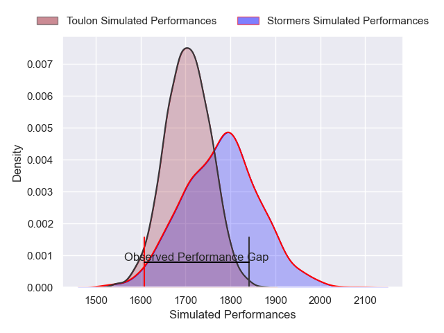
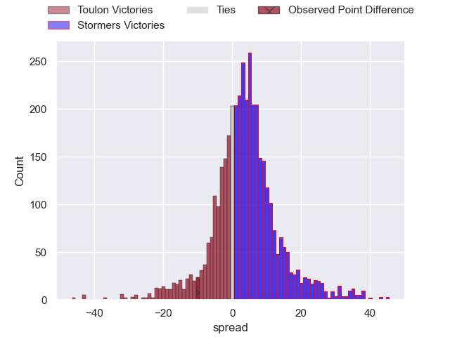
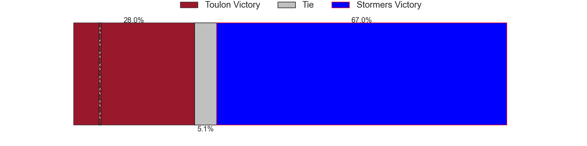
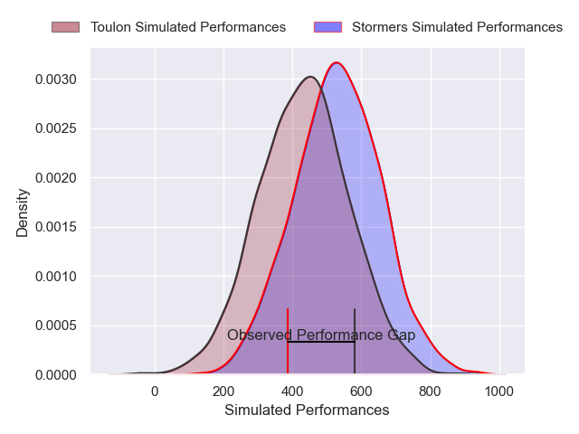
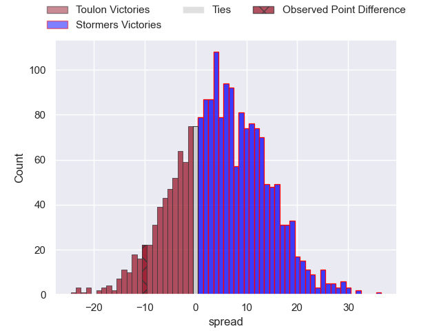

---  
layout: page  
title: Toulon at Stormers; 24-14  
date: 2024-12-07 18:00:00 -0500  
categories: "European Rugby Champions Cup 2024" match review  
---
# Toulon at Stormers; 24-14

# Club Level Predictions

The first set of predictions treats a club as the smallest object, as the club develops its members, organizes a gameplan, and deploys its players as needed for each match. This club model has a prediction of 0.602, which translates to predicting Stormers to win by 3.6.

Our Over/Under is 51.5 - and combined with the spread above, we have a predicted scoreline of 24 to 27

Each club has a rating and a rating deviation (similar to a Glicko rating), and expected performances can be generated. This allows for simulated matches and spreads like the ones below.
## Projected Performances - Club Model

## Projected Spreads - Club Model

## Projected Results - Club Model

# Player Level Predictions

Treating teams instead as an entity made up of the currently active players, I have ratings for each player in an altogether different system. These can be combined to form team ratings once teamsheets are announced, weighting starters a bit higher than the reserves. After the match is played, players can be weighted by their minutes on the field, allowing for an accurate measure of the team's composition. With these compiled team ratings, we can make predictions, measure inaccuracy, and update the individual player ratings.
## Prediction without Player Minutes: Stormers by 5.4

Toulon by 3.1 on a neutral pitch

## Projected Performances - Player Model

## Projected Spreads - Player Model

## Projected Results - Player Model

|   Away Minutes | Away Player       |   Away Percentile |   Number |   Home Percentile | Home Player          |   Home Minutes |
|---------------:|:------------------|------------------:|---------:|------------------:|:---------------------|---------------:|
|             32 | Dany Priso        |             88.45 |        1 |             75.44 | Alistair Vermaak     |             59 |
|              8 | Teddy Baubigny    |             91.32 |        2 |             79.45 | Joseph Dweba         |             59 |
|             72 | Kyle Sinckler     |             90.29 |        3 |             83.2  | Neethling Fouche     |              9 |
|             81 | Matthias Halagahu |             68.97 |        4 |             35.18 | JD Schickerling      |             71 |
|             20 | David Ribbans     |             89.2  |        5 |             93.52 | Ruben van Heerden    |             68 |
|             61 | Lewis Ludlam      |             72.21 |        6 |             41.85 | Keketso Morabe       |             26 |
|             73 | Jules Coulon      |             78.47 |        7 |             85.59 | Ben-Jason Dixon      |             61 |
|             49 | Facundo Isa       |             91.83 |        8 |             59.48 | Willie Engelbrecht   |             81 |
|             32 | Baptiste Serin    |             99.36 |        9 |             82.83 | Paul de Wet          |             59 |
|             55 | Dan Biggar        |             98.8  |       10 |             85.66 | Manie Libbok         |             59 |
|             19 | Gabin Villiere    |             83.71 |       11 |             82.7  | Leolin Zas           |             81 |
|             59 | Mathieu Smaili    |             28.31 |       12 |             36.81 | Jean-Luc du Plessis  |             74 |
|             81 | Jeremy Sinzelle   |             72.08 |       13 |             26.18 | Ruhan Nel            |             81 |
|             81 | Gael Drean        |             64.25 |       14 |             72.74 | Suleiman Hartzenberg |             59 |
|             18 | Marius Domon      |             69.47 |       15 |             99.63 | Warrick Gelant       |             64 |
|             81 | Mickael Ivaldi    |             87.82 |       16 |             86.3  | Andre-Hugo Venter    |             51 |
|             81 | Daniel Brennan    |            nan    |       17 |             24.56 | Leon Lyons           |             21 |
|             81 | Beka Gigashvili   |             76.48 |       18 |             23.46 | Sazi Sandi           |             51 |
|             81 | Brian Alainu'uese |             81.59 |       19 |             85.48 | Adre Smith           |             63 |
|             81 | Yannick Youyoutte |             88.42 |       20 |             63.65 | Marcel Theunissen    |             81 |
|             22 | Enzo Herve        |             89.04 |       21 |            nan    | Louw Nel             |             81 |
|             81 | Antoine Frisch    |             97.29 |       22 |             93.42 | Herschel Jantjies    |             18 |
|             22 | Jiuta Wainiqolo   |             91.74 |       23 |            nan    | Seabelo Senatla      |             56 |

