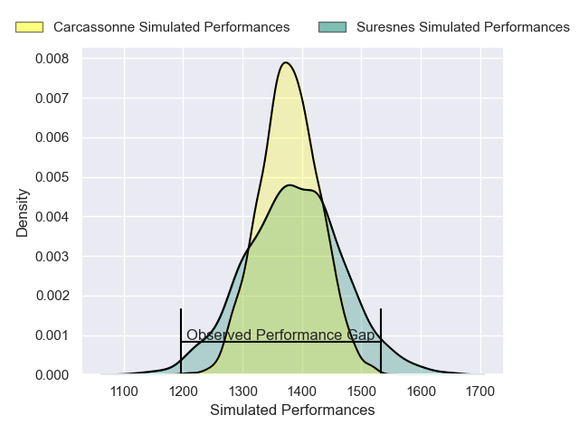
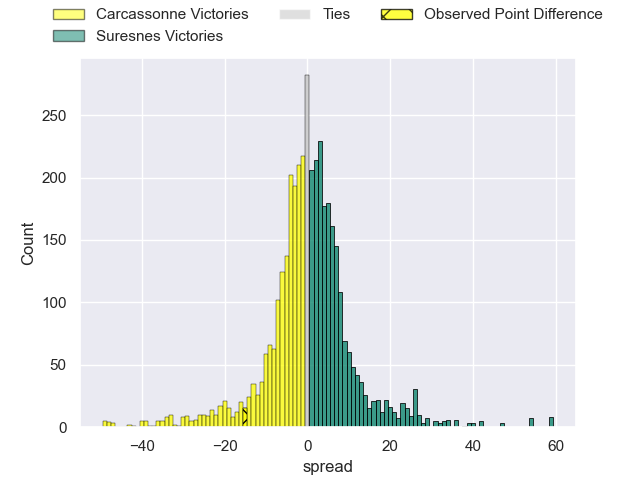
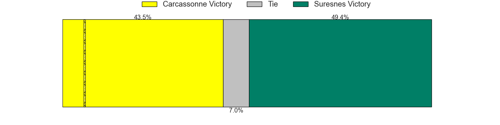
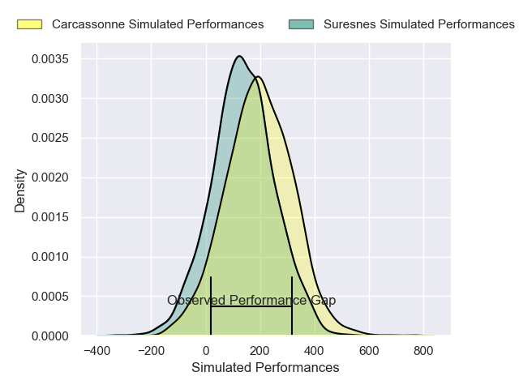
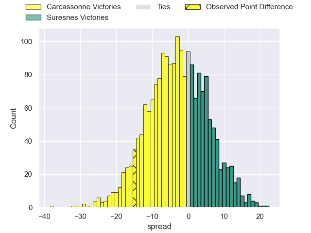
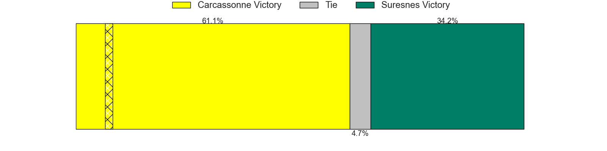

---  
layout: page  
title: Carcassonne at Suresnes; 24-9  
date: 2024-12-07 18:00:00 -0500  
categories: "Nationale 2024" match review  
---
# Carcassonne at Suresnes; 24-9

# Club Level Predictions

The first set of predictions treats a club as the smallest object, as the club develops its members, organizes a gameplan, and deploys its players as needed for each match. This club model has a prediction of 0.509, which translates to predicting Suresnes to win by 0.3.

Our Over/Under is 40.5 - and combined with the spread above, we have a predicted scoreline of 20 to 20

Each club has a rating and a rating deviation (similar to a Glicko rating), and expected performances can be generated. This allows for simulated matches and spreads like the ones below.
## Projected Performances - Club Model

## Projected Spreads - Club Model

## Projected Results - Club Model

# Player Level Predictions

Treating teams instead as an entity made up of the currently active players, I have ratings for each player in an altogether different system. These can be combined to form team ratings once teamsheets are announced, weighting starters a bit higher than the reserves. After the match is played, players can be weighted by their minutes on the field, allowing for an accurate measure of the team's composition. With these compiled team ratings, we can make predictions, measure inaccuracy, and update the individual player ratings.
## Prediction without Player Minutes: Carcassonne by 2.3

Carcassonne by 5.7 on a neutral pitch

## Projected Performances - Player Model

## Projected Spreads - Player Model

## Projected Results - Player Model

|   Away Minutes | Away Player         |   Away Percentile |   Number |   Home Percentile | Home Player          |   Home Minutes |
|---------------:|:--------------------|------------------:|---------:|------------------:|:---------------------|---------------:|
|             80 | Thomas Agati        |             58.72 |        1 |             79.06 | Elias Coulibaly      |             81 |
|             80 | Raphael Carbou      |             65.02 |        2 |             12.33 | Jean-Étienne Lesueur |             81 |
|             16 | Vakhtangi Akhobadze |             18.92 |        3 |             33.93 | Leandro Mario Assi   |             55 |
|             80 | Romain Guyot        |             82.36 |        4 |             68.96 | Marvin Woki          |             80 |
|             80 | Clément Fontaine    |             44.09 |        5 |             26.19 | Sacha Yahi           |             80 |
|             55 | Maxime Millan       |             59.71 |        6 |             17.72 | Florian Desbordes    |             80 |
|             81 | Etienne Herjean     |             84.33 |        7 |             63.63 | Wian Vosloo          |             16 |
|             81 | Thomas Hoarau       |             11.05 |        8 |             82.89 | Lakisipone Lee       |             55 |
|             80 | Gaetan Pichon       |             35.17 |        9 |             12.97 | Théo Bachiri         |             80 |
|             80 | Johnny McPhillips   |             61.65 |       10 |             68.47 | Jean Chezeau         |             24 |
|             80 | Clement Egiziano    |             92.57 |       11 |             16.17 | Yohan Fournier       |             80 |
|             24 | Jordan Puletua      |             29.64 |       12 |             65.5  | Petero Tuwai         |             80 |
|             65 | Sefa Naivalu        |             97.76 |       13 |             69    | Victor Barnier       |             80 |
|             61 | Paul Gadea          |             76.7  |       14 |             10.88 | Thomas Baudy         |             80 |
|             80 | Maxime Gianet       |             90.88 |       15 |              8.75 | Goulwen Gueho        |             65 |

