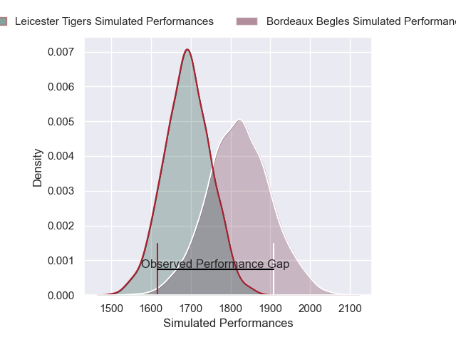
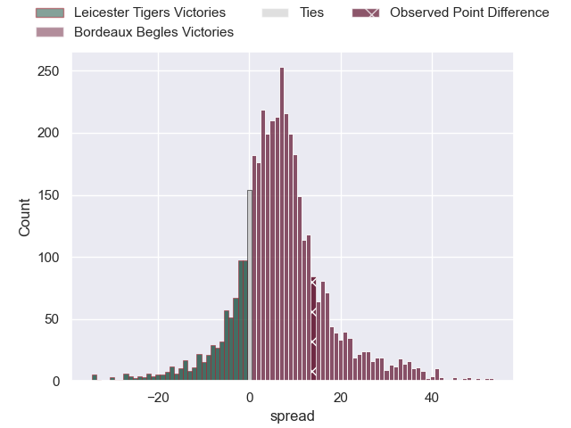
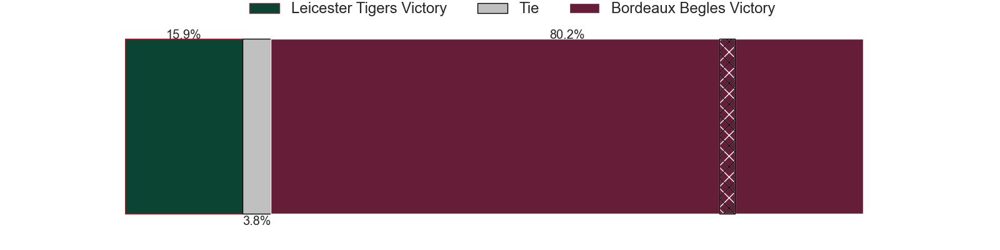
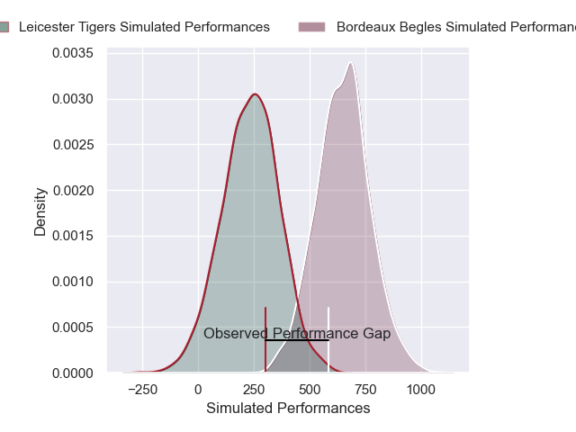
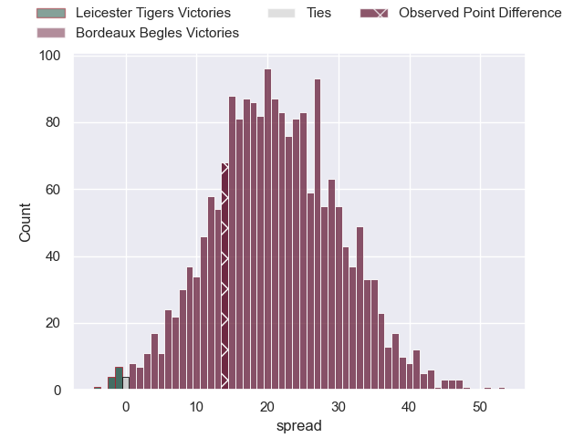

---  
layout: page  
title: Leicester Tigers at Bordeaux Begles; 28-42  
date: 2024-12-08 18:00:00 -0500  
categories: "European Rugby Champions Cup 2024" match review  
---
# Leicester Tigers at Bordeaux Begles; 28-42

# Club Level Predictions

The first set of predictions treats a club as the smallest object, as the club develops its members, organizes a gameplan, and deploys its players as needed for each match. This club model has a prediction of 0.675, which translates to predicting Bordeaux Begles to win by 6.4.

Our Over/Under is 52.5 - and combined with the spread above, we have a predicted scoreline of 23 to 29

Each club has a rating and a rating deviation (similar to a Glicko rating), and expected performances can be generated. This allows for simulated matches and spreads like the ones below.
## Projected Performances - Club Model

## Projected Spreads - Club Model

## Projected Results - Club Model

# Player Level Predictions

Treating teams instead as an entity made up of the currently active players, I have ratings for each player in an altogether different system. These can be combined to form team ratings once teamsheets are announced, weighting starters a bit higher than the reserves. After the match is played, players can be weighted by their minutes on the field, allowing for an accurate measure of the team's composition. With these compiled team ratings, we can make predictions, measure inaccuracy, and update the individual player ratings.
## Prediction without Player Minutes: Bordeaux Begles by 24.9

Bordeaux Begles by 12.9 on a neutral pitch

## Projected Performances - Player Model

## Projected Spreads - Player Model

## Projected Results - Player Model

|   Away Minutes | Away Player           |   Away Percentile |   Number |   Home Percentile | Home Player               |   Home Minutes |
|---------------:|:----------------------|------------------:|---------:|------------------:|:--------------------------|---------------:|
|             51 | James Cronin          |             75.2  |        1 |             69.82 | Jefferson Poirot          |              9 |
|             14 | Charlie Clare         |             19.03 |        2 |             36.38 | Maxime Lamothe            |             21 |
|             84 | Joe Heyes             |             83.81 |        3 |             86.19 | Ben Tameifuna             |             21 |
|             51 | Harry Wells           |             87.9  |        4 |             92.57 | Guido Petti               |             81 |
|             84 | Come Joussain         |             46.07 |        5 |             94.81 | Jonny Gray                |             18 |
|             84 | Hanro Liebenberg      |             70.24 |        6 |             73.07 | Mahamadou Diaby           |             81 |
|             21 | Emeka Ilione          |             57.38 |        7 |             79.42 | Bastien Vergnes Taillefer |             81 |
|             24 | Olly Cracknell        |             20.17 |        8 |             83.83 | Pete Samu                 |             46 |
|             84 | Jack van Poortvliet   |             75.6  |        9 |             98.23 | Maxime Lucu               |             72 |
|             84 | Jamie Shillcock       |             57.77 |       10 |             95.82 | Matthieu Jalibert         |             81 |
|             43 | Ollie Hassell-Collins |             64.63 |       11 |             93.44 | Arthur Retiere            |             81 |
|             84 | Solomone Kata         |             48.7  |       12 |             86.67 | Yoram Moefana             |              0 |
|             75 | Izaia Perese          |             20.87 |       13 |             77.2  | Nicolas Depoortere        |              9 |
|             41 | Josh Bassett          |             83.4  |       14 |             93.75 | Damian Penaud             |             84 |
|             81 | Freddie Steward       |             11.15 |       15 |             60.69 | Louis Bielle-Biarrey      |             81 |
|             14 | Finn Theobald-Thomas  |            nan    |       16 |             32.88 | Connor Sa                 |             17 |
|             81 | James Whitcombe       |             66.04 |       17 |             80.64 | Ugo Boniface              |             63 |
|             16 | Will Hurd             |             70.37 |       18 |             69.46 | Carlu Sadie               |             46 |
|             16 | Jed Holloway          |             18.32 |       19 |             98.01 | Adam Coleman              |             64 |
|             24 | Kyle Hatherell        |              0.87 |       20 |             10.81 | Lachlan Swinton           |             55 |
|             21 | Tom Whiteley          |             70.63 |       21 |             84    | Tevita Tatafu             |             64 |
|             84 | Joseph Woodward       |             61.35 |       22 |             44.93 | Ben Tapuai                |             65 |
|             81 | Mike Brown            |             91.22 |       23 |             66.91 | Joey Carbery              |             81 |

