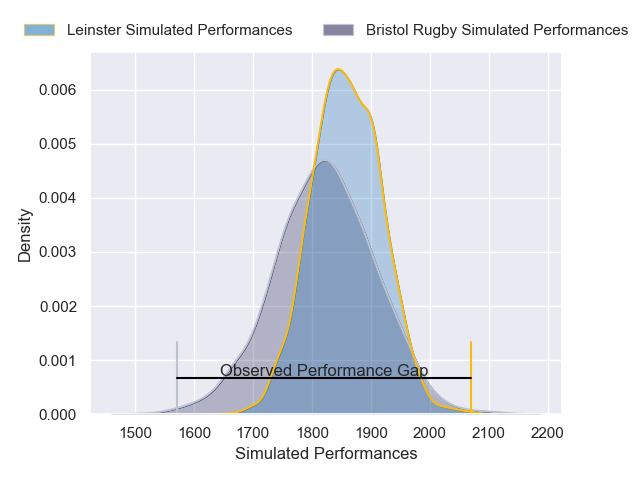
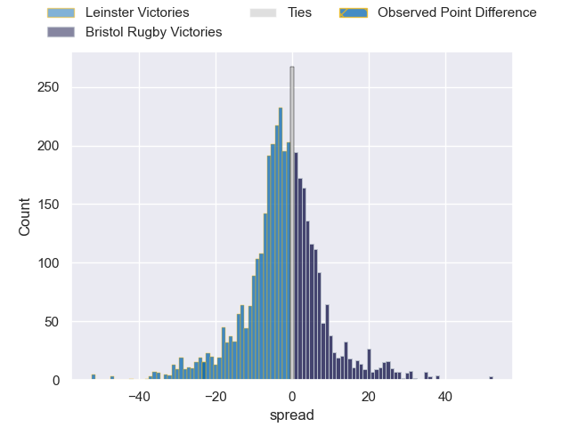
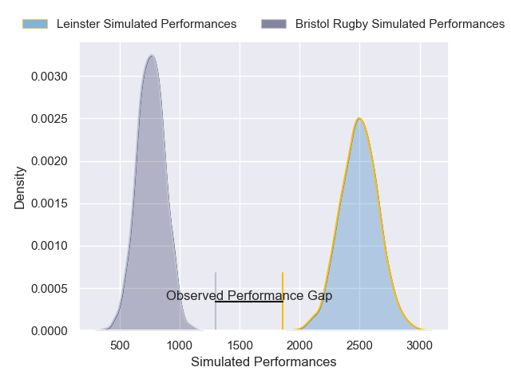
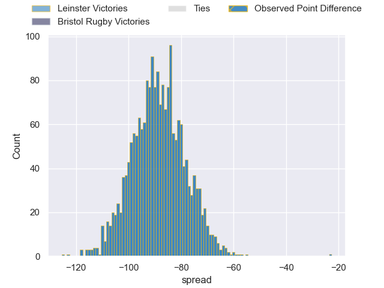

---  
layout: page  
title: Leinster at Bristol Rugby; 35-12  
date: 2024-12-08 18:00:00 -0500  
categories: "European Rugby Champions Cup 2024" match review  
---
# Leinster at Bristol Rugby; 35-12

# Club Level Predictions

The first set of predictions treats a club as the smallest object, as the club develops its members, organizes a gameplan, and deploys its players as needed for each match. This club model has a prediction of 0.445, which translates to predicting Leinster to win by 1.9.

Our Over/Under is 52.5 - and combined with the spread above, we have a predicted scoreline of 27 to 25

Each club has a rating and a rating deviation (similar to a Glicko rating), and expected performances can be generated. This allows for simulated matches and spreads like the ones below.
## Projected Performances - Club Model

## Projected Spreads - Club Model

## Projected Results - Club Model

# Player Level Predictions

Treating teams instead as an entity made up of the currently active players, I have ratings for each player in an altogether different system. These can be combined to form team ratings once teamsheets are announced, weighting starters a bit higher than the reserves. After the match is played, players can be weighted by their minutes on the field, allowing for an accurate measure of the team's composition. With these compiled team ratings, we can make predictions, measure inaccuracy, and update the individual player ratings.
## Prediction without Player Minutes: Leinster by 16.1

Leinster by 23.5 on a neutral pitch

## Projected Performances - Player Model

## Projected Spreads - Player Model

## Projected Results - Player Model

|   Away Minutes | Away Player         |   Away Percentile |   Number |   Home Percentile | Home Player                |   Home Minutes |
|---------------:|:--------------------|------------------:|---------:|------------------:|:---------------------------|---------------:|
|             36 | Jack Boyle          |             77.64 |        1 |             78.07 | Ellis Genge                |             45 |
|             30 | Ronan Kelleher      |             83.56 |        2 |             90.11 | Harry Thacker              |             80 |
|             83 | Rabah Slimani       |             96.27 |        3 |             84.73 | Max Lahiff                 |             64 |
|              8 | Rabah Slimani       |             96.27 |        3 |             84.73 | Max Lahiff                 |             64 |
|             36 | Rabah Slimani       |             96.27 |        3 |             84.73 | Max Lahiff                 |             64 |
|             83 | Joe McCarthy        |             28.44 |        4 |             96.02 | James Dun                  |             25 |
|             47 | James Ryan          |             97.58 |        5 |             68.8  | Joe Owen                   |              9 |
|             12 | Max Deegan          |             97.51 |        6 |             97.86 | Santiago Grondona          |             42 |
|             19 | Josh van der Flier  |             95.37 |        7 |             97.26 | Fitz Harding               |              5 |
|             45 | Jack Conan          |            100    |        8 |             68    | Viliame Mata               |             59 |
|             78 | Jamison Gibson-Park |             94.86 |        9 |             97.75 | Harry Randall              |             80 |
|             29 | Sam Prendergast     |             10.96 |       10 |             98.41 | AJ MacGinty                |             80 |
|             20 | Jimmy O'Brien       |             91.04 |       11 |             98.07 | Gabriel Ibitoye            |             80 |
|             83 | Robbie Henshaw      |             86.18 |       12 |             98.45 | Benhard Janse van Rensburg |             80 |
|             57 | Garry Ringrose      |             98.84 |       13 |             87.25 | Kalaveti Ravouvou          |             68 |
|             12 | Jordan Larmour      |             84.94 |       14 |             58.84 | Jack Bates                 |             63 |
|             18 | Ciaran Frawley      |             53.2  |       15 |             82.45 | Richard Lane               |             27 |
|             45 | Gus McCarthy        |            100    |       16 |             86.91 | Gabriel Oghre              |             41 |
|             63 | Gus McCarthy        |            100    |       16 |             86.91 | Gabriel Oghre              |             41 |
|             83 | Gus McCarthy        |            100    |       16 |             86.91 | Gabriel Oghre              |             41 |
|             71 | Andrew Porter       |             84.3  |       17 |             87.23 | Jake Woolmore              |             24 |
|             83 | Thomas Clarkson     |             79.41 |       18 |            nan    | Lovejoy Chawatama          |             73 |
|             83 | RG Snyman           |             99.83 |       19 |             98.89 | Steven Luatua              |             83 |
|             55 | Caelan Doris        |             90.09 |       20 |             75.3  | Benjamin Grondona          |             83 |
|             75 | Luke McGrath        |             99.52 |       21 |             95.18 | Kieran Marmion             |             60 |
|             47 | Ross Byrne          |             98.61 |       22 |             58.84 | Joe Jenkins                |             83 |
|             80 | Jordie Barrett      |             94.4  |       23 |            nan    | Benjamin Elizalde          |             18 |

