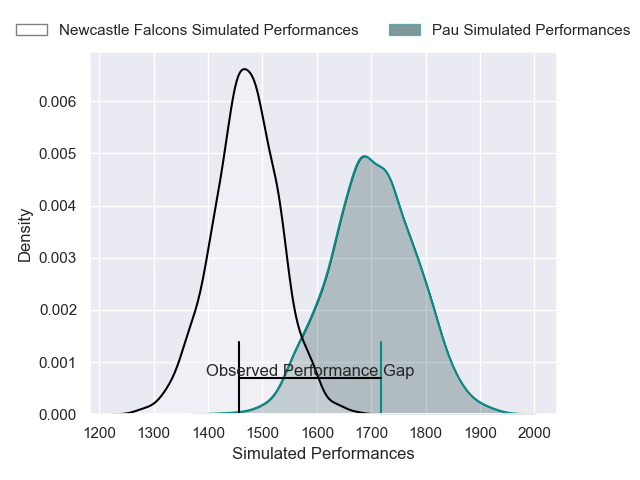
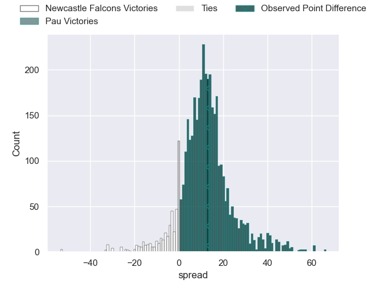
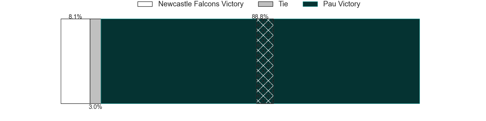
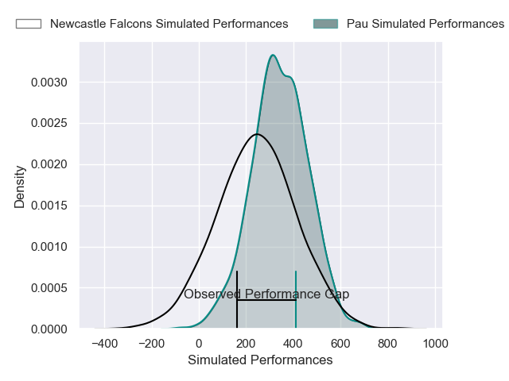
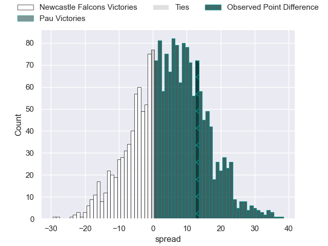
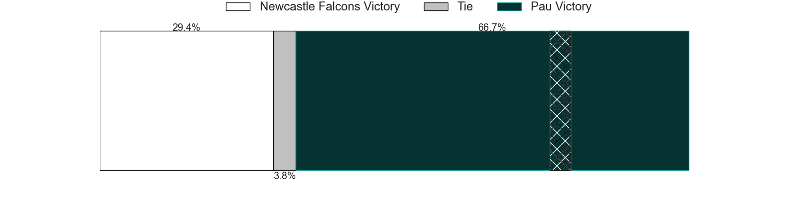

---  
layout: page  
title: Newcastle Falcons at Pau; 19-32  
date: 2024-12-08 18:00:00 -0500  
categories: "European Rugby Challenge Cup 2024" match review  
---
# Newcastle Falcons at Pau; 19-32

# Club Level Predictions

The first set of predictions treats a club as the smallest object, as the club develops its members, organizes a gameplan, and deploys its players as needed for each match. This club model has a prediction of 0.788, which translates to predicting Pau to win by 11.6.

Our Over/Under is 58.5 - and combined with the spread above, we have a predicted scoreline of 23 to 35

Each club has a rating and a rating deviation (similar to a Glicko rating), and expected performances can be generated. This allows for simulated matches and spreads like the ones below.
## Projected Performances - Club Model

## Projected Spreads - Club Model

## Projected Results - Club Model

# Player Level Predictions

Treating teams instead as an entity made up of the currently active players, I have ratings for each player in an altogether different system. These can be combined to form team ratings once teamsheets are announced, weighting starters a bit higher than the reserves. After the match is played, players can be weighted by their minutes on the field, allowing for an accurate measure of the team's composition. With these compiled team ratings, we can make predictions, measure inaccuracy, and update the individual player ratings.
## Prediction without Player Minutes: Pau by 7.6

Newcastle Falcons by 5.9 on a neutral pitch

## Projected Performances - Player Model

## Projected Spreads - Player Model

## Projected Results - Player Model

|   Away Minutes | Away Player         |   Away Percentile |   Number |   Home Percentile | Home Player         |   Home Minutes |
|---------------:|:--------------------|------------------:|---------:|------------------:|:--------------------|---------------:|
|             67 | Murray McCallum     |             52.41 |        1 |             54.55 | Remi Seneca         |             24 |
|             19 | Ollie Fletcher      |             51.9  |        2 |             52.82 | Dan Jooste          |             18 |
|             81 | Richard Palframan   |             58.95 |        3 |             60.05 | Jon Zabala          |             14 |
|             81 | Sebastian de Chaves |              4.67 |        4 |             18.41 | Thomas Jolmes       |             65 |
|             81 | Kiran McDonald      |             22.82 |        5 |             61.71 | Jimi Maximin        |             59 |
|             81 | Freddie Lockwood    |             58.49 |        6 |             69.98 | Mehdi Tlili         |             81 |
|             48 | Tom Gordon          |             96.83 |        7 |             78.39 | Reece Hewat         |             22 |
|             22 | Tom Gordon          |             96.83 |        7 |             78.39 | Reece Hewat         |             22 |
|              0 | Callum Chick        |             36    |        8 |              6.43 | Thibaut Hamonou     |             81 |
|             62 | Callum Chick        |             36    |        8 |              6.43 | Thibaut Hamonou     |             81 |
|             81 | Callum Chick        |             36    |        8 |              6.43 | Thibaut Hamonou     |             81 |
|             33 | Callum Chick        |             36    |        8 |              6.43 | Thibaut Hamonou     |             81 |
|             81 | Max Pepper          |             30.18 |        9 |             55.7  | Thomas Souverbie    |             81 |
|             81 | Kieran Wilkinson    |             69.32 |       10 |             90.24 | Axel Desperes       |             65 |
|             55 | Ben Stevenson       |             41.62 |       11 |             56.14 | Gregoire Arfeuil    |             72 |
|             55 | Cameron Hutchison   |             68.12 |       12 |             38.65 | Eliott Roudil       |             81 |
|             81 | Alex Hearle         |             52.75 |       13 |              4.73 | Olivier Klemenczak  |             57 |
|             57 | Adam Radwan         |             21.08 |       14 |             73.59 | Aaron Grandidier    |              5 |
|             81 | Ben Redshaw         |             85.19 |       15 |             50.64 | Clement Mondinat    |             65 |
|             72 | Bryan Byrne         |             70.93 |       16 |             64.08 | Youri Delhommel     |             59 |
|             72 | Mike Rewcastle      |            nan    |       17 |             13.44 | Daniel Bibi Biziwu  |             22 |
|             81 | Callum Hancock      |            nan    |       18 |             22.05 | Guram Papidze       |             59 |
|             76 | Finn Baker          |            nan    |       19 |             38.12 | Hugo Auradou        |             59 |
|              9 | Ollie Leatherbarrow |            nan    |       20 |             70.41 | Lekima Tagitagivalu |             81 |
|             81 | Hugh O'Sullivan     |             45.75 |       21 |             87    | Thibault Daubagna   |             40 |
|             16 | Brett Connon        |              1.79 |       22 |             63.09 | Nathan Decron       |             81 |
|             57 | Oliver Spencer      |             75.91 |       23 |             21.57 | Aymeric Luc         |             81 |

