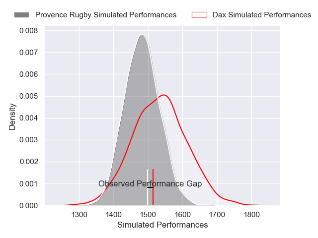
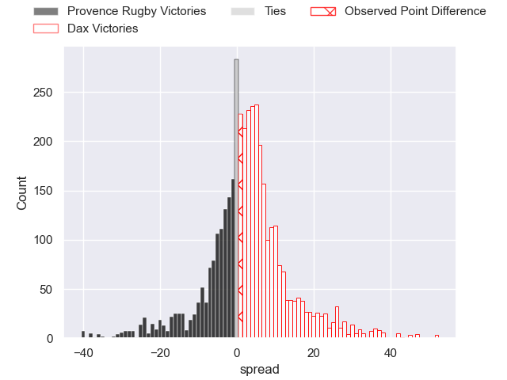
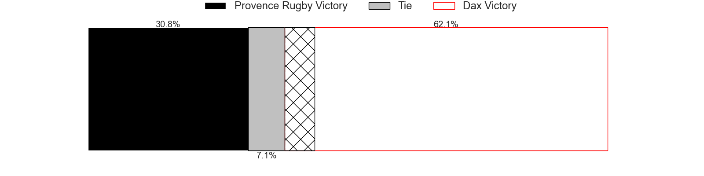
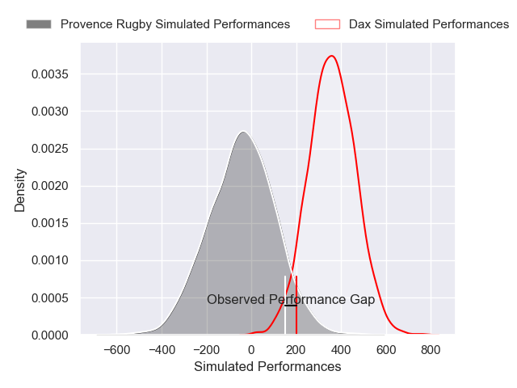
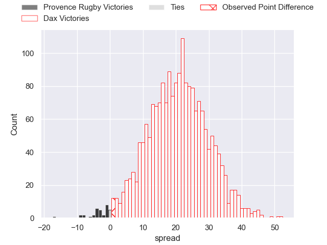
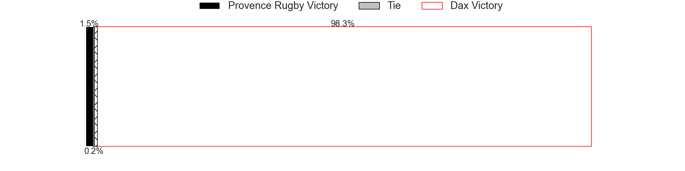

---  
layout: page  
title: Provence Rugby at Dax; 22-23  
date: 2024-12-12 18:00:00 -0500  
categories: "Pro D2 2024" match review  
---
# Provence Rugby at Dax; 22-23

# Club Level Predictions

The first set of predictions treats a club as the smallest object, as the club develops its members, organizes a gameplan, and deploys its players as needed for each match. This club model has a prediction of 0.571, which translates to predicting Dax to win by 2.5.

Our Over/Under is 41.5 - and combined with the spread above, we have a predicted scoreline of 20 to 22

Each club has a rating and a rating deviation (similar to a Glicko rating), and expected performances can be generated. This allows for simulated matches and spreads like the ones below.
## Projected Performances - Club Model

## Projected Spreads - Club Model

## Projected Results - Club Model

# Player Level Predictions

Treating teams instead as an entity made up of the currently active players, I have ratings for each player in an altogether different system. These can be combined to form team ratings once teamsheets are announced, weighting starters a bit higher than the reserves. After the match is played, players can be weighted by their minutes on the field, allowing for an accurate measure of the team's composition. With these compiled team ratings, we can make predictions, measure inaccuracy, and update the individual player ratings.
## Prediction without Player Minutes: Dax by 13.4

Dax by 1.2 on a neutral pitch

## Projected Performances - Player Model

## Projected Spreads - Player Model

## Projected Results - Player Model

|   Away Minutes | Away Player              |   Away Percentile |   Number |   Home Percentile | Home Player           |   Home Minutes |
|---------------:|:-------------------------|------------------:|---------:|------------------:|:----------------------|---------------:|
|             33 | Thomas Vernet            |             79.1  |        1 |             55.79 | Dino Casadei          |             82 |
|             36 | Joseph Laget             |             47.89 |        2 |             58.06 | Kito Falatea          |             58 |
|             45 | Eliott Yemsi             |             47.99 |        3 |             61.1  | David Lolohea         |             27 |
|             69 | Jérôme Dufour            |             87.83 |        4 |             39.88 | Brice Ferrer          |             51 |
|             49 | Izack Rodda              |             83.93 |        5 |              5.33 | Jean-Baptiste Singer  |             51 |
|             80 | Teimana Harrison         |             75.24 |        6 |             83.2  | Arnaud Aletti         |             27 |
|             80 | Andres Zafra Tarazona    |              8.57 |        7 |             69.41 | Ratu Nacika           |             27 |
|             21 | Tornike Jalagonia        |             12.16 |        8 |             68.77 | Sam Wasley            |             82 |
|             81 | Arthur Coville           |             21.31 |        9 |             84.59 | Paul Ravier           |             27 |
|             31 | Jules Soulan             |             77.37 |       10 |             81.82 | Hugo Cerisier         |             18 |
|             21 | Mathias Colombet         |             67.01 |       11 |             70.27 | Guillaume Bouche      |             31 |
|             31 | Jimmy Gopperth           |             91.77 |       12 |              1.82 | Jale Vatubua          |             27 |
|             31 | Atila Septar             |             77.8  |       13 |             88.8  | Hugo Fourquet         |             31 |
|             21 | Nadir Bouhedjeur         |             88.47 |       14 |             43.32 | Viliame Tutuvili      |             16 |
|             58 | Thomas Salles            |             82.58 |       15 |              9.93 | Maxime Oltmann        |             27 |
|             82 | Enrique Pieretto         |             43.8  |       16 |             53.36 | Louis Mary            |             80 |
|             31 | Josh Tyrell              |             69.18 |       17 |             16.37 | Jean-Baptiste Barrère |             49 |
|             80 | Joris Cazenave           |             65.41 |       18 |             14.4  | Louis Barrere         |             61 |
|             54 | Jules Plisson            |             28.28 |       19 |             18.89 | Diogo Hasse Ferreira  |             80 |
|             80 | Léo Drouet               |             70.51 |       20 |             44.04 | Romuald Séguy         |             80 |
|             36 | Bilel Taieb              |             75.49 |       21 |             76.71 | Théo Gatelier         |             80 |
|             80 | Hayden Thompson-Stringer |             85.42 |       22 |             51.87 | Bastien Daguerre      |             54 |
|             52 | Hayden Thompson-Stringer |             85.42 |       22 |             51.87 | Bastien Daguerre      |             54 |
|             58 | Hayden Thompson-Stringer |             85.42 |       22 |             51.87 | Bastien Daguerre      |             54 |
|             40 | Hayden Thompson-Stringer |             85.42 |       22 |             51.87 | Bastien Daguerre      |             54 |
|             27 | Ian Boubila              |             31.77 |       23 |             70.12 | Genesis Mamea Lemalu  |             54 |

