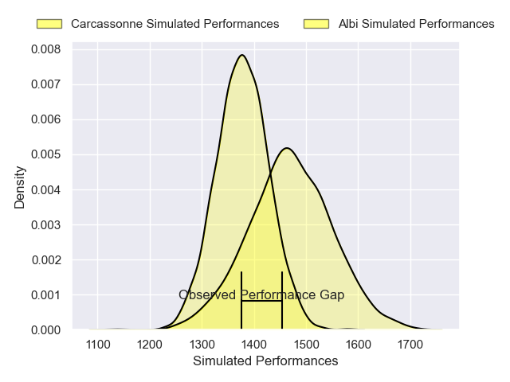
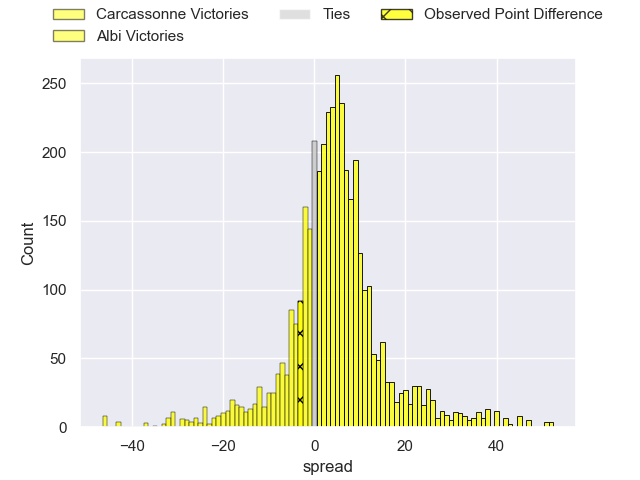
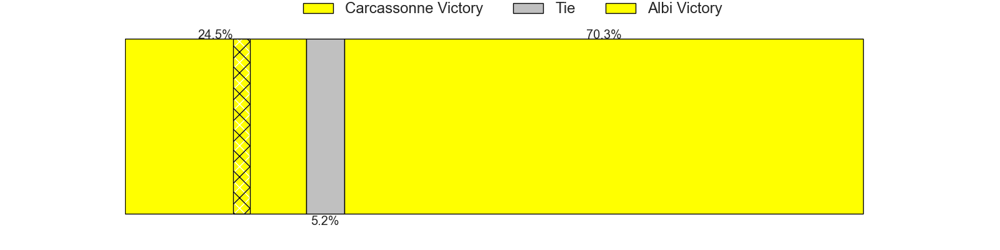
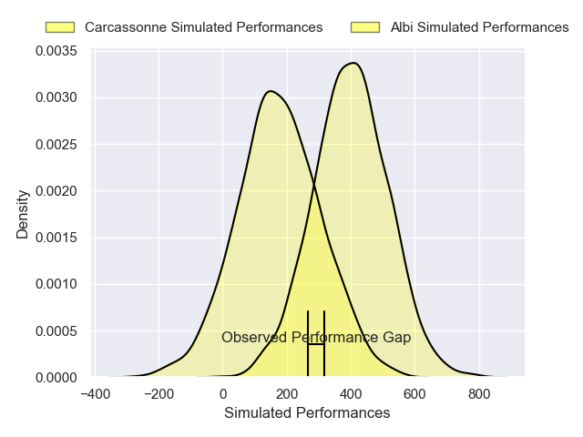
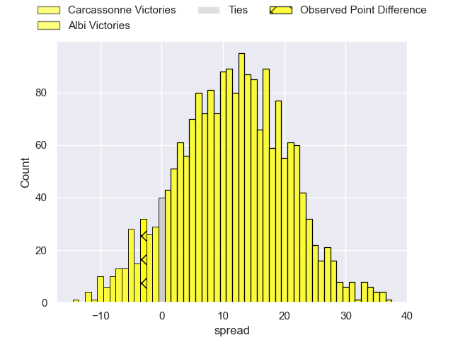
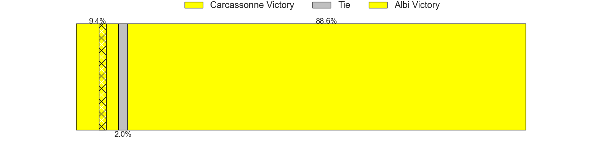

---  
layout: page  
title: Carcassonne at Albi; 31-28  
date: 2024-12-13 18:00:00 -0500  
categories: "Nationale 2024" match review  
---
# Carcassonne at Albi; 31-28

# Club Level Predictions

The first set of predictions treats a club as the smallest object, as the club develops its members, organizes a gameplan, and deploys its players as needed for each match. This club model has a prediction of 0.621, which translates to predicting Albi to win by 4.4.

Our Over/Under is 47.5 - and combined with the spread above, we have a predicted scoreline of 22 to 26

Each club has a rating and a rating deviation (similar to a Glicko rating), and expected performances can be generated. This allows for simulated matches and spreads like the ones below.
## Projected Performances - Club Model

## Projected Spreads - Club Model

## Projected Results - Club Model

# Player Level Predictions

Treating teams instead as an entity made up of the currently active players, I have ratings for each player in an altogether different system. These can be combined to form team ratings once teamsheets are announced, weighting starters a bit higher than the reserves. After the match is played, players can be weighted by their minutes on the field, allowing for an accurate measure of the team's composition. With these compiled team ratings, we can make predictions, measure inaccuracy, and update the individual player ratings.
## Prediction without Player Minutes: Albi by 8.2

Carcassonne by 3.1 on a neutral pitch

## Projected Performances - Player Model

## Projected Spreads - Player Model

## Projected Results - Player Model

|   Away Minutes | Away Player       |   Away Percentile |   Number |   Home Percentile | Home Player             |   Home Minutes |
|---------------:|:------------------|------------------:|---------:|------------------:|:------------------------|---------------:|
|             80 | Yan Arnold        |             70.9  |        1 |             71.84 | Antoine Soave           |             22 |
|             55 | Raphael Carbou    |             74.33 |        2 |             17.84 | Reinach Venter          |             24 |
|              1 | Siua Halanukonuka |             61.04 |        3 |             52.89 | Jean Baptiste De Clercq |             35 |
|              9 | Romain Guyot      |             79.48 |        4 |             81.35 | Vincent Mutel           |             27 |
|             53 | Marius Iftimiciuc |             17.94 |        5 |             22.65 | Dion Evrard Oulai       |             48 |
|             28 | Bilal Fadli       |             70.44 |        6 |             14.05 | Mattéo Coustalat        |             55 |
|             80 | Valentin Sese     |             25.36 |        7 |             12.34 | Ianis Ponsole           |             40 |
|             80 | Ferdinand Dreno   |             42.79 |        8 |             49.55 | Camille Jarreau         |             80 |
|             80 | Gaetan Pichon     |             44.26 |        9 |             78.03 | Gilen Queheille         |             80 |
|             63 | Johnny McPhillips |             72.53 |       10 |             15.76 | Victor Pisano           |             31 |
|             67 | Clement Egiziano  |             94.59 |       11 |             75.99 | Kamilieni Raivono       |             26 |
|             25 | Sefa Naivalu      |             98.76 |       12 |             15.12 | Leo Treilles            |             22 |
|             80 | Lukas Doyhenard   |             80.57 |       13 |             80.19 | Baptiste Couchinave     |             63 |
|             80 | Paul Gadea        |             84.1  |       14 |             57.39 | Simon Hartmann          |             70 |
|             62 | Maxime Gianet     |             91.95 |       15 |             46.63 | Téo Dospital            |             63 |
|             47 | Thomas Agati      |             49.06 |       16 |             45.16 | Lucas Pindor            |             40 |
|             67 | Baptiste Moreno   |            nan    |       17 |             20.34 | Arthur Castant          |             40 |
|             47 | Etienne Herjean   |             86.63 |       18 |             31.76 | Esteban Talalua         |             80 |
|             80 | Clément Fontaine  |             38.1  |       19 |             72.38 | Jonathan Kpoku          |             80 |
|             80 | Thomas Hoarau     |             16.52 |       20 |             24.92 | Guillem Calmon          |             80 |
|             80 | Gabin Michet      |             84.85 |       21 |             90.49 | Théo Vidal              |             80 |
|             25 | Nils Chalies      |             41.2  |       22 |             73.13 | Thibault Olender        |             76 |
|            nan | nan               |            nan    |       23 |             71.29 | Victorien Jacomme       |             80 |

