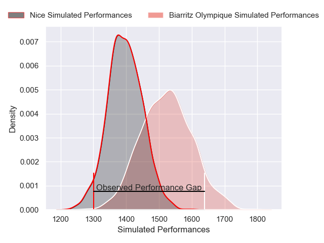
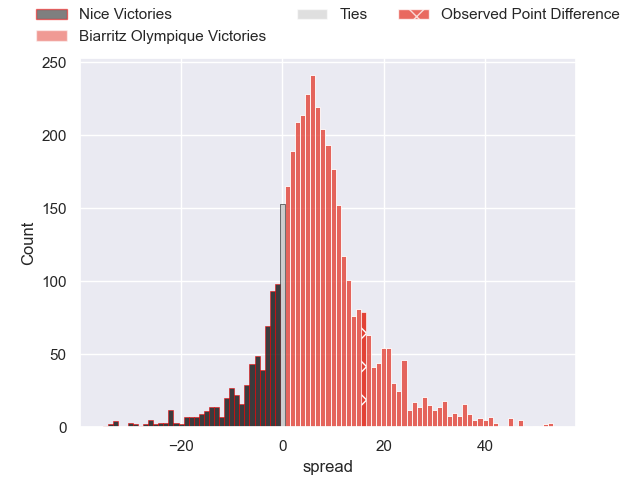
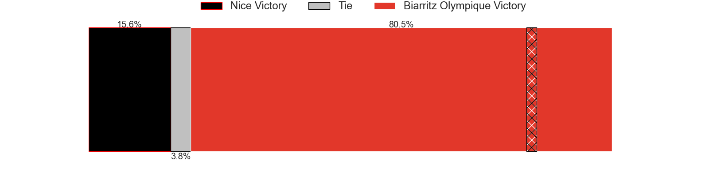
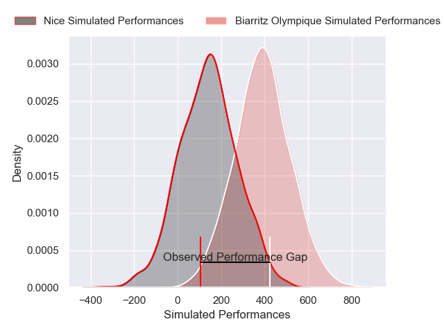
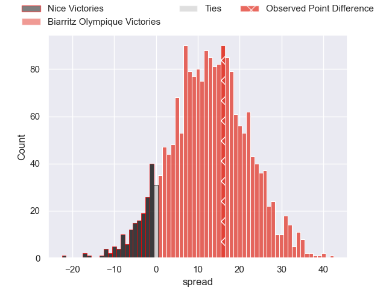
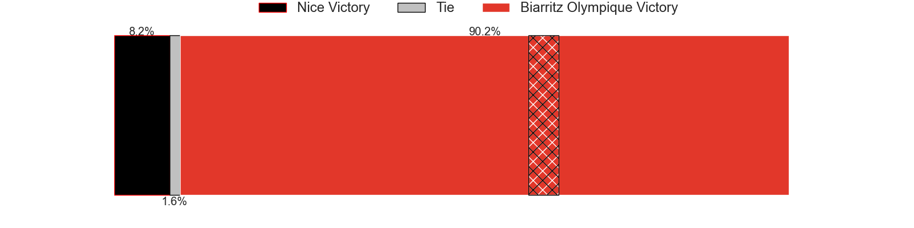

---  
layout: page  
title: Nice at Biarritz Olympique; 0-16  
date: 2024-12-13 18:00:00 -0500  
categories: "Pro D2 2024" match review  
---
# Nice at Biarritz Olympique; 0-16

# Club Level Predictions

The first set of predictions treats a club as the smallest object, as the club develops its members, organizes a gameplan, and deploys its players as needed for each match. This club model has a prediction of 0.677, which translates to predicting Biarritz Olympique to win by 6.5.

Our Over/Under is 44.5 - and combined with the spread above, we have a predicted scoreline of 19 to 25

Each club has a rating and a rating deviation (similar to a Glicko rating), and expected performances can be generated. This allows for simulated matches and spreads like the ones below.
## Projected Performances - Club Model

## Projected Spreads - Club Model

## Projected Results - Club Model

# Player Level Predictions

Treating teams instead as an entity made up of the currently active players, I have ratings for each player in an altogether different system. These can be combined to form team ratings once teamsheets are announced, weighting starters a bit higher than the reserves. After the match is played, players can be weighted by their minutes on the field, allowing for an accurate measure of the team's composition. With these compiled team ratings, we can make predictions, measure inaccuracy, and update the individual player ratings.
## Prediction without Player Minutes: Biarritz Olympique by 13.7

Nice by 1.8 on a neutral pitch

## Projected Performances - Player Model

## Projected Spreads - Player Model

## Projected Results - Player Model

|   Away Minutes | Away Player              |   Away Percentile |   Number |   Home Percentile | Home Player         |   Home Minutes |
|---------------:|:-------------------------|------------------:|---------:|------------------:|:--------------------|---------------:|
|             18 | Facundo Gigena           |             14.58 |        1 |             10.21 | Giorgi Nutsubidze   |             80 |
|             59 | Sacha Idoumi             |             15.65 |        2 |             72.14 | Luteru Tolai        |             80 |
|             25 | Luvuyo Pupuma            |             13.25 |        3 |             73.49 | Solomone Tukuafu    |             27 |
|             80 | Thibault Rey             |              4.83 |        4 |              4.13 | Adrian Motoc        |             44 |
|             70 | Clément Chartier         |             27.22 |        5 |             79.98 | Piula Faasalele     |             40 |
|             63 | Louis Suaud              |             96.2  |        6 |             86.52 | Cornell du Preez    |             40 |
|             80 | Joris Sylvestre Simon    |             56.27 |        7 |             37.25 | Thomas Hebert       |             80 |
|             53 | Ramiha Tarrel Tia Smiler |             21.06 |        8 |             50.8  | Masivesi Dakuwaqa   |             39 |
|             58 | Jules Gimbert            |             12.38 |        9 |             48.71 | Imanol Biscay       |             25 |
|             80 | Mathis Viard             |             49.49 |       10 |             51.93 | Thomas Dolhagaray   |             80 |
|             53 | Andrzej Charlat          |             86.33 |       11 |             94.74 | Mathieu Acebes      |             79 |
|             53 | Tom Daly                 |             12.05 |       12 |              5.58 | Francois Vergnaud   |             67 |
|             29 | Nathan Courtade          |             79.92 |       13 |             55.04 | Ilian Perraux       |             80 |
|             11 | Simon Delas              |             77.93 |       14 |             14.61 | Zach Kibirige       |             63 |
|             80 | Paul Auradou             |             55.37 |       15 |             88.51 | Kylian Jaminet      |             80 |
|             80 | Pierre Strippoli         |             36.62 |       16 |             36.84 | Killian Taofifenua  |             80 |
|             80 | Martin Freytes           |             86.39 |       17 |             59.63 | Edgar Retiere       |             71 |
|              8 | Tom Ross                 |             21.81 |       18 |              6.91 | Aitor Hourcade      |             80 |
|             36 | Sunia Vola               |             68.55 |       19 |             77.33 | Kerman Aurrekoetxea |             80 |
|             29 | Hugo Sarrasin            |            nan    |       20 |             15.47 | Zakaria El Fakir    |             80 |
|             56 | Jules Solinas            |             69.94 |       21 |             28.88 | Levi Douglas        |             80 |
|             80 | Luca Cutayar             |             18.71 |       22 |             72.46 | Brendan Lebrun      |             19 |
|             80 | Yann Tivoli              |             60.84 |       23 |             10.05 | Steeve Barry        |             28 |

