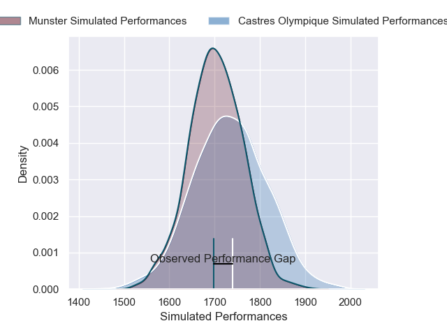
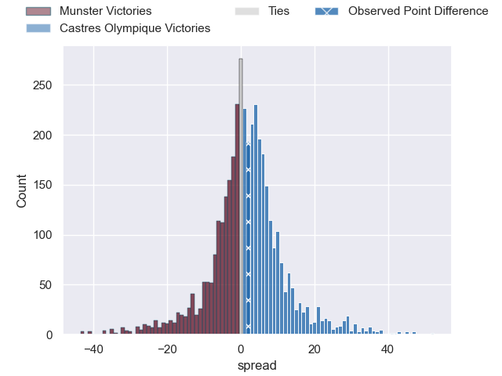
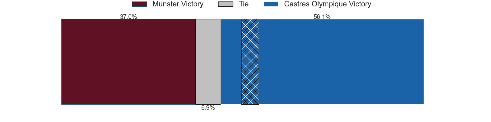
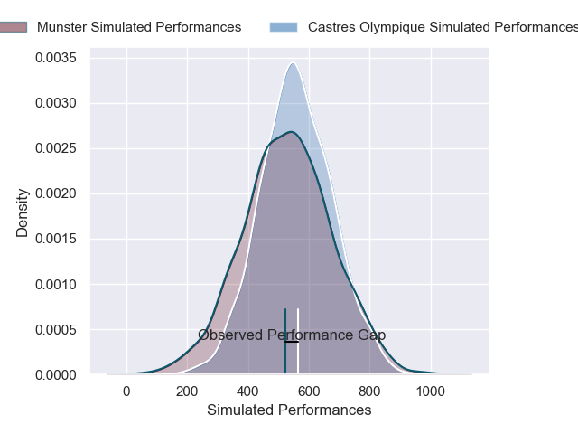
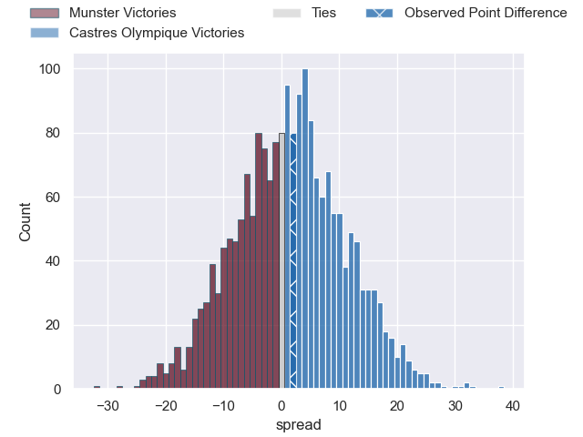

---  
layout: page  
title: Munster at Castres Olympique; 14-16  
date: 2024-12-13 18:00:00 -0500  
categories: "European Rugby Champions Cup 2024" match review  
---
# Munster at Castres Olympique; 14-16

# Club Level Predictions

The first set of predictions treats a club as the smallest object, as the club develops its members, organizes a gameplan, and deploys its players as needed for each match. This club model has a prediction of 0.544, which translates to predicting Castres Olympique to win by 1.6.

Our Over/Under is 38.5 - and combined with the spread above, we have a predicted scoreline of 18 to 20

Each club has a rating and a rating deviation (similar to a Glicko rating), and expected performances can be generated. This allows for simulated matches and spreads like the ones below.
## Projected Performances - Club Model

## Projected Spreads - Club Model

## Projected Results - Club Model

# Player Level Predictions

Treating teams instead as an entity made up of the currently active players, I have ratings for each player in an altogether different system. These can be combined to form team ratings once teamsheets are announced, weighting starters a bit higher than the reserves. After the match is played, players can be weighted by their minutes on the field, allowing for an accurate measure of the team's composition. With these compiled team ratings, we can make predictions, measure inaccuracy, and update the individual player ratings.
## Prediction without Player Minutes: Castres Olympique by 15.6

Castres Olympique by 1.4 on a neutral pitch

## Projected Performances - Player Model

## Projected Spreads - Player Model

## Projected Results - Player Model

|   Away Minutes | Away Player      |   Away Percentile |   Number |   Home Percentile | Home Player         |   Home Minutes |
|---------------:|:-----------------|------------------:|---------:|------------------:|:--------------------|---------------:|
|             65 | Dian Bleuler     |             90.3  |        1 |             55.49 | Quentin Walcker     |             71 |
|             23 | Dian Bleuler     |             90.3  |        1 |             55.49 | Quentin Walcker     |             71 |
|             82 | Dian Bleuler     |             90.3  |        1 |             55.49 | Quentin Walcker     |             71 |
|             81 | Niall Scannell   |             34.59 |        2 |             89.83 | Gaetan Barlot       |             58 |
|             19 | Stephen Archer   |             87.19 |        3 |             76.85 | Will Collier        |             81 |
|             81 | Fineen Wycherley |             35.03 |        4 |              6.32 | Gauthier Maravat    |             62 |
|             49 | Tadhg Beirne     |             94.82 |        5 |             96.22 | Leone Nakarawa      |             52 |
|             19 | Peter O'Mahony   |             94.9  |        6 |             20.92 | Mathieu Babillot    |             62 |
|             56 | John Hodnett     |             24.98 |        7 |             79.17 | Tyler Ardron        |             53 |
|             16 | Brian Gleeson    |             28.3  |        8 |             19.94 | Abraham Papali'i    |             24 |
|             22 | Craig Casey      |              6.11 |        9 |             66.56 | Jeremy Fernandez    |             16 |
|             61 | Jack Crowley     |              2.03 |       10 |             84.18 | Louis Le Brun       |             22 |
|             82 | Thaakir Abrahams |             32.36 |       11 |             87.43 | Remy Baget          |             81 |
|             32 | Alex Nankivell   |             91.77 |       12 |             83.15 | Adrea Cocagi        |             57 |
|             61 | Tom Farrell      |             32.52 |       13 |             96.67 | Jack Goodhue        |             81 |
|             63 | Calvin Nash      |             87.35 |       14 |             96.62 | Geoffrey Palis      |             81 |
|             82 | Mike Haley       |             21.85 |       15 |             67.98 | Julien Dumora       |             18 |
|             29 | Diarmuid Barron  |             74.8  |       16 |             20.5  | Loris Zarantonello  |             22 |
|             82 | Dave Kilcoyne    |            nan    |       17 |             58.78 | Wayan de Benedittis |             52 |
|             41 | Oli Jager        |             77.81 |       18 |             29.61 | Nicolas Corato      |             81 |
|             36 | Thomas Ahern     |             12.27 |       19 |             57.42 | Paul Jedrasiak      |             82 |
|             81 | Alex Kendellen   |             82.45 |       20 |             46.3  | Feibyan Tukino      |             82 |
|             81 | Paddy Patterson  |            nan    |       21 |             67.85 | Santiago Arata      |             29 |
|             82 | Rory Scannell    |             91.38 |       22 |             58.95 | Theo Chabouni       |             61 |
|             58 | Jack O'Donoghue  |             39.93 |       23 |             11.07 | Adrien Seguret      |             46 |

