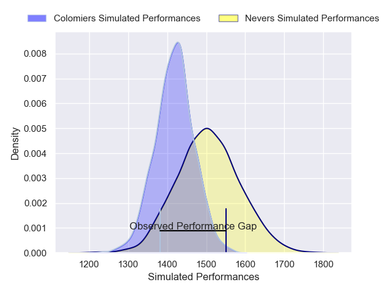
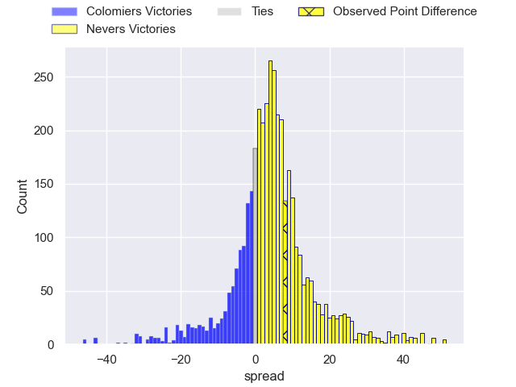
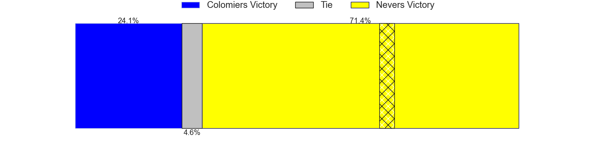
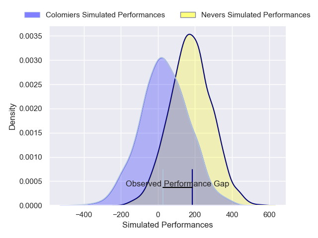
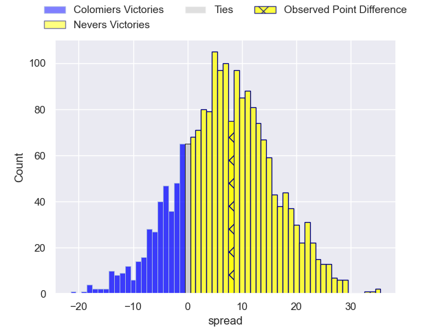
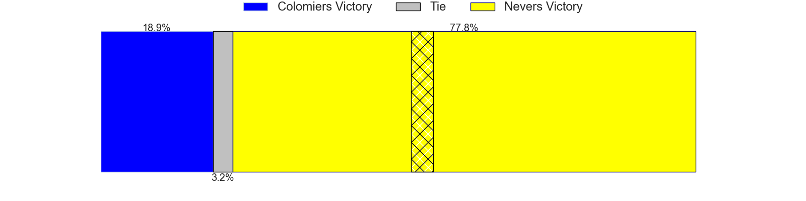

---  
layout: page  
title: Colomiers at Nevers; 15-23  
date: 2024-12-13 18:00:00 -0500  
categories: "Pro D2 2024" match review  
---
# Colomiers at Nevers; 15-23

# Club Level Predictions

The first set of predictions treats a club as the smallest object, as the club develops its members, organizes a gameplan, and deploys its players as needed for each match. This club model has a prediction of 0.626, which translates to predicting Nevers to win by 4.5.

Our Over/Under is 50.5 - and combined with the spread above, we have a predicted scoreline of 23 to 28

Each club has a rating and a rating deviation (similar to a Glicko rating), and expected performances can be generated. This allows for simulated matches and spreads like the ones below.
## Projected Performances - Club Model

## Projected Spreads - Club Model

## Projected Results - Club Model

# Player Level Predictions

Treating teams instead as an entity made up of the currently active players, I have ratings for each player in an altogether different system. These can be combined to form team ratings once teamsheets are announced, weighting starters a bit higher than the reserves. After the match is played, players can be weighted by their minutes on the field, allowing for an accurate measure of the team's composition. With these compiled team ratings, we can make predictions, measure inaccuracy, and update the individual player ratings.
## Prediction without Player Minutes: Nevers by 7.4

Nevers by 2.3 on a neutral pitch

## Projected Performances - Player Model

## Projected Spreads - Player Model

## Projected Results - Player Model

|   Away Minutes | Away Player               |   Away Percentile |   Number |   Home Percentile | Home Player                |   Home Minutes |
|---------------:|:--------------------------|------------------:|---------:|------------------:|:---------------------------|---------------:|
|             80 | Guillaume Tartas          |             78.1  |        1 |             45.79 | Tornike Mataradze          |             35 |
|             67 | Thomas Larrieu            |             21.5  |        2 |             60.28 | Efi Ma'afu                 |             35 |
|             80 | Marco Fepulea'i           |             23.5  |        3 |             31.51 | Farai Mudariki             |             80 |
|             80 | Maxime Granouillet        |             25.8  |        4 |             73.75 | Lasha Jaiani               |             20 |
|             80 | Janse Roux                |             55.79 |        5 |             35.37 | Chris Gabriel              |             10 |
|             80 | Baseisei Sakiusa          |             45.91 |        6 |             75.81 | Luka Plataret              |              3 |
|             27 | Gregoire Bazin            |             28.96 |        7 |             77.51 | Julien Kazubek             |             80 |
|             24 | Aldric Lescure            |             55.09 |        8 |             64.44 | Steven David               |             80 |
|             80 | Ugo Seguela               |             19.44 |        9 |              3.65 | Hugo Bouyssou              |             38 |
|             29 | Joaquin de la Vega Mendia |             14.29 |       10 |             37.14 | Shaun Reynolds             |             80 |
|             27 | Martin Alonso Munoz       |             16.34 |       11 |             36.5  | Arthur Mathiron            |             80 |
|             80 | Dorian Laborde            |             74.09 |       12 |             62.41 | Noa Pommelet               |             40 |
|             27 | Martin Dulon              |              8.64 |       13 |             84.3  | Rudy Derrieux              |             51 |
|             80 | Vincent Pinto             |             77.28 |       14 |             70.04 | Johan Georg Wasserman      |             52 |
|             80 | Valentin Saurs            |              3.14 |       15 |             53.6  | Dylan Jaminet              |             35 |
|             20 | Enzo Salles               |             51.91 |       16 |             25.34 | Ugo Vignolles              |             80 |
|             40 | Elias El Ansari           |             41.19 |       17 |             68.83 | Kamaliele Tufele           |             80 |
|             40 | Theo Lachaud              |              1.56 |       18 |             41.4  | Rati Zazadze               |             80 |
|             21 | Robin Bellemand           |             49.93 |       19 |             44.86 | Jean-Maxence Jules-Rosette |             80 |
|             28 | Mathis Galthié            |             47.18 |       20 |             22.59 | Simon Tarel                |             42 |
|             80 | Jack Whetton              |              7.02 |       21 |             83.5  | Lucas Blanc                |             10 |
|             52 | Jeremy Bechu              |             19.37 |       22 |             30.32 | Nicolas Ragoevi            |             48 |
|             34 | Max Auriac                |             12.94 |       23 |            nan    | nan                        |            nan |

