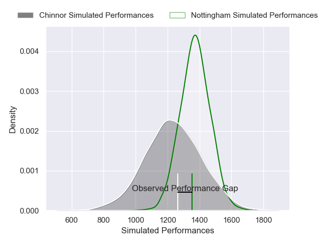
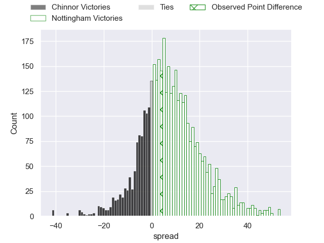
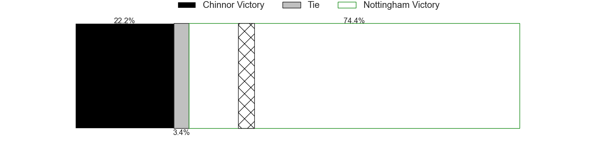
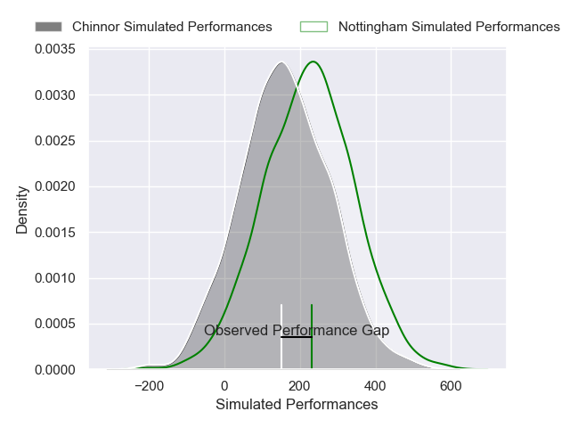
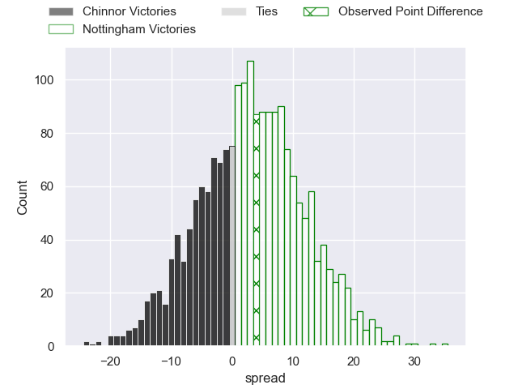

---  
layout: page  
title: Chinnor at Nottingham; 15-19  
date: 2024-12-13 18:00:00 -0500  
categories: "RFU Championship 2024" match review  
---
# Chinnor at Nottingham; 15-19

# Club Level Predictions

The first set of predictions treats a club as the smallest object, as the club develops its members, organizes a gameplan, and deploys its players as needed for each match. This club model has a prediction of 0.67, which translates to predicting Nottingham to win by 7.1.

Our Over/Under is 38.5 - and combined with the spread above, we have a predicted scoreline of 16 to 23

Each club has a rating and a rating deviation (similar to a Glicko rating), and expected performances can be generated. This allows for simulated matches and spreads like the ones below.
## Projected Performances - Club Model

## Projected Spreads - Club Model

## Projected Results - Club Model

# Player Level Predictions

Treating teams instead as an entity made up of the currently active players, I have ratings for each player in an altogether different system. These can be combined to form team ratings once teamsheets are announced, weighting starters a bit higher than the reserves. After the match is played, players can be weighted by their minutes on the field, allowing for an accurate measure of the team's composition. With these compiled team ratings, we can make predictions, measure inaccuracy, and update the individual player ratings.
## Prediction without Player Minutes: Nottingham by 1.7

Chinnor by 3.0 on a neutral pitch

## Projected Performances - Player Model

## Projected Spreads - Player Model

## Projected Results - Player Model

|   Away Minutes | Away Player           |   Away Percentile |   Number |   Home Percentile | Home Player          |   Home Minutes |
|---------------:|:----------------------|------------------:|---------:|------------------:|:---------------------|---------------:|
|             80 | Keston Lines          |             36.58 |        1 |             61.42 | Kai Owen             |             80 |
|             52 | Alun Walker           |             96.11 |        2 |             72.59 | Jack Dickinson       |             24 |
|             56 | Tim Hoyt              |             36.18 |        3 |             80.17 | Dan Richardson       |             62 |
|             23 | Scott Hall            |             10.85 |        4 |              4.19 | Sebastien Ferreira   |             28 |
|             80 | Charlie Irvine        |             47.58 |        5 |             69.1  | Jack Shine           |             80 |
|             80 | Harry Dugmore         |             68.99 |        6 |             27.85 | Sam Green            |             80 |
|             60 | George Richard Stokes |             54.77 |        7 |             48.55 | Sam Williams         |             80 |
|             80 | Willie Ryan           |             66.78 |        8 |             68.28 | James Cherry         |             80 |
|             80 | Luke Carter           |             90.37 |        9 |             53.99 | Will Yarnell         |             80 |
|             80 | George Worboys        |             77.14 |       10 |             15.92 | Gwyn Parks           |             21 |
|             80 | Kieran Goss           |             51.13 |       11 |             82.26 | Harry Graham         |             80 |
|             40 | Epi Rokodrava         |             31.8  |       12 |             71.25 | Kegan Christian-Goss |             24 |
|             28 | Grant Hughes          |             40.24 |       13 |              2.36 | Jack Stapley         |             28 |
|             26 | Joe Browning          |             14.79 |       14 |             55.95 | David Williams       |             50 |
|             16 | William Feeney        |             29.57 |       15 |             74.31 | Ryan Olowofela       |             80 |
|             46 | Rob Hardwick          |             54.74 |       16 |             74.83 | Aniseko Sio          |             80 |
|             44 | Alfie North           |             42.02 |       17 |             83.64 | Harry Clayton        |             18 |
|             15 | Will Cave             |            nan    |       18 |             88.05 | Ale Loman            |             52 |
|             56 | Cameron Rafferty      |            nan    |       19 |            nan    | Lewis Chessum        |             80 |
|             18 | Connor Slevin         |             36.12 |       20 |             73.76 | Kody Vereti          |             17 |
|             24 | Callum Pascoe         |            nan    |       21 |             29.73 | Josh Goodwin         |             52 |
|             24 | Morgan Passman        |             40.43 |       22 |             42.98 | Levi Roper           |             80 |

