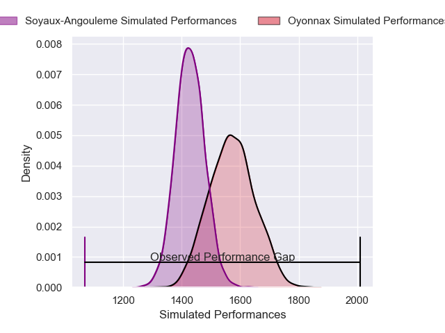
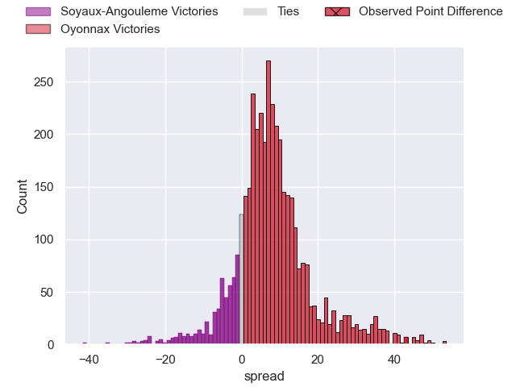
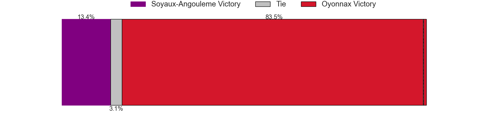
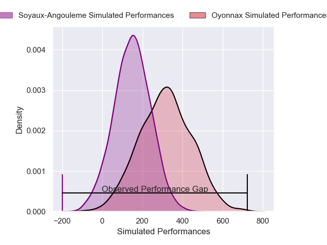
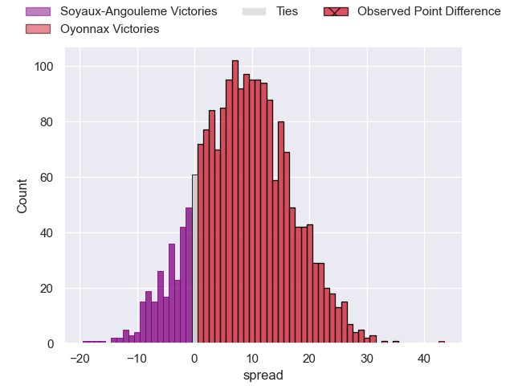
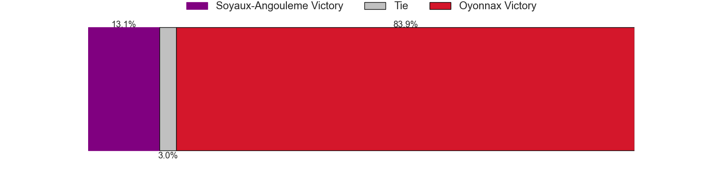

---  
layout: page  
title: Soyaux-Angouleme at Oyonnax; 10-53  
date: 2024-12-13 18:00:00 -0500  
categories: "Pro D2 2024" match review  
---
# Soyaux-Angouleme at Oyonnax; 10-53

# Club Level Predictions

The first set of predictions treats a club as the smallest object, as the club develops its members, organizes a gameplan, and deploys its players as needed for each match. This club model has a prediction of 0.694, which translates to predicting Oyonnax to win by 7.2.

Our Over/Under is 49.5 - and combined with the spread above, we have a predicted scoreline of 21 to 28

Each club has a rating and a rating deviation (similar to a Glicko rating), and expected performances can be generated. This allows for simulated matches and spreads like the ones below.
## Projected Performances - Club Model

## Projected Spreads - Club Model

## Projected Results - Club Model

# Player Level Predictions

Treating teams instead as an entity made up of the currently active players, I have ratings for each player in an altogether different system. These can be combined to form team ratings once teamsheets are announced, weighting starters a bit higher than the reserves. After the match is played, players can be weighted by their minutes on the field, allowing for an accurate measure of the team's composition. With these compiled team ratings, we can make predictions, measure inaccuracy, and update the individual player ratings.
## Prediction without Player Minutes: Oyonnax by 5.4

Soyaux-Angouleme by 7.8 on a neutral pitch

## Projected Performances - Player Model

## Projected Spreads - Player Model

## Projected Results - Player Model

|   Away Minutes | Away Player        |   Away Percentile |   Number |   Home Percentile | Home Player       |   Home Minutes |
|---------------:|:-------------------|------------------:|---------:|------------------:|:------------------|---------------:|
|             28 | Vivien Devisme     |             78.63 |        1 |             24.85 | Adrien Bordenave  |             51 |
|             28 | Rayne Barka        |             88.73 |        2 |             91.39 | Peniami Narisia   |             80 |
|             27 | Karl Sorin         |             50.47 |        3 |             26.51 | Ali Oz            |             51 |
|             59 | Léo Morand-Bruyat  |             78.6  |        4 |             95.2  | Phoenix Battye    |             80 |
|              5 | Enzo Morand-Bruyat |             73.18 |        5 |             38.37 | Ewan Johnson      |             51 |
|             18 | Gautier Gibouin    |             14.82 |        6 |             21.08 | Kevin Lebreton    |             40 |
|             45 | Hubert Texier      |             43.79 |        7 |             17.22 | Hugo Hermet       |             56 |
|             80 | Samuel Nollet      |             21.77 |        8 |              6.31 | Loic Godener      |             80 |
|             27 | Adrien Bau         |              6.39 |        9 |             92.62 | Jonathan Ruru     |             41 |
|             52 | Ben Botica         |             87.27 |       10 |             70.51 | Zack Holmes       |             29 |
|             35 | Katende Tumba      |             43.64 |       11 |              9.86 | Gavin Stark       |             29 |
|             46 | George Tilsley     |             93.49 |       12 |             57.7  | Maelan Rabut      |             29 |
|             28 | Mathis Lafon       |             63.64 |       13 |              5.36 | Edward Sawailau   |             80 |
|             29 | Eoghan Barrett     |             74.32 |       14 |             72.97 | Daniel Ikpefan    |             80 |
|             24 | Jonny May          |             14.23 |       15 |             49.25 | Martin Bogado     |             80 |
|             40 | Alexander Masibaka |             70.27 |       16 |             17.81 | Maxime Salles     |             24 |
|             21 | Arthur Proult      |             10.62 |       17 |             76.95 | Wandrille Picault |             51 |
|             24 | Lucas Zamora       |             48.85 |       18 |             74.2  | Paulo Tafili      |             75 |
|             29 | Germain Burgaud    |             82.52 |       19 |             64.88 | Antoine Abraham   |             80 |
|             53 | Patxi Bidart       |             78.56 |       20 |             12.97 | Victor Lebas      |             80 |
|             56 | Léo Labarthe       |             55.77 |       21 |             25.2  | Benjamin Geledan  |             80 |
|            nan | nan                |            nan    |       22 |              6.07 | Vasil Lobzhanidze |             80 |
|             80 | Seydou Diakité     |             65.17 |       23 |             60    | Chris Smith       |             80 |

