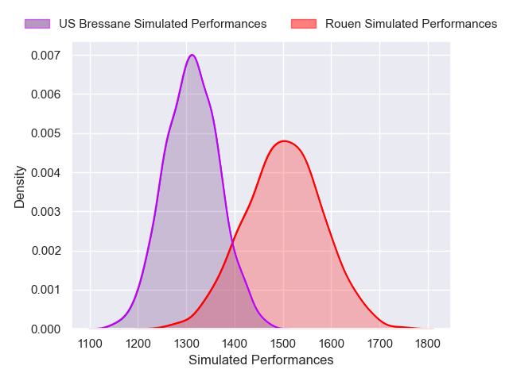
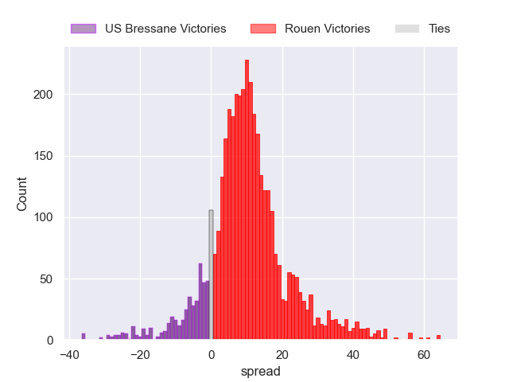
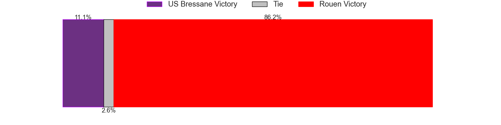
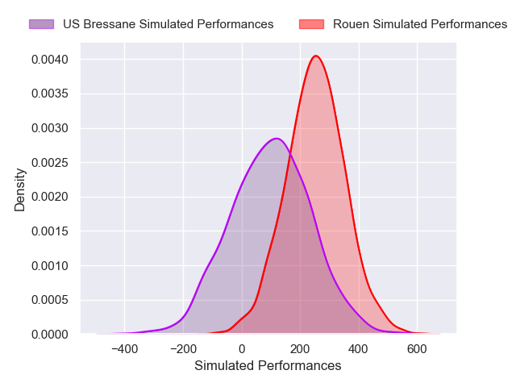
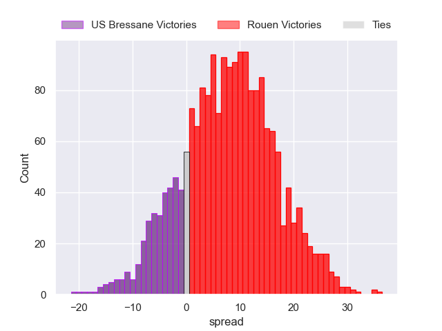
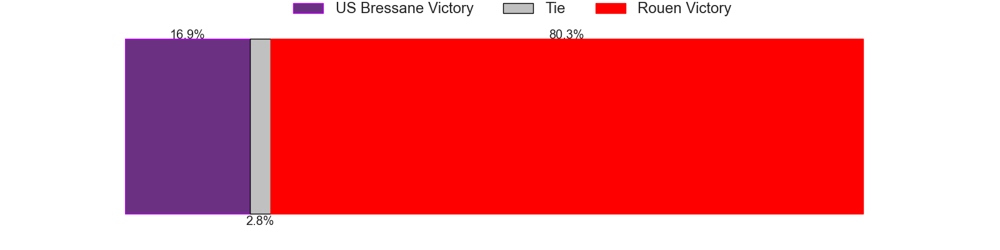

---  
layout: page  
title: US Bressane at Rouen; 20-20  
date: 2024-12-13 18:00:00 -0500  
categories: "Nationale 2024" match review  
---
# US Bressane at Rouen; 20-20

# Club Level Predictions

The first set of predictions treats a club as the smallest object, as the club develops its members, organizes a gameplan, and deploys its players as needed for each match. This club model has a prediction of 0.747, which translates to predicting Rouen to win by 9.6.

Our Over/Under is 38.5 - and combined with the spread above, we have a predicted scoreline of 15 to 24

Each club has a rating and a rating deviation (similar to a Glicko rating), and expected performances can be generated. This allows for simulated matches and spreads like the ones below.
## Projected Performances - Club Model

## Projected Spreads - Club Model

## Projected Results - Club Model

# Player Level Predictions

Treating teams instead as an entity made up of the currently active players, I have ratings for each player in an altogether different system. These can be combined to form team ratings once teamsheets are announced, weighting starters a bit higher than the reserves. After the match is played, players can be weighted by their minutes on the field, allowing for an accurate measure of the team's composition. With these compiled team ratings, we can make predictions, measure inaccuracy, and update the individual player ratings.
## Prediction without Player Minutes: Rouen by 11.4

Rouen by 7.2 on a neutral pitch

## Projected Performances - Player Model

## Projected Spreads - Player Model

## Projected Results - Player Model

|   Away Minutes | Away Player          |   Away Percentile |   Number |   Home Percentile | Home Player        |   Home Minutes |
|---------------:|:---------------------|------------------:|---------:|------------------:|:-------------------|---------------:|
|             80 | Nicolas Lemaire      |             37.31 |        1 |             37.49 | Ewan Clément       |             14 |
|             66 | Arnaud Feltrin       |             18.62 |        2 |             72.3  | Mathieu Bonnot     |             19 |
|             80 | Lasha Mchelidze      |             85.12 |        3 |             79.22 | Soso Bekoshvili    |             23 |
|             21 | Quentin Witt         |             14.92 |        4 |             36.68 | Corentin Vernet    |             10 |
|             36 | Victor Fromenteze    |              0.53 |        5 |             81.26 | John-Charles Astle |             19 |
|             80 | Nicolas Tachat       |             53.81 |        6 |             32.56 | Manolo Laffond     |             51 |
|             51 | Pierre Reynaud       |             64.1  |        7 |             19.79 | Willy N'Diaye      |             80 |
|             12 | Loic Baradel         |             72.22 |        8 |             65.92 | Abdelkarim Fofana  |             51 |
|             80 | Jeremy Valencot      |             82.95 |        9 |             83.77 | Florent Campeggia  |             80 |
|             15 | Fred Zeilinga        |             92.32 |       10 |             66.87 | Maxime Javaux      |             16 |
|             80 | Élie De Fleurian     |             66.14 |       11 |             81.08 | Benito Masilevu    |             80 |
|             68 | Benjamin Doy         |             57.13 |       12 |             51    | Nicolas Nieto      |             61 |
|             54 | Joe Margetts         |             54.74 |       13 |             13.11 | Opetera Peleseuma  |             52 |
|             17 | Thibaut Perrette     |             52.54 |       14 |             66.77 | Benjamin Debetz    |             23 |
|             80 | Jules Margarit       |             54.31 |       15 |             68.16 | Joaquin Riera      |             29 |
|             30 | Atonio Ulutuipalelei |             36.72 |       16 |             49.18 | Gauthier Lelong    |             29 |
|             80 | Nathan Azais         |             40.4  |       17 |             61.87 | Jean Leleu         |             51 |
|             52 | Nail Ait Naceur      |             65.64 |       18 |             62.38 | Ernest Eudier      |             29 |
|             56 | Erich de Jager       |             42.8  |       19 |             41.26 | Diego Arbelo       |             80 |
|             65 | Louis Dasalmartini   |             44.6  |       20 |            nan    | Soulemane Camara   |             29 |
|             80 | Jeremie Martin       |             19.67 |       21 |             10.43 | Theo Dachary       |             28 |
|             51 | Alexandre Badet      |             23.35 |       22 |             88.89 | Benjamin Pehau     |             68 |
|             80 | Wael May             |             64.86 |       23 |            nan    | Lucas Poisson      |             80 |

