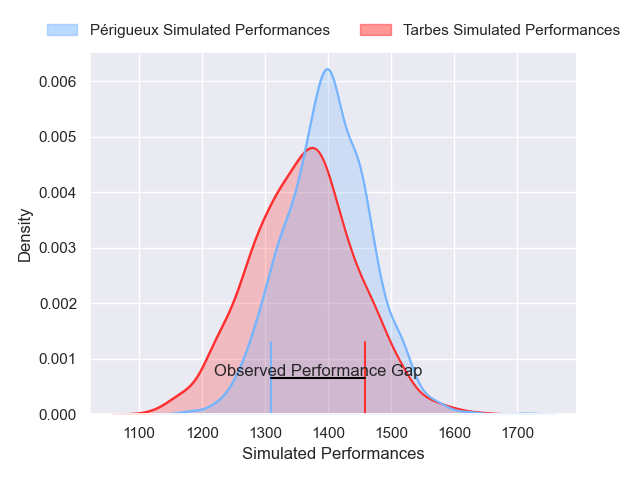
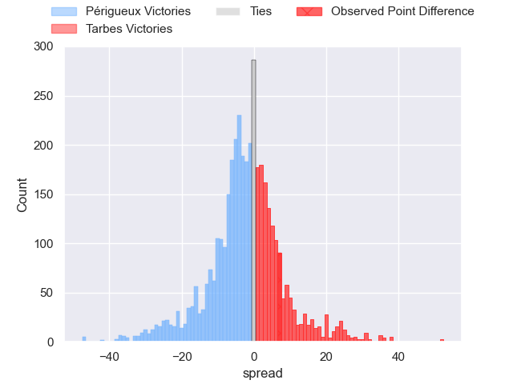
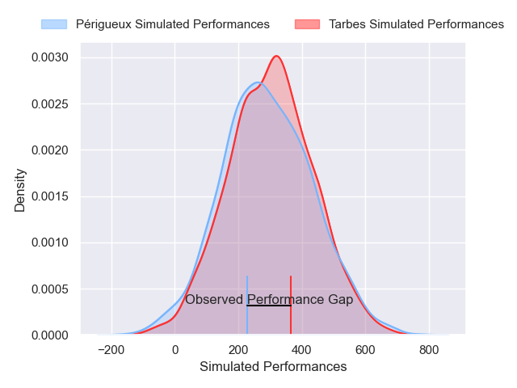
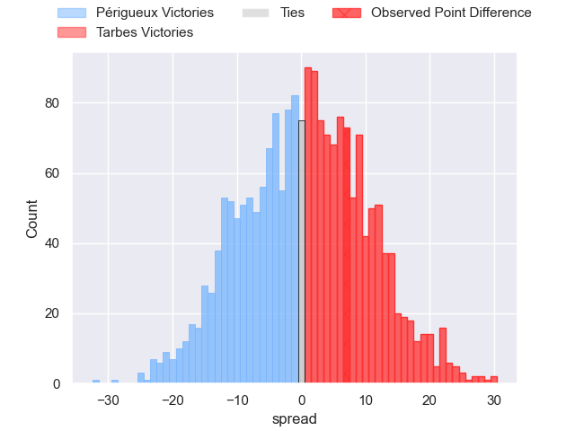

---  
layout: page  
title: Perigueux at Tarbes; 23-30  
date: 2024-12-13 18:00:00 -0500  
categories: "Nationale 2024" match review  
---
# Perigueux at Tarbes; 23-30

# Club Level Predictions

The first set of predictions treats a club as the smallest object, as the club develops its members, organizes a gameplan, and deploys its players as needed for each match. This club model has a prediction of 0.447, which translates to predicting Périgueux to win by 1.9.

Our Over/Under is 41.5 - and combined with the spread above, we have a predicted scoreline of 22 to 20

Each club has a rating and a rating deviation (similar to a Glicko rating), and expected performances can be generated. This allows for simulated matches and spreads like the ones below.
## Projected Performances - Club Model

## Projected Spreads - Club Model

## Projected Results - Club Model

# Player Level Predictions

Treating teams instead as an entity made up of the currently active players, I have ratings for each player in an altogether different system. These can be combined to form team ratings once teamsheets are announced, weighting starters a bit higher than the reserves. After the match is played, players can be weighted by their minutes on the field, allowing for an accurate measure of the team's composition. With these compiled team ratings, we can make predictions, measure inaccuracy, and update the individual player ratings.
## Prediction without Player Minutes: Tarbes by 2.1

Périgueux by 8.6 on a neutral pitch

## Projected Performances - Player Model

## Projected Spreads - Player Model

## Projected Results - Player Model

|   Away Minutes | Away Player       |   Away Percentile |   Number |   Home Percentile | Home Player         |   Home Minutes |
|---------------:|:------------------|------------------:|---------:|------------------:|:--------------------|---------------:|
|             80 | Thomas Vidal      |             69.63 |        1 |             35.38 | Enzo Baggiani       |             80 |
|             80 | Manu Leiataua     |              4.83 |        2 |             59.35 | Florian Lamothe     |             19 |
|             62 | Kalaveti Tawake   |             46.26 |        3 |             25.03 | Luka Vea            |              8 |
|             80 | Clement Lanen     |             73.66 |        4 |             79.31 | Baptiste Peytavi    |             27 |
|             62 | Damien Lavergne   |             74.38 |        5 |              1.09 | Filipe Manu         |             80 |
|             69 | Hendri Storm      |             57.24 |        6 |             98.04 | Alexis Armary       |             80 |
|             51 | Madioke Konate    |             75.13 |        7 |             15.25 | Spike Salman        |             80 |
|             80 | Nahum Merigan     |             62.27 |        8 |             25.88 | Joeli Matalaweru    |             40 |
|             53 | Max Green         |             85.71 |        9 |             45.51 | Mickael Thébault    |             80 |
|             80 | Juan Kotze        |             83.47 |       10 |             16.33 | Alexandre Perez     |             80 |
|             67 | Fred Hickes       |             91.28 |       11 |             16.11 | Johan Paulet        |             52 |
|             80 | Cyril Couturier   |             77.43 |       12 |              5.59 | Savenaca Rawaca     |             80 |
|             80 | Dorian Lavernhe   |             78.02 |       13 |             15.11 | Maile Mamao         |             80 |
|             21 | Vincent Fouillade |             90.66 |       14 |             76.73 | Clement Latorre     |             80 |
|             80 | Yon Camou         |             11.28 |       15 |             32.72 | Amona Artaud        |             80 |
|             53 | Jason Tindiliere  |             40.72 |       16 |             12.95 | Ximun Bessonart     |             35 |
|             80 | Louis Martin      |             83.33 |       17 |             73.16 | Irakli Mirtskhulava |             80 |
|             80 | Anthony Pelmard   |             79.91 |       18 |             25.23 | Vincent Dolier      |             28 |
|             63 | Mathieu Pace      |             81.4  |       19 |             36.74 | Mathieu Soufflet    |             57 |
|             13 | Afaesetiti Amosa  |             95.4  |       20 |             14.77 | Léo Saint-Guilhem   |             80 |
|             71 | Karl Lambert      |             67.11 |       21 |             44.2  | Matias Brocal       |             80 |
|             53 | Matteo Bordenave  |             61.96 |       22 |             63.42 | Osea Waqaninavatu   |             80 |
|             25 | Anderson Neisen   |             78.37 |       23 |             33.64 | Kevin Lhomy         |             51 |

