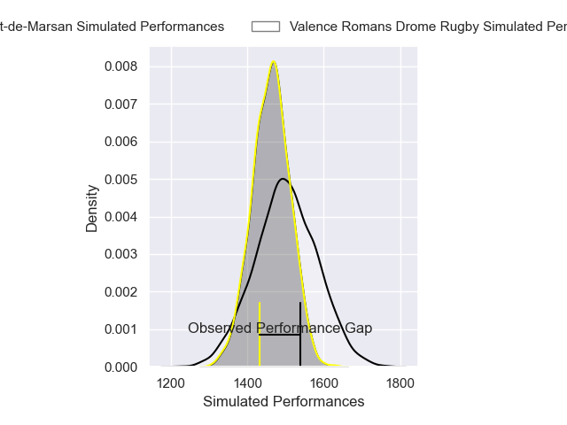
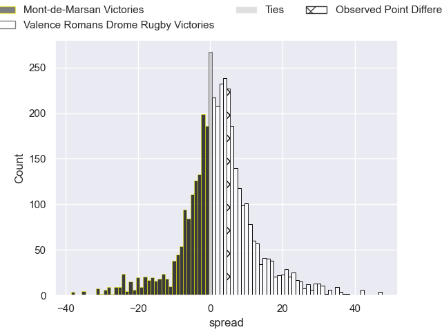
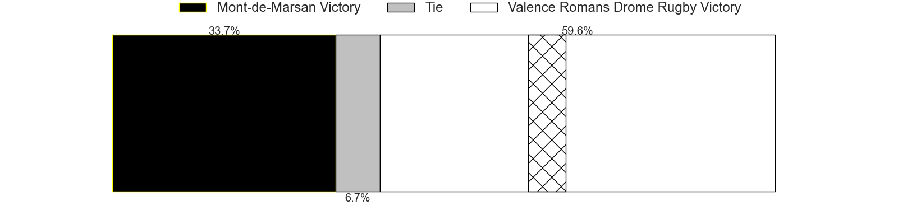
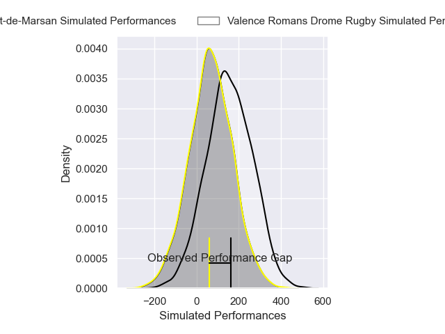
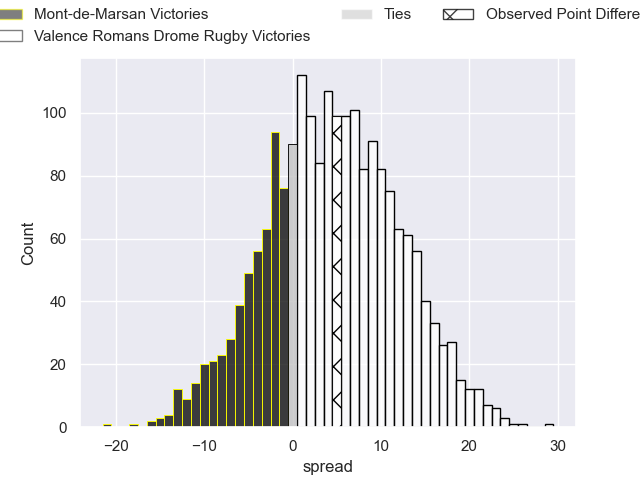
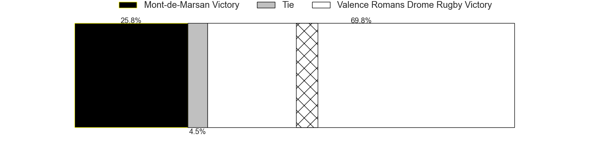

---  
layout: page  
title: Mont-de-Marsan at Valence Romans Drome Rugby; 23-28  
date: 2024-12-13 18:00:00 -0500  
categories: "Pro D2 2024" match review  
---
# Mont-de-Marsan at Valence Romans Drome Rugby; 23-28

# Club Level Predictions

The first set of predictions treats a club as the smallest object, as the club develops its members, organizes a gameplan, and deploys its players as needed for each match. This club model has a prediction of 0.558, which translates to predicting Valence Romans Drome Rugby to win by 2.1.

Our Over/Under is 54.5 - and combined with the spread above, we have a predicted scoreline of 26 to 28

Each club has a rating and a rating deviation (similar to a Glicko rating), and expected performances can be generated. This allows for simulated matches and spreads like the ones below.
## Projected Performances - Club Model

## Projected Spreads - Club Model

## Projected Results - Club Model

# Player Level Predictions

Treating teams instead as an entity made up of the currently active players, I have ratings for each player in an altogether different system. These can be combined to form team ratings once teamsheets are announced, weighting starters a bit higher than the reserves. After the match is played, players can be weighted by their minutes on the field, allowing for an accurate measure of the team's composition. With these compiled team ratings, we can make predictions, measure inaccuracy, and update the individual player ratings.
## Prediction without Player Minutes: Valence Romans Drome Rugby by 8.5

Valence Romans Drome Rugby by 4.7 on a neutral pitch

## Projected Performances - Player Model

## Projected Spreads - Player Model

## Projected Results - Player Model

|   Away Minutes | Away Player           |   Away Percentile |   Number |   Home Percentile | Home Player         |   Home Minutes |
|---------------:|:----------------------|------------------:|---------:|------------------:|:--------------------|---------------:|
|             48 | Luka Goginava         |             68.04 |        1 |             63.98 | Anthony Aléo        |             54 |
|             53 | Luka Begic            |              6.73 |        2 |             64.01 | Dorian Marco Pena   |             80 |
|             10 | Anthony Alves         |              9.58 |        3 |             51.17 | Vincent Vial        |             80 |
|             22 | Jules Dussutour       |             70.76 |        4 |             68.92 | Ryan McCauley       |             53 |
|             80 | Romain Durand         |             75.24 |        5 |             62.95 | Yassine Maamry      |             80 |
|             42 | Yann Brethous         |             21.69 |        6 |             66.98 | Adrien Roux         |             24 |
|              4 | Raphaël Robic         |             82.8  |        7 |             13.4  | Ilia Spanderashvili |             26 |
|             55 | Ioane Iashagashvili   |             79.9  |        8 |              1.93 | Mathieu Vachon      |             80 |
|             48 | Baptiste Canut        |             44.86 |        9 |             90.68 | Tim Menzel          |             40 |
|             17 | Willie du Plessis     |             74.85 |       10 |             28.4  | Lucas Meret         |             80 |
|             17 | Semi Lagivala         |             28.75 |       11 |             86.17 | Mosese Mawalu       |             27 |
|             24 | Nacani Wakaya         |             53.18 |       12 |             85.6  | Louis Marrou        |             27 |
|             48 | Gatien Masse          |             10.58 |       13 |             10.48 | Mathieu Guillomot   |              4 |
|             13 | Simao Bento           |             12.8  |       14 |             93.4  | Adam Vargas         |             32 |
|             27 | Yoann Laousse Azpiazu |             17.51 |       15 |             88.7  | Joris De Moura      |             25 |
|             25 | Thomas Bultel         |             48.45 |       16 |              9.32 | Mattéo Rodor        |             32 |
|             80 | Waël Ponpon           |             28.09 |       17 |             69.23 | Thembelani Bholi    |             40 |
|             40 | Samuel Lagrange       |             37.87 |       18 |             71.2  | Florian Goumat      |             21 |
|             40 | Myles Edwards         |             14.75 |       19 |             40.9  | Esteban Chouteau    |             40 |
|             20 | Mike Faleafa          |             13.83 |       20 |             50.98 | Gareth Milasinovich |             80 |
|             40 | Nicolas Darquier      |             43.25 |       21 |             27.87 | Thomas Roziere      |             59 |
|             80 | Alexandre de Nardi    |             48.94 |       22 |             59.55 | Axel Bruchet        |             25 |
|             80 | Gheorghe Gajion       |             41.92 |       23 |              2.82 | Cyril Deligny       |             80 |

