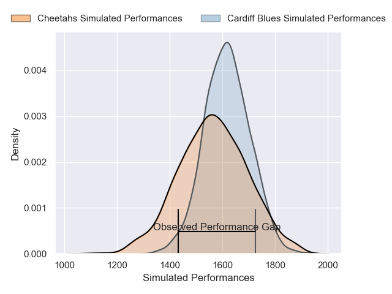
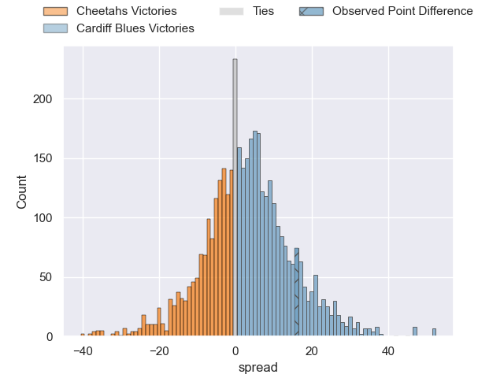
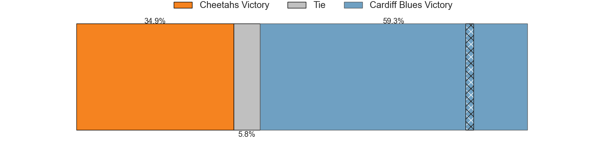
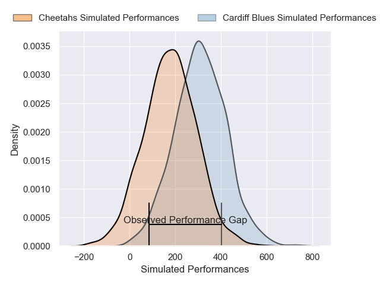
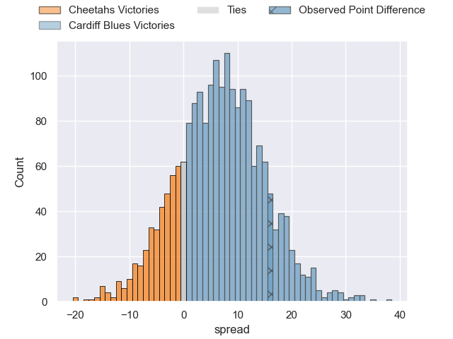
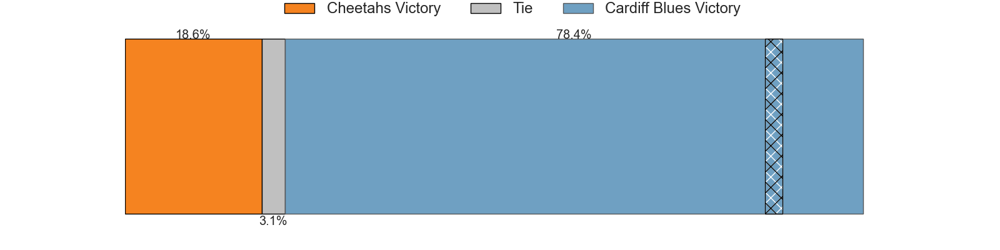

---  
layout: page  
title: Cheetahs at Cardiff Blues; 10-26  
date: 2024-12-14 18:00:00 -0500  
categories: "European Rugby Challenge Cup 2024" match review  
---
# Cheetahs at Cardiff Blues; 10-26

# Club Level Predictions

The first set of predictions treats a club as the smallest object, as the club develops its members, organizes a gameplan, and deploys its players as needed for each match. This club model has a prediction of 0.572, which translates to predicting Cardiff Blues to win by 2.7.

Our Over/Under is 47.5 - and combined with the spread above, we have a predicted scoreline of 22 to 25

Each club has a rating and a rating deviation (similar to a Glicko rating), and expected performances can be generated. This allows for simulated matches and spreads like the ones below.
## Projected Performances - Club Model

## Projected Spreads - Club Model

## Projected Results - Club Model

# Player Level Predictions

Treating teams instead as an entity made up of the currently active players, I have ratings for each player in an altogether different system. These can be combined to form team ratings once teamsheets are announced, weighting starters a bit higher than the reserves. After the match is played, players can be weighted by their minutes on the field, allowing for an accurate measure of the team's composition. With these compiled team ratings, we can make predictions, measure inaccuracy, and update the individual player ratings.
## Prediction without Player Minutes: Cardiff Blues by 10.1

Cheetahs by 2.3 on a neutral pitch

## Projected Performances - Player Model

## Projected Spreads - Player Model

## Projected Results - Player Model

|   Away Minutes | Away Player              |   Away Percentile |   Number |   Home Percentile | Home Player       |   Home Minutes |
|---------------:|:-------------------------|------------------:|---------:|------------------:|:------------------|---------------:|
|             81 | Schalk Ferreira          |             32.47 |        1 |             76.74 | Corey Domachowski |             48 |
|             33 | Louis van der Westhuizen |             28.01 |        2 |             63.38 | Liam Belcher      |             14 |
|             33 | Aranos Coetzee           |             42.21 |        3 |             33.71 | Will Davies-King  |             70 |
|             15 | Carl Wegner              |             44.23 |        4 |             84.72 | Josh McNally      |             81 |
|             80 | Victor Sekekete          |             78.24 |        5 |             10.3  | Teddy Williams    |             62 |
|             81 | Gideon van der Merwe     |             30.93 |        6 |             66.67 | James Botham      |             81 |
|             27 | Oupa Mohoje              |             18.25 |        7 |             13.45 | Dan Thomas        |             54 |
|             18 | Jeandre Rudolph          |             54.65 |        8 |             43.24 | Taulupe Faletau   |             53 |
|             81 | Ruben de Haas            |             27.21 |        9 |             81.48 | Aled Davies       |             66 |
|             33 | Ethan Wentzel            |             33.74 |       10 |             90.51 | Callum Sheedy     |             57 |
|             21 | Cohen Jasper             |             48.01 |       11 |             59.06 | Tom Bowen         |             81 |
|             81 | Ali Mgijima              |             31.2  |       12 |             48.71 | Ben Thomas        |             45 |
|             41 | Carel-Jan Coetzee        |             29.57 |       13 |             86.99 | Rey Lee-Lo        |             11 |
|             69 | Munier Hartzenberg       |             81.88 |       14 |             86.57 | Josh Adams        |             52 |
|             28 | Michael Annies           |             27.53 |       15 |             11.42 | Cameron Winnett   |             80 |
|             21 | Vernon Paulo             |            nan    |       16 |             17.21 | Dafydd Hughes     |             81 |
|             31 | Hencus van Wyk           |            nan    |       17 |             41.56 | Danny Southworth  |             30 |
|             54 | Robert Hunt              |            nan    |       18 |             14.88 | Keiron Assiratti  |             30 |
|             19 | Pierre-Raymond Uys       |            nan    |       19 |             16.34 | Seb Davies        |             30 |
|             81 | Friedle Olivier          |             94.09 |       20 |             11.83 | Alex Mann         |             30 |
|             19 | Daniel Maartens          |            nan    |       21 |             71.17 | Alun Lawrence     |             30 |
|             80 | Rewan Kruger             |            nan    |       22 |            nan    | Johan Mulder      |             15 |
|             66 | George Lourens           |             22.83 |       23 |             41.15 | Rory Jennings     |             81 |

