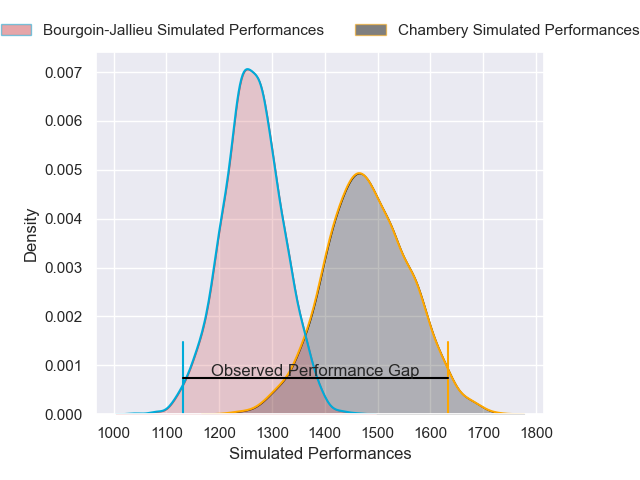
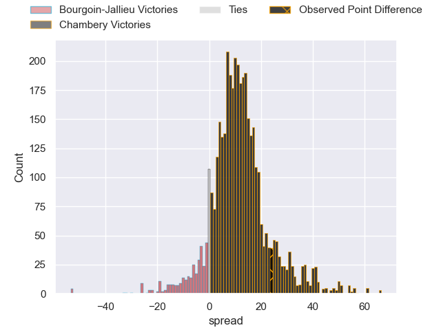
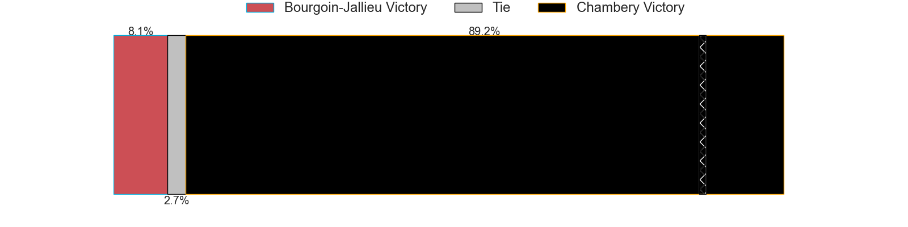
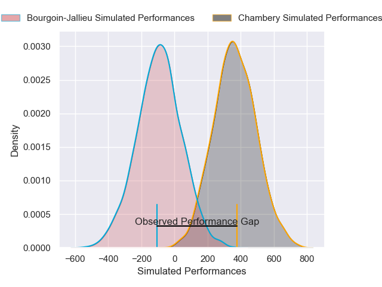
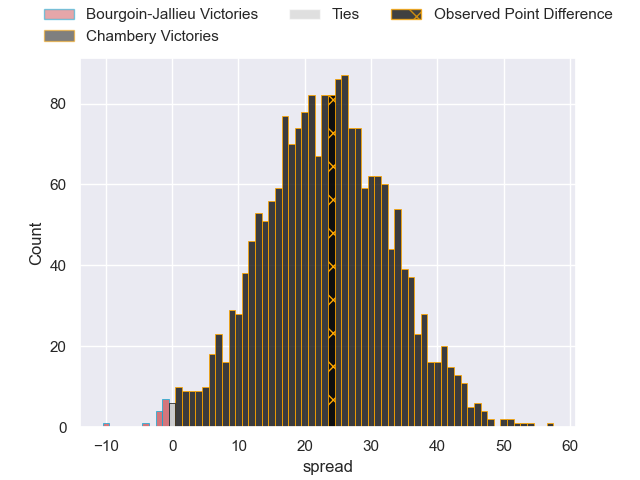
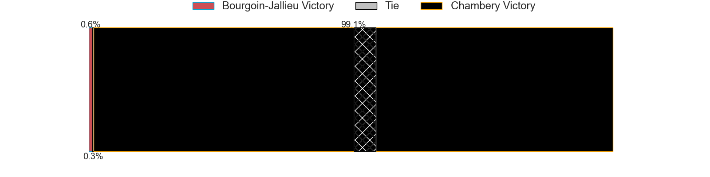

---  
layout: page  
title: Bourgoin-Jallieu at Chambery; 0-24  
date: 2024-12-14 18:00:00 -0500  
categories: "Nationale 2024" match review  
---
# Bourgoin-Jallieu at Chambery; 0-24

# Club Level Predictions

The first set of predictions treats a club as the smallest object, as the club develops its members, organizes a gameplan, and deploys its players as needed for each match. This club model has a prediction of 0.775, which translates to predicting Chambery to win by 10.9.

Our Over/Under is 55.5 - and combined with the spread above, we have a predicted scoreline of 22 to 33

Each club has a rating and a rating deviation (similar to a Glicko rating), and expected performances can be generated. This allows for simulated matches and spreads like the ones below.
## Projected Performances - Club Model

## Projected Spreads - Club Model

## Projected Results - Club Model

# Player Level Predictions

Treating teams instead as an entity made up of the currently active players, I have ratings for each player in an altogether different system. These can be combined to form team ratings once teamsheets are announced, weighting starters a bit higher than the reserves. After the match is played, players can be weighted by their minutes on the field, allowing for an accurate measure of the team's composition. With these compiled team ratings, we can make predictions, measure inaccuracy, and update the individual player ratings.
## Prediction without Player Minutes: Chambery by 19.6

Chambery by 16.1 on a neutral pitch

## Projected Performances - Player Model

## Projected Spreads - Player Model

## Projected Results - Player Model

|   Away Minutes | Away Player       |   Away Percentile |   Number |   Home Percentile | Home Player              |   Home Minutes |
|---------------:|:------------------|------------------:|---------:|------------------:|:-------------------------|---------------:|
|             11 | Adrien Mallet     |             48.8  |        1 |             89.72 | Nugzar Somkhishvili      |             49 |
|             21 | Maxime Castant    |             69.47 |        2 |             74.45 | Quentin Beaudaux         |             68 |
|             34 | Keynan Knox       |             15.15 |        3 |             81.44 | Lasha Tabidze            |             80 |
|             80 | Robin Gascou      |              9.57 |        4 |             89.61 | Ahmed Tidiane Kane       |             56 |
|             28 | Léandre Cotte     |              3.28 |        5 |             62.81 | Fabien Witz              |             39 |
|             29 | Theophile Cotte   |             35.18 |        6 |             94.04 | Jean-Baptiste Grenod     |             57 |
|             53 | Sam Daly          |             22.4  |        7 |             71.04 | Colin Lebian             |             67 |
|             80 | Poutasi Luafutu   |              3.17 |        8 |             46.91 | Taniela Matakaiongo      |             41 |
|             39 | Liam Rimet        |             21.1  |        9 |              6.98 | Sonatane Takulua         |             80 |
|             64 | Nicolas Vuillemin |             77.76 |       10 |             44.08 | Thibault Moreno          |             80 |
|             80 | Joe Ravouvou      |             85.6  |       11 |             64.98 | Arthur Nennig            |             80 |
|             50 | Isaiah Leota      |             82.73 |       12 |             71.44 | Mickael Blanc            |             52 |
|             62 | Pierre Mignot     |             16.88 |       13 |             42.79 | Maewen Sao               |             51 |
|             62 | Paul-Hugo Champ   |             20.16 |       14 |             74.01 | Va'aufauese Apelu Maliko |             68 |
|             62 | Nicolas Cachet    |              6.47 |       15 |             73.57 | Paul Altier              |             12 |
|             62 | Nicolas Cachet    |              6.47 |       15 |             73.57 | Paul Altier              |             41 |
|             64 | Morgan Eames      |              0.46 |       16 |             95.33 | Yan Tabarot              |             41 |
|             68 | Rémy Gaborit      |             31.24 |       17 |             60.94 | Youenn Floch             |             28 |
|             68 | Kevin Chaudouard  |             13.97 |       18 |             61.53 | Corentin Astier          |             80 |
|             80 | Thomas Adélaïde   |             30.54 |       19 |             69.27 | Mateo Guerret            |             68 |
|             51 | Jeremy Gondrand   |             17.55 |       20 |             77.84 | Enzo Segui               |             51 |
|             80 | Christopher Bosch |              1.47 |       21 |             89.18 | Matheo Triki             |             80 |
|             71 | Oktay Yilmaz      |             50.93 |       22 |             60.08 | Osman Dimen              |             80 |
|             80 | Louis Ponton      |            nan    |       23 |            nan    | nan                      |            nan |

