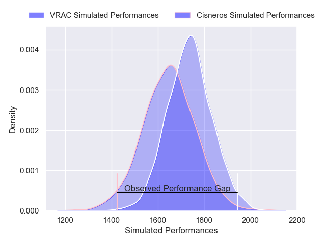
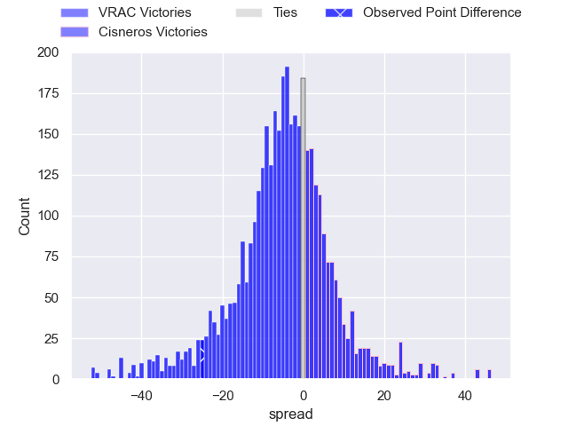
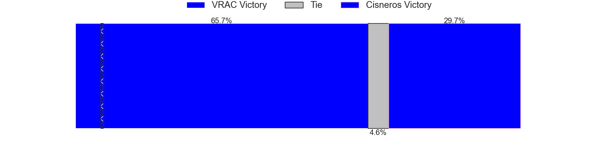
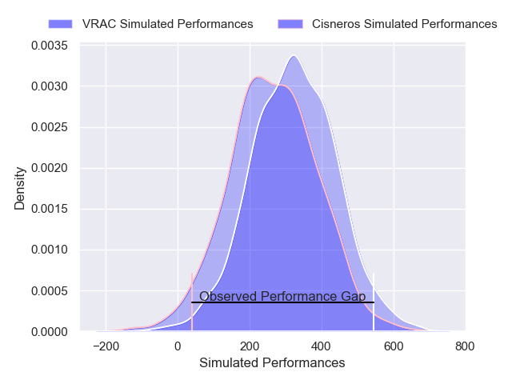
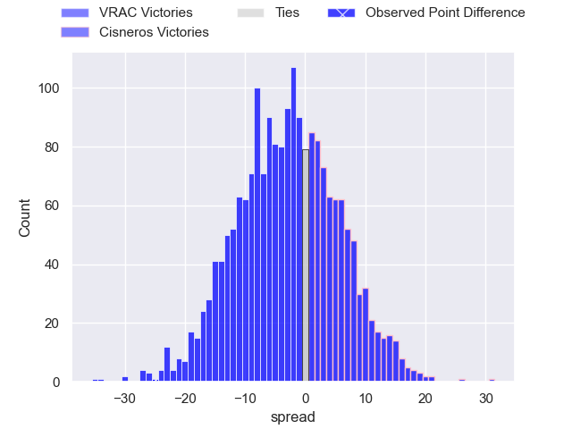
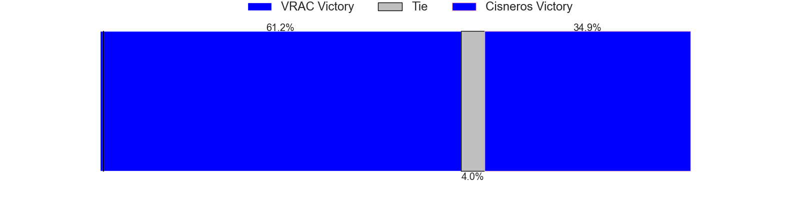

---  
layout: page  
title: VRAC at Cisneros; 35-10  
date: 2024-12-14 18:00:00 -0500  
categories: "Division de Honor de Rugby 2024" match review  
---
# VRAC at Cisneros; 35-10

# Club Level Predictions

The first set of predictions treats a club as the smallest object, as the club develops its members, organizes a gameplan, and deploys its players as needed for each match. This club model has a prediction of 0.383, which translates to predicting VRAC to win by 4.3.

Our Over/Under is 43.5 - and combined with the spread above, we have a predicted scoreline of 24 to 20

Each club has a rating and a rating deviation (similar to a Glicko rating), and expected performances can be generated. This allows for simulated matches and spreads like the ones below.
## Projected Performances - Club Model

## Projected Spreads - Club Model

## Projected Results - Club Model

# Player Level Predictions

Treating teams instead as an entity made up of the currently active players, I have ratings for each player in an altogether different system. These can be combined to form team ratings once teamsheets are announced, weighting starters a bit higher than the reserves. After the match is played, players can be weighted by their minutes on the field, allowing for an accurate measure of the team's composition. With these compiled team ratings, we can make predictions, measure inaccuracy, and update the individual player ratings.
## Prediction without Player Minutes: VRAC by 7.6

VRAC by 11.4 on a neutral pitch

## Projected Performances - Player Model

## Projected Spreads - Player Model

## Projected Results - Player Model

|   Away Minutes | Away Player                 |   Away Percentile |   Number |   Home Percentile | Home Player             |   Home Minutes |
|---------------:|:----------------------------|------------------:|---------:|------------------:|:------------------------|---------------:|
|             80 | Marcos Muniz                |             91.92 |        1 |             79.97 | Andres Vallejo          |             28 |
|             80 | Tsotne Tchurumbindze        |             92.99 |        2 |             40.19 | Gonzalo Gonzalez        |             80 |
|             80 | Giorgi Turabelidze          |             70.69 |        3 |             29.04 | Hugo Gonzalez Hernandez |             80 |
|             57 | Arnau Ojeda Galvez          |             70.56 |        4 |             85.69 | Tomas Antozzi           |             28 |
|             56 | Kalokalo (Carlos) Gavidi    |             96.99 |        5 |             31.45 | Pablo Riva Boal         |             59 |
|             23 | Marc Sanchez                |             91.31 |        6 |             72.06 | Manex Pujana Lendinez   |             28 |
|             80 | Alex Saleta                 |             59.45 |        7 |             76.75 | Abraham Tamargo         |             12 |
|             80 | Maxim Ermakov               |             64.94 |        8 |             75.79 | Guillermo Moreton       |              9 |
|             20 | Mauro Perotti               |             97.34 |        9 |             51.66 | Nicolas Infer Arias     |              8 |
|             46 | Sam Hollingsworth           |             76.73 |       10 |             73.67 | Ike Irusta              |             62 |
|             31 | Pedro Luis de la Lastra     |             88.72 |       11 |             34.09 | Miguel Perez            |             80 |
|             57 | Balthazar Taibo             |             84.4  |       12 |             76.64 | Juan Fonseca            |             80 |
|             23 | Francisco Gonzalez del Pino |             64.97 |       13 |             37.78 | Pablo Martinez Sanchez  |             80 |
|             27 | Miguel Lainz                |             93.85 |       14 |             53.39 | Francisco Soriano       |              7 |
|             13 | Martiniano Cian             |             85.21 |       15 |             50.65 | Lucas Nicolas Armani    |             80 |
|             24 | Pablo Miejimolle Ligero     |             91.59 |       16 |             52.24 | Xabier Gonzalez         |             80 |
|             69 | Teodoro Marcos              |             55.51 |       17 |            nan    | Adrian Plaza Pegueroles |             80 |
|             80 | Raul Calzon                 |             59.41 |       18 |             76.41 | Robert Edginton         |             39 |
|             23 | Alejandro Alonso Munoz      |             77.92 |       19 |             84.27 | Andres Petros           |             80 |
|             11 | Mauro Genco                 |             89.19 |       20 |             40.25 | Nicolas Fernandez-Duran |             28 |
|             52 | Gabriel Velez               |             61.94 |       21 |             89.43 | Jorge Gonzalez          |             80 |
|             52 | Alex Perez                  |             44.48 |       22 |            nan    | Nicolas Hinojosa        |             52 |
|             52 | Gonzalo Dominguez           |             43.36 |       23 |             53.85 | Salvador Guardiola      |             69 |

