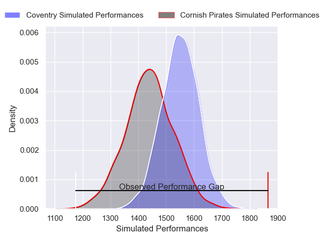
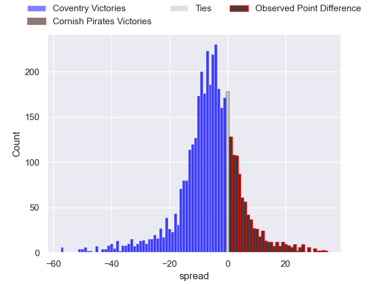
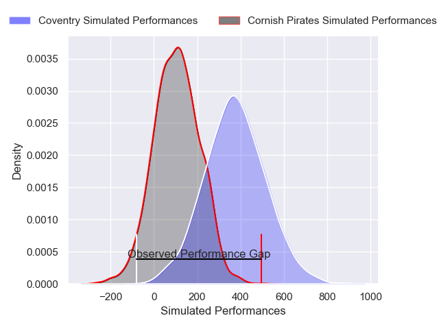
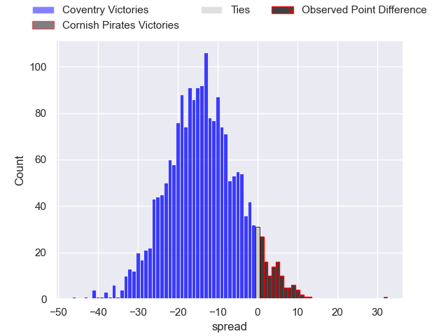

---  
layout: page  
title: Coventry at Cornish Pirates; 14-46  
date: 2024-12-14 18:00:00 -0500  
categories: "RFU Championship 2024" match review  
---
# Coventry at Cornish Pirates; 14-46

# Club Level Predictions

The first set of predictions treats a club as the smallest object, as the club develops its members, organizes a gameplan, and deploys its players as needed for each match. This club model has a prediction of 0.347, which translates to predicting Coventry to win by 5.6.

Our Over/Under is 44.5 - and combined with the spread above, we have a predicted scoreline of 25 to 19

Each club has a rating and a rating deviation (similar to a Glicko rating), and expected performances can be generated. This allows for simulated matches and spreads like the ones below.
## Projected Performances - Club Model

## Projected Spreads - Club Model

## Projected Results - Club Model

# Player Level Predictions

Treating teams instead as an entity made up of the currently active players, I have ratings for each player in an altogether different system. These can be combined to form team ratings once teamsheets are announced, weighting starters a bit higher than the reserves. After the match is played, players can be weighted by their minutes on the field, allowing for an accurate measure of the team's composition. With these compiled team ratings, we can make predictions, measure inaccuracy, and update the individual player ratings.
## Prediction without Player Minutes: Coventry by 11.2

Coventry by 15.7 on a neutral pitch

## Projected Performances - Player Model

## Projected Spreads - Player Model

## Projected Results - Player Model

|   Away Minutes | Away Player          |   Away Percentile |   Number |   Home Percentile | Home Player       |   Home Minutes |
|---------------:|:---------------------|------------------:|---------:|------------------:|:------------------|---------------:|
|              8 | Toby Trinder         |             88.02 |        1 |             38.93 | Billy Young       |             80 |
|             80 | Jordon Poole         |             86.23 |        2 |             77.93 | Harry Hocking     |             80 |
|             10 | Matt Johnson         |             84.59 |        3 |             74.83 | James French      |             80 |
|             80 | James Tyas           |             79.19 |        4 |             21.86 | Charlie Rice      |             64 |
|             58 | Obinna Nkwocha       |             76.73 |        5 |             91.22 | Lewis Pearson     |             27 |
|             39 | Tom Ball             |             93.6  |        6 |             91.18 | Martin Moloney    |             16 |
|             52 | Aaron Hinkley        |             26.97 |        7 |             84.36 | Will Gibson       |             30 |
|             63 | Senitiki Nayalo      |             84.89 |        8 |             57.23 | Hugh Bokenham     |             27 |
|             80 | Will Lane            |             36.33 |        9 |             22.19 | Dan HIscocks      |             80 |
|             80 | Tommy Mathews        |             39.15 |       10 |             79.51 | Bruce Houston     |             27 |
|             80 | James Martin         |             89.32 |       11 |             73.06 | Arthur Relton     |             21 |
|             80 | Dafydd-Rhys Tiueti   |             17.24 |       12 |             61.9  | Chester Ribbons   |             30 |
|             74 | Ryan Hutler          |             67.78 |       13 |             63.17 | Charlie McCaig    |             80 |
|             80 | David Opoku-Fordjour |             14.06 |       14 |             33.31 | Matthew McNab     |             67 |
|             80 | Liam Richman         |             15.82 |       15 |             77.4  | Will Trewin       |             23 |
|             80 | Jevaughn Warren      |             25.3  |       16 |            nan    | Oisin Michel      |             15 |
|             53 | Eliot Salt           |             32.91 |       17 |             12.52 | Sol Moody         |             53 |
|             54 | Will Biggs           |            nan    |       18 |             57.58 | Jay Tyack         |             53 |
|             80 | Dan Green            |            nan    |       19 |             20.37 | Matt Cannon       |             53 |
|             24 | Josh Barton          |             77.97 |       20 |             29.21 | Jack King         |              8 |
|             80 | Daniel Okeke         |             66.88 |       21 |             11.9  | Cam Jones         |             80 |
|             26 | Charlie Robson       |             62.52 |       22 |             80.36 | Robin Wedlake     |             16 |
|            nan | nan                  |            nan    |       23 |              9.79 | Iwan Price-Thomas |             30 |

