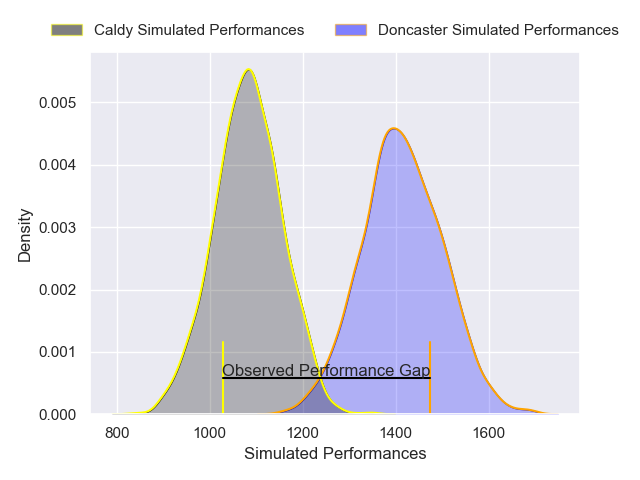
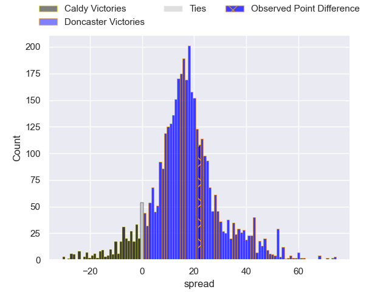
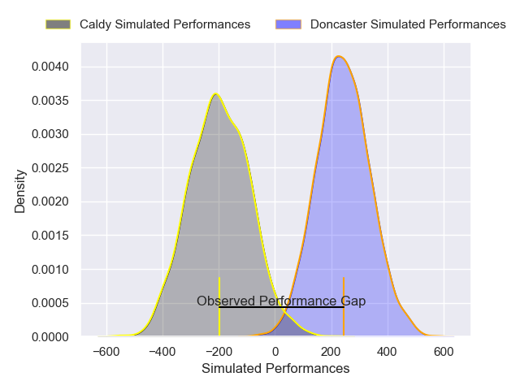
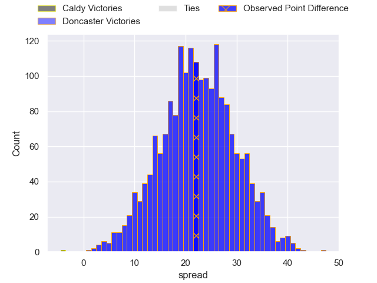

---  
layout: page  
title: Caldy at Doncaster; 0-22  
date: 2024-12-14 18:00:00 -0500  
categories: "RFU Championship 2024" match review  
---
# Caldy at Doncaster; 0-22

# Club Level Predictions

The first set of predictions treats a club as the smallest object, as the club develops its members, organizes a gameplan, and deploys its players as needed for each match. This club model has a prediction of 0.866, which translates to predicting Doncaster to win by 16.6.

Our Over/Under is 47.5 - and combined with the spread above, we have a predicted scoreline of 15 to 32

Each club has a rating and a rating deviation (similar to a Glicko rating), and expected performances can be generated. This allows for simulated matches and spreads like the ones below.
## Projected Performances - Club Model

## Projected Spreads - Club Model

## Projected Results - Club Model

# Player Level Predictions

Treating teams instead as an entity made up of the currently active players, I have ratings for each player in an altogether different system. These can be combined to form team ratings once teamsheets are announced, weighting starters a bit higher than the reserves. After the match is played, players can be weighted by their minutes on the field, allowing for an accurate measure of the team's composition. With these compiled team ratings, we can make predictions, measure inaccuracy, and update the individual player ratings.
## Prediction without Player Minutes: Doncaster by 20.1

Doncaster by 15.4 on a neutral pitch

## Projected Performances - Player Model

## Projected Spreads - Player Model

## Projected Results - Player Model

|   Away Minutes | Away Player          |   Away Percentile |   Number |   Home Percentile | Home Player        |   Home Minutes |
|---------------:|:---------------------|------------------:|---------:|------------------:|:-------------------|---------------:|
|             46 | Monty Weatherby      |             27.8  |        1 |             49.41 | Andrew Turner      |             54 |
|             80 | Matt Gallagher       |             10.8  |        2 |             11.11 | George Roberts     |             17 |
|             10 | Joe Sproston         |             18.65 |        3 |             46.4  | Joe Jones          |             20 |
|             53 | Tom Burrow           |             83.21 |        4 |              6.39 | Ben Murphy         |             27 |
|             39 | Thomas Sanders       |             15.54 |        5 |             41.56 | Adam Hopkinson     |              6 |
|             58 | Callum Ridgway       |              6.26 |        6 |              6.68 | Thom Smith         |             18 |
|              8 | Tristan Woodman      |             52.44 |        7 |             73.69 | Arthur Green       |             10 |
|             26 | Josiah Dickinson     |              8.41 |        8 |             68.17 | Morgan Strong      |             54 |
|             80 | Ollie Wynn           |              6.56 |        9 |             71.31 | Alex Dolly         |             30 |
|             80 | Lewis Barker         |              1.62 |       10 |             91.72 | Russell Bennett    |             56 |
|              6 | Michael Cartmill     |              8.35 |       11 |             23.45 | Jordan Olowofela   |             80 |
|             53 | Connor Wilkinson     |              8.13 |       12 |              7.56 | Connor Edwards     |             40 |
|             27 | Rekeiti Ma'asi-White |             15.69 |       13 |              3.83 | George Wacokecoke  |             28 |
|             50 | Matt Kilcourse       |             25.2  |       14 |             92.93 | Semesa Rokoduguni  |             46 |
|             26 | Michael Barlow       |              6.93 |       15 |             97.57 | Telusa Veainu      |             80 |
|             24 | Nathan Rushton       |             17.12 |       16 |             32.59 | Jasper McGuire     |             49 |
|             47 | Oliver Hearn         |              2.82 |       17 |             25.31 | Taniela Ramasibana |             35 |
|             44 | Ryan Higginson       |             23.2  |       18 |             82.76 | Logovi'i Mulipola  |             80 |
|             40 | Freddie Stevenson    |             25.84 |       19 |              9.08 | Benjamin Chapman   |             34 |
|             50 | Joseph Murray        |             24.92 |       20 |             26.65 | Archie Smeaton     |             36 |
|             80 | Sam Bedlow           |              1.53 |       21 |              3.28 | Ollie Fox          |             53 |
|             80 | William Robinson     |             12.32 |       22 |             65.55 | Will Parry         |             57 |

