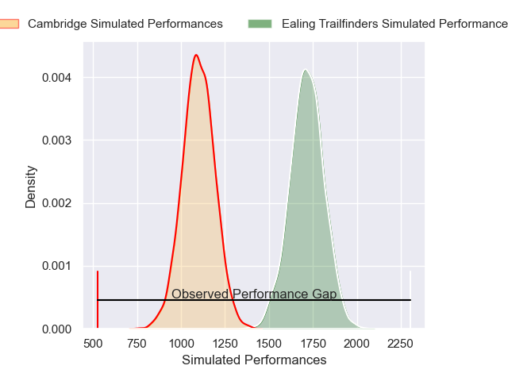
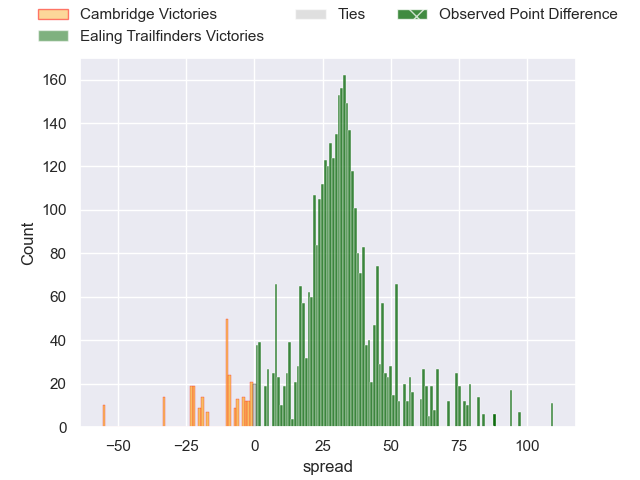
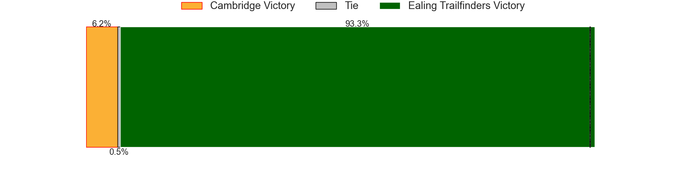
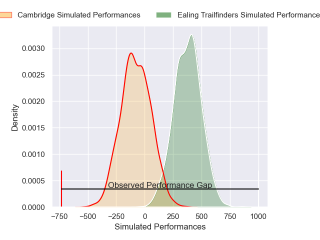
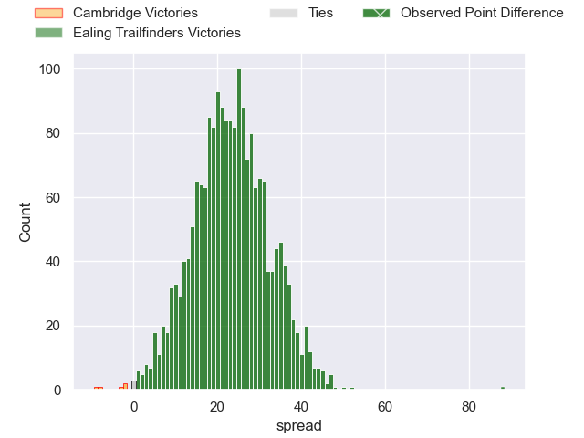

---  
layout: page  
title: Cambridge at Ealing Trailfinders; 7-95  
date: 2024-12-14 18:00:00 -0500  
categories: "RFU Championship 2024" match review  
---
# Cambridge at Ealing Trailfinders; 7-95

# Club Level Predictions

The first set of predictions treats a club as the smallest object, as the club develops its members, organizes a gameplan, and deploys its players as needed for each match. This club model has a prediction of 0.968, which translates to predicting Ealing Trailfinders to win by 30.8.

Our Over/Under is 72.5 - and combined with the spread above, we have a predicted scoreline of 21 to 52

Each club has a rating and a rating deviation (similar to a Glicko rating), and expected performances can be generated. This allows for simulated matches and spreads like the ones below.
## Projected Performances - Club Model

## Projected Spreads - Club Model

## Projected Results - Club Model

# Player Level Predictions

Treating teams instead as an entity made up of the currently active players, I have ratings for each player in an altogether different system. These can be combined to form team ratings once teamsheets are announced, weighting starters a bit higher than the reserves. After the match is played, players can be weighted by their minutes on the field, allowing for an accurate measure of the team's composition. With these compiled team ratings, we can make predictions, measure inaccuracy, and update the individual player ratings.
## Prediction without Player Minutes: Ealing Trailfinders by 26.3

Ealing Trailfinders by 22.0 on a neutral pitch

## Projected Performances - Player Model

## Projected Spreads - Player Model

## Projected Results - Player Model

|   Away Minutes | Away Player          |   Away Percentile |   Number |   Home Percentile | Home Player         |   Home Minutes |
|---------------:|:---------------------|------------------:|---------:|------------------:|:--------------------|---------------:|
|             53 | Zac Nearchou         |             35.06 |        1 |             56.73 | Elliott Chilvers    |             37 |
|             56 | Benjamin Brownlie    |             15.02 |        2 |             76.37 | Matthew Cornish     |             80 |
|             81 | Billy Walker         |             16.59 |        3 |             74.73 | George Davis        |             43 |
|             81 | George Bretag-Norris |             10.75 |        4 |             95.29 | Bobby de Wee        |             80 |
|             70 | Gareth Baxter        |             15.28 |        5 |             43.34 | Sean Lonsdale       |             81 |
|             48 | Kayde Sylvester      |             39.76 |        6 |             55.27 | Danny Bridge        |             31 |
|             11 | Jared Cardew         |             10.11 |        7 |             72.15 | Siya Ningiza        |             80 |
|             62 | Matthew Dawson       |             19.37 |        8 |             84.23 | Ryan Smid           |             40 |
|             80 | Ruaridh Dawson       |             63.93 |        9 |             89.34 | Lloyd Williams      |             80 |
|             56 | Louis Grimoldby      |             12.12 |       10 |             75.76 | Dan Jones           |             81 |
|             30 | William Glister      |             30.45 |       11 |             78.14 | Michael Dykes       |             24 |
|             61 | Matthew Hema         |             11.77 |       12 |             82.39 | Jordan Holgate      |             19 |
|             40 | Sam Hanks            |              2.3  |       13 |             78.09 | Reuben Bird-Tulloch |             80 |
|             81 | Josh Skelcey         |             14.94 |       14 |             41.26 | Ben Harris          |             80 |
|             20 | Elias Caven          |              2.81 |       15 |             76.22 | Tobi Wilson         |             34 |
|             81 | Ollie Scola          |            nan    |       16 |            nan    | James Kenny         |             24 |
|             53 | Morgan Veness        |              6.26 |       17 |             77.78 | Cameron Terry       |             15 |
|             28 | Jake Bridges         |             26.8  |       18 |             74.26 | Kyle John Whyte     |             80 |
|             80 | Iestyn Rees          |             27.89 |       19 |             25.49 | Matas Jurevicius    |             80 |
|             81 | Archie Benson        |             30.33 |       20 |             90.49 | Simon Uzokwe        |             50 |
|             80 | Joseph Tarrant       |             17.23 |       21 |             82.79 | Craig Hampson       |             60 |
|             67 | Matt Williams        |             11.05 |       22 |             98.18 | Craig Willis        |             33 |
|            nan | nan                  |            nan    |       23 |             40.96 | Francis Moore       |             30 |

