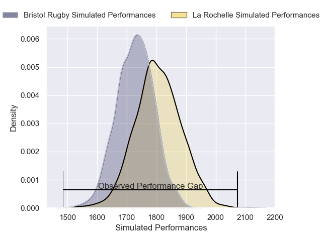
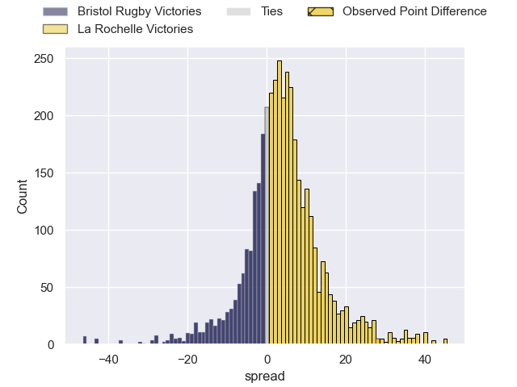
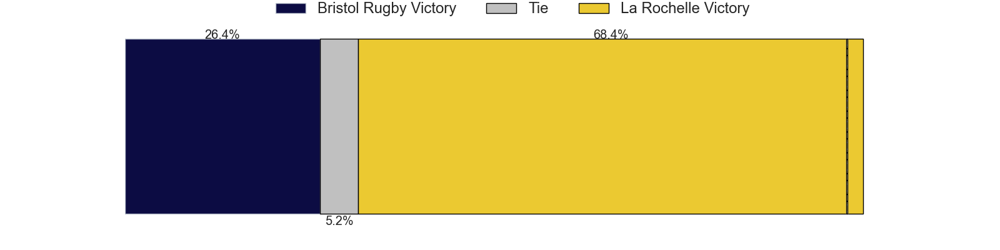
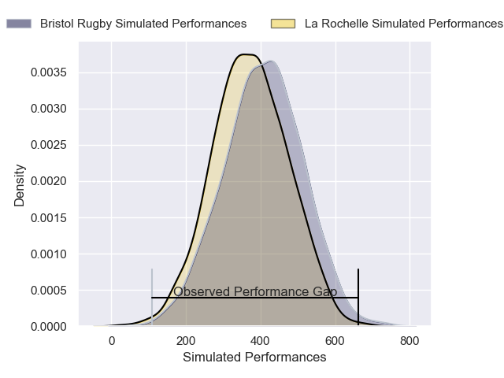
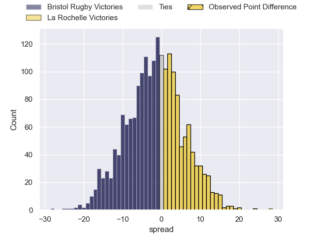

---  
layout: page  
title: Bristol Rugby at La Rochelle; 7-35  
date: 2024-12-14 18:00:00 -0500  
categories: "European Rugby Champions Cup 2024" match review  
---
# Bristol Rugby at La Rochelle; 7-35

# Club Level Predictions

The first set of predictions treats a club as the smallest object, as the club develops its members, organizes a gameplan, and deploys its players as needed for each match. This club model has a prediction of 0.604, which translates to predicting La Rochelle to win by 3.7.

Our Over/Under is 45.5 - and combined with the spread above, we have a predicted scoreline of 21 to 25

Each club has a rating and a rating deviation (similar to a Glicko rating), and expected performances can be generated. This allows for simulated matches and spreads like the ones below.
## Projected Performances - Club Model

## Projected Spreads - Club Model

## Projected Results - Club Model

# Player Level Predictions

Treating teams instead as an entity made up of the currently active players, I have ratings for each player in an altogether different system. These can be combined to form team ratings once teamsheets are announced, weighting starters a bit higher than the reserves. After the match is played, players can be weighted by their minutes on the field, allowing for an accurate measure of the team's composition. With these compiled team ratings, we can make predictions, measure inaccuracy, and update the individual player ratings.
## Prediction without Player Minutes: Bristol Rugby by 0.6

Bristol Rugby by 12.3 on a neutral pitch

## Projected Performances - Player Model

## Projected Spreads - Player Model

## Projected Results - Player Model

|   Away Minutes | Away Player                |   Away Percentile |   Number |   Home Percentile | Home Player           |   Home Minutes |
|---------------:|:---------------------------|------------------:|---------:|------------------:|:----------------------|---------------:|
|             62 | Ellis Genge                |             73.1  |        1 |             76.57 | Reda Wardi            |             29 |
|             25 | Gabriel Oghre              |             89.41 |        2 |             65.42 | Tolu Latu             |             62 |
|             40 | Lovejoy Chawatama          |             48.13 |        3 |             92.19 | Uini Atonio           |             61 |
|             15 | Steven Luatua              |             99.73 |        4 |             83.68 | Kane Douglas          |             80 |
|             20 | Joe Owen                   |             70.28 |        5 |             65    | Will Skelton          |             68 |
|             22 | Santiago Grondona          |             97.02 |        6 |             79.64 | Oscar Jegou           |             21 |
|             63 | Jake Heenan                |             25.3  |        7 |             69.76 | Matthias Haddad       |             10 |
|             22 | Viliame Mata               |             64.11 |        8 |             92.15 | Gregory Alldritt      |             46 |
|             15 | Harry Randall              |             97.18 |        9 |             98.17 | Tawera Kerr-Barlow    |             47 |
|             15 | Sam Worsley                |             27.55 |       10 |             12.24 | Ihaia West            |             29 |
|             34 | Gabriel Ibitoye            |             96.73 |       11 |             73.07 | Teddy Thomas          |             26 |
|             60 | Benhard Janse van Rensburg |             97.74 |       12 |             87.24 | Jonathan Danty        |             26 |
|             62 | Kalaveti Ravouvou          |             80.57 |       13 |             82.04 | Ulupano Seuteni       |             33 |
|             11 | Jack Bates                 |             19.38 |       14 |             98.68 | Jack Nowell           |             40 |
|             11 | Benjamin Elizalde          |             69.69 |       15 |             97.78 | Dillyn Leyds          |             80 |
|             67 | Jake Woolmore              |             89.79 |       16 |             33.24 | Louis Penverne        |             80 |
|             58 | Harry Thacker              |             88.32 |       17 |             30.06 | Quentin Lespiaucq     |             18 |
|             52 | Jamie Hodgson              |             93.98 |       18 |             13.08 | Georges-Henri Colombe |             80 |
|             80 | Jimmy Halliwell            |             64.02 |       19 |             74.36 | Ultan Dillane         |             25 |
|             80 | Benjamin Grondona          |             66.44 |       20 |             10.22 | Judicael Cancoriet    |             80 |
|             80 | Kieran Marmion             |             95.51 |       21 |             90.46 | Levani Botia          |             14 |
|             65 | Joe Jenkins                |             62.32 |       22 |             85.76 | Thomas Berjon         |             17 |
|             40 | Richard Lane               |             72.09 |       23 |             86.15 | Jules Favre           |             46 |

