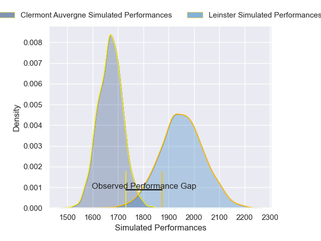
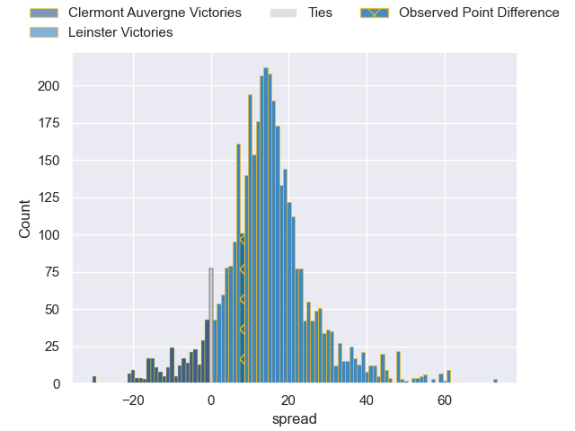
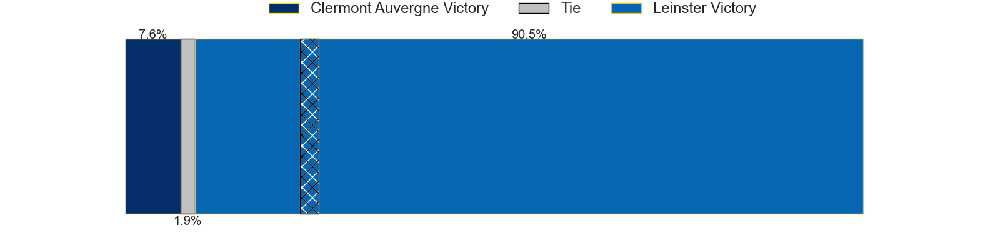
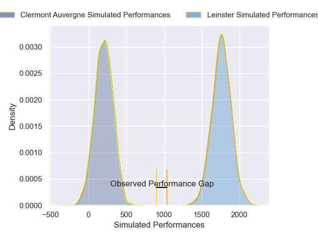
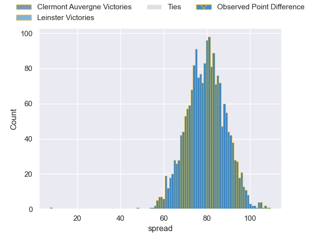

---  
layout: page  
title: Clermont Auvergne at Leinster; 7-15  
date: 2024-12-14 18:00:00 -0500  
categories: "European Rugby Champions Cup 2024" match review  
---
# Clermont Auvergne at Leinster; 7-15

# Club Level Predictions

The first set of predictions treats a club as the smallest object, as the club develops its members, organizes a gameplan, and deploys its players as needed for each match. This club model has a prediction of 0.83, which translates to predicting Leinster to win by 13.9.

Our Over/Under is 53.5 - and combined with the spread above, we have a predicted scoreline of 20 to 34

Each club has a rating and a rating deviation (similar to a Glicko rating), and expected performances can be generated. This allows for simulated matches and spreads like the ones below.
## Projected Performances - Club Model

## Projected Spreads - Club Model

## Projected Results - Club Model

# Player Level Predictions

Treating teams instead as an entity made up of the currently active players, I have ratings for each player in an altogether different system. These can be combined to form team ratings once teamsheets are announced, weighting starters a bit higher than the reserves. After the match is played, players can be weighted by their minutes on the field, allowing for an accurate measure of the team's composition. With these compiled team ratings, we can make predictions, measure inaccuracy, and update the individual player ratings.
## Prediction without Player Minutes: Leinster by 30.0

Leinster by 19.9 on a neutral pitch

## Projected Performances - Player Model

## Projected Spreads - Player Model

## Projected Results - Player Model

|   Away Minutes | Away Player          |   Away Percentile |   Number |   Home Percentile | Home Player         |   Home Minutes |
|---------------:|:---------------------|------------------:|---------:|------------------:|:--------------------|---------------:|
|             57 | Etienne Falgoux      |             76.41 |        1 |             80.22 | Andrew Porter       |             33 |
|             29 | Etienne Fourcade     |             85.6  |        2 |             73.71 | Ronan Kelleher      |             48 |
|             81 | Michael Ala'alatoa   |             85.73 |        3 |             82.82 | Thomas Clarkson     |             18 |
|             41 | Peceli Yato          |             50.13 |        4 |             25.72 | Joe McCarthy        |             40 |
|             78 | Rob Simmons          |             93.33 |        5 |             95.52 | James Ryan          |             55 |
|             40 | Killian Tixeront     |             83.58 |        6 |             97.49 | Max Deegan          |             81 |
|             29 | Alexandre Fischer    |             82.37 |        7 |             95.25 | Josh van der Flier  |             68 |
|             31 | Fritz Lee            |             80.39 |        8 |             71.22 | Caelan Doris        |             81 |
|             10 | Baptiste Jauneau     |             83.12 |        9 |             94.37 | Jamison Gibson-Park |             33 |
|             80 | Irae Simone          |             61.26 |       10 |              8.11 | Sam Prendergast     |              5 |
|             80 | Alivereti Raka       |             15.08 |       11 |             91.04 | Jimmy O'Brien       |             33 |
|             13 | George Moala         |             93.83 |       12 |             89.81 | Robbie Henshaw      |              6 |
|             65 | Pierre Fouyssac      |             20.57 |       13 |             99.61 | Garry Ringrose      |             33 |
|             27 | Lucas Tauzin         |             87.82 |       14 |             76.67 | Liam Turner         |             33 |
|             80 | Alex Newsome         |             75.52 |       15 |             91.15 | Jordie Barrett      |             81 |
|             83 | Barnabe Massa        |             76.84 |       16 |            100    | Gus McCarthy        |             81 |
|             83 | Barnabe Massa        |             76.84 |       16 |            100    | Gus McCarthy        |             29 |
|             48 | Giorgi Akhaladze     |             20.16 |       17 |             83.51 | Cian Healy          |             13 |
|             81 | Cristian Ojovan      |             42.61 |       18 |             93.09 | Rabah Slimani       |             31 |
|             81 | Cristian Ojovan      |             42.61 |       18 |             93.09 | Rabah Slimani       |             48 |
|             81 | Cristian Ojovan      |             42.61 |       18 |             93.09 | Rabah Slimani       |             81 |
|             41 | Oskar Rixen          |             38.02 |       19 |             99.82 | RG Snyman           |             26 |
|             60 | Antoine Chalus-Cercy |            nan    |       20 |             86.17 | Jack Conan          |             62 |
|             83 | Sebastien Bezy       |             82.32 |       21 |            nan    | Fintan Gunne        |             81 |
|             23 | Benjamin Urdapilleta |             81.95 |       22 |             98.38 | Ross Byrne          |             83 |
|             70 | Theo Giral           |            nan    |       23 |             73.53 | Andrew Osborne      |             53 |

