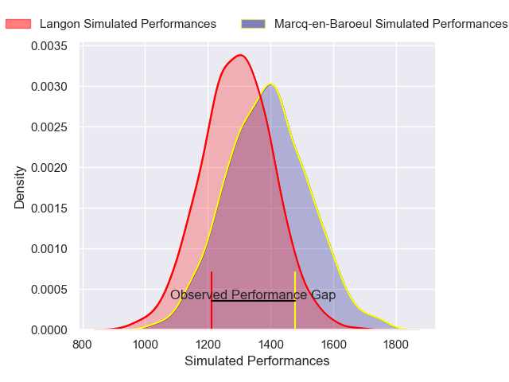
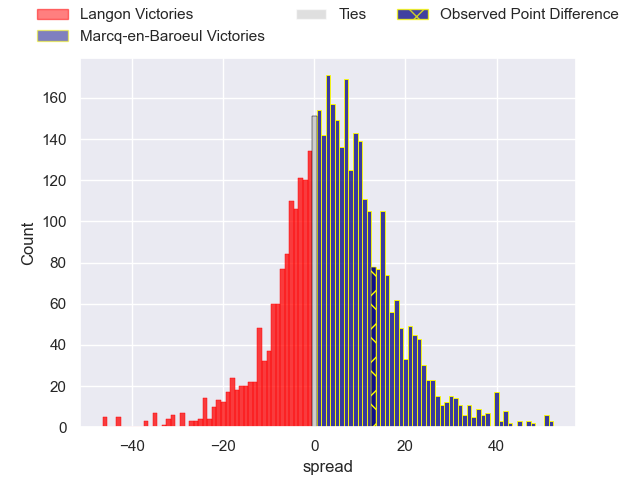
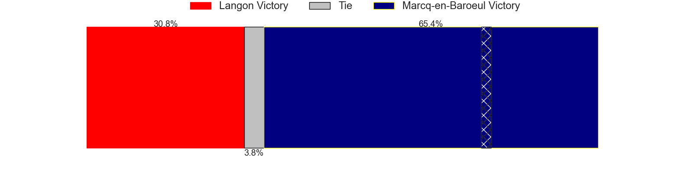
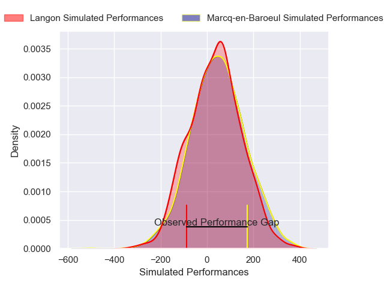
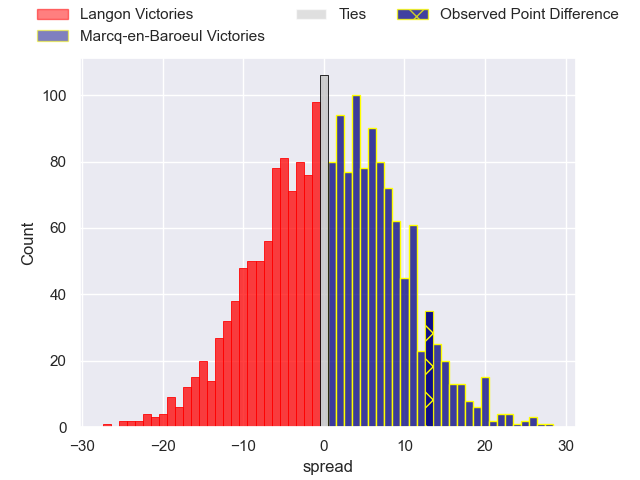
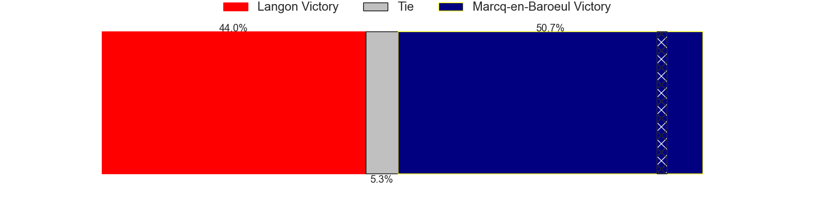

---  
layout: page  
title: Langon at Marcq-en-Baroeul; 9-22  
date: 2024-12-14 18:00:00 -0500  
categories: "Nationale 2024" match review  
---
# Langon at Marcq-en-Baroeul; 9-22

# Club Level Predictions

The first set of predictions treats a club as the smallest object, as the club develops its members, organizes a gameplan, and deploys its players as needed for each match. This club model has a prediction of 0.625, which translates to predicting Marcq-en-Baroeul to win by 4.7.

Our Over/Under is 41.5 - and combined with the spread above, we have a predicted scoreline of 18 to 23

Each club has a rating and a rating deviation (similar to a Glicko rating), and expected performances can be generated. This allows for simulated matches and spreads like the ones below.
## Projected Performances - Club Model

## Projected Spreads - Club Model

## Projected Results - Club Model

# Player Level Predictions

Treating teams instead as an entity made up of the currently active players, I have ratings for each player in an altogether different system. These can be combined to form team ratings once teamsheets are announced, weighting starters a bit higher than the reserves. After the match is played, players can be weighted by their minutes on the field, allowing for an accurate measure of the team's composition. With these compiled team ratings, we can make predictions, measure inaccuracy, and update the individual player ratings.
## Prediction without Player Minutes: Langon by 1.4

Langon by 3.7 on a neutral pitch

## Projected Performances - Player Model

## Projected Spreads - Player Model

## Projected Results - Player Model

|   Away Minutes | Away Player                    |   Away Percentile |   Number |   Home Percentile | Home Player              |   Home Minutes |
|---------------:|:-------------------------------|------------------:|---------:|------------------:|:-------------------------|---------------:|
|             30 | Ratu Nailoma Vatubua           |             21.36 |        1 |             22.76 | Eli Serra-Miglietti      |             54 |
|             80 | Maxime Gau                     |              6.07 |        2 |             43.61 | Santiago Iglesias Valdez |             48 |
|             80 | Loïc Clave                     |             19.43 |        3 |             59.61 | Victor-Fy Balas Burel    |             80 |
|             80 | Kemueli Lavetanakoroi          |             80.86 |        4 |             35.92 | Lucio Anconetani         |             10 |
|             26 | Helmi Mimouna                  |             53.78 |        5 |              1.19 | Maselino Paulino         |             80 |
|             63 | Thomas De Molder               |             12.95 |        6 |             37.9  | Thomas Simonet           |             31 |
|             60 | Thomas Geffré                  |             24.79 |        7 |             41.14 | Cedric Yonkeu            |             40 |
|             50 | Isikili Seva Davetawalu        |              7.51 |        8 |              7.35 | Otilo Kafotamaki         |             58 |
|             50 | Baptiste Tisne Cardeneau       |             28.41 |        9 |             30.73 | Geoffrey Cazanave        |             20 |
|             50 | Vincent Debladis               |             11.02 |       10 |             54.29 | Paul Decavel             |             80 |
|             22 | Thomas Wallraf                 |             71.91 |       11 |             59.69 | Mathias Ortiz            |             30 |
|             15 | Sionasa Vunisa                 |             74.19 |       12 |             60.84 | Louis Decavel            |             34 |
|             58 | Quentin Lefort                 |             18.45 |       13 |             16.68 | Hugo Detre               |             80 |
|             69 | Jean-Baptiste Bretagnolle      |             20.23 |       14 |             17.74 | Dany Antunes             |             46 |
|             32 | Christel Bertrand              |             13.12 |       15 |             59.15 | Patrick Fleming Dewhirst |             50 |
|             14 | Lucas Hernandez                |             49    |       16 |             20.03 | Bruno Vliegen            |             58 |
|             19 | Maxime Lancon                  |             34.89 |       17 |             64.95 | Joseph Reynaud           |             50 |
|             11 | Julien Graffouillère           |             46.88 |       18 |             63.35 | Lewys Jones              |             14 |
|              4 | Thomas Mendy                   |             29.55 |       19 |             49.23 | Antoine Delaporte        |             66 |
|             63 | Meryll Ech Chalka Roumazeilles |             56.9  |       20 |             50.41 | Jean-Baptiste Rende      |             50 |
|             66 | Bastien Cazale-Debat           |             72.76 |       21 |             80.15 | Joachim Beaumont         |             80 |
|             11 | Baptiste Castanier             |             33.27 |       22 |             49.83 | Dylan Nocete             |             80 |
|             80 | Simon Zubizarreta              |              9.68 |       23 |             29.34 | Hugues Crespo            |             54 |

