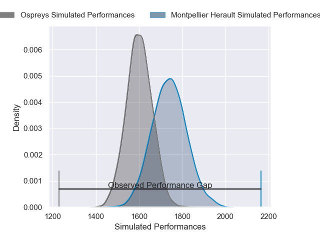
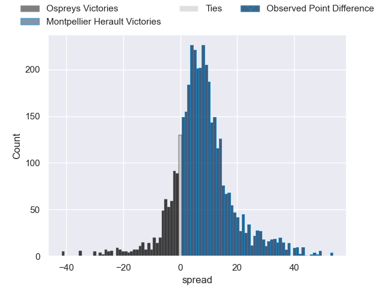
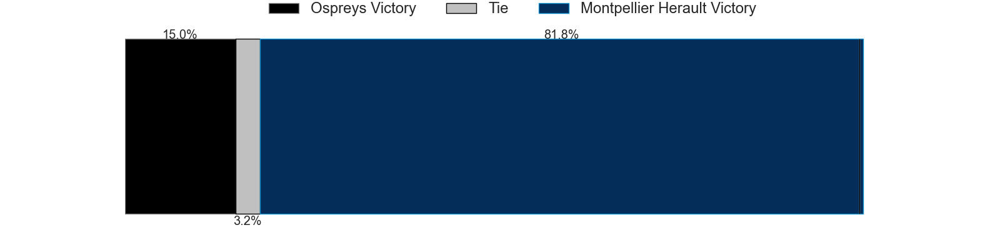
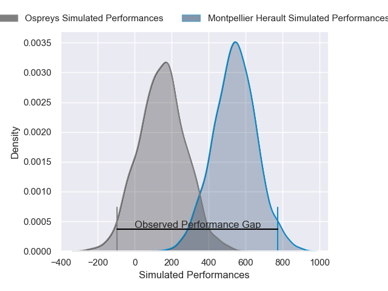
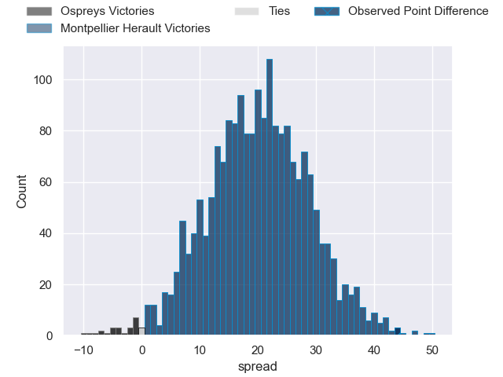
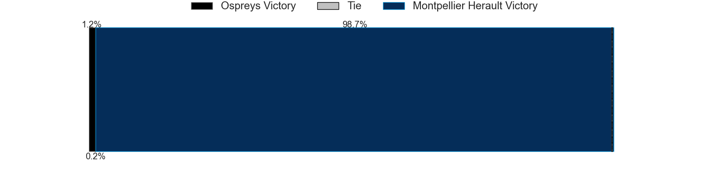

---  
layout: page  
title: Ospreys at Montpellier Herault; 15-59  
date: 2024-12-14 18:00:00 -0500  
categories: "European Rugby Challenge Cup 2024" match review  
---
# Ospreys at Montpellier Herault; 15-59

# Club Level Predictions

The first set of predictions treats a club as the smallest object, as the club develops its members, organizes a gameplan, and deploys its players as needed for each match. This club model has a prediction of 0.687, which translates to predicting Montpellier Herault to win by 6.9.

Our Over/Under is 42.5 - and combined with the spread above, we have a predicted scoreline of 18 to 25

Each club has a rating and a rating deviation (similar to a Glicko rating), and expected performances can be generated. This allows for simulated matches and spreads like the ones below.
## Projected Performances - Club Model

## Projected Spreads - Club Model

## Projected Results - Club Model

# Player Level Predictions

Treating teams instead as an entity made up of the currently active players, I have ratings for each player in an altogether different system. These can be combined to form team ratings once teamsheets are announced, weighting starters a bit higher than the reserves. After the match is played, players can be weighted by their minutes on the field, allowing for an accurate measure of the team's composition. With these compiled team ratings, we can make predictions, measure inaccuracy, and update the individual player ratings.
## Prediction without Player Minutes: Montpellier Herault by 16.6

Montpellier Herault by 4.4 on a neutral pitch

## Projected Performances - Player Model

## Projected Spreads - Player Model

## Projected Results - Player Model

|   Away Minutes | Away Player            |   Away Percentile |   Number |   Home Percentile | Home Player                 |   Home Minutes |
|---------------:|:-----------------------|------------------:|---------:|------------------:|:----------------------------|---------------:|
|             68 | Gareth Thomas          |             24.43 |        1 |             10.75 | Baptiste Erdocio            |             50 |
|             10 | Dewi Lake              |             22.12 |        2 |             32.09 | Jordan Uelese               |             50 |
|             80 | Ben Warren             |             59.88 |        3 |             87.45 | Luka Japaridze              |             65 |
|             26 | Will Spencer           |             68.28 |        4 |             87.69 | Nicolaas Janse van Rensburg |             39 |
|             50 | Lewis Jones            |              8.3  |        5 |             84.96 | Tyler Duguid                |             48 |
|             30 | Tristan Davies         |             42.76 |        6 |             86.63 | Nicolas Martins             |             32 |
|             20 | Jac Morgan             |             84.5  |        7 |             93.27 | Lenni Nouchi                |             46 |
|             46 | Morgan Morris          |              5.34 |        8 |             21.04 | Sam Simmonds                |             19 |
|             80 | Kieran Hardy           |             42.52 |        9 |             33.55 | Leo Coly                    |             30 |
|             30 | Dan Edwards            |             67.76 |       10 |             95.92 | Stuart Hogg                 |             54 |
|             70 | Keelan Giles           |             19.84 |       11 |             91.98 | Madosh Tambwe               |             48 |
|             40 | Owen Williams          |             94.8  |       12 |             12.86 | Thomas Vincent              |             50 |
|             52 | Owen Watkin            |             97.25 |       13 |             24.24 | Thomas Darmon               |             80 |
|             80 | Daniel Kasende         |             92.06 |       14 |             22.18 | Mael Moustin                |             80 |
|             80 | Jack Walsh             |             35.49 |       15 |             74.49 | Joshua Moorby               |             80 |
|             80 | Steffan Thomas         |             20.16 |       16 |             84.05 | Enzo Forletta               |             50 |
|             52 | Sam Parry              |             26.32 |       17 |             65.29 | Wilfrid Hounkpatin          |             80 |
|             40 | William Greatbanks     |             62.99 |       18 |             75.3  | Bastien Chalureau           |             29 |
|             80 | Rhys Henry             |             83.71 |       19 |             91.49 | Billy Vunipola              |             80 |
|             13 | William Griffiths      |            nan    |       20 |             65.11 | Lyam Akrab                  |             40 |
|             67 | Reuben Morgan-Williams |             75.58 |       21 |             95.02 | Ryan Louwrens               |             71 |
|             80 | Evardi Boshoff         |              2.16 |       22 |             68.37 | Aurelien Barreau            |             80 |
|             80 | Iestyn Hopkins         |             66.15 |       23 |             73.31 | Jan Serfontein              |             80 |

