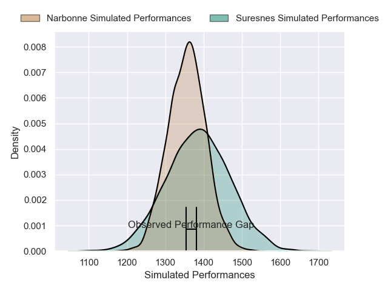
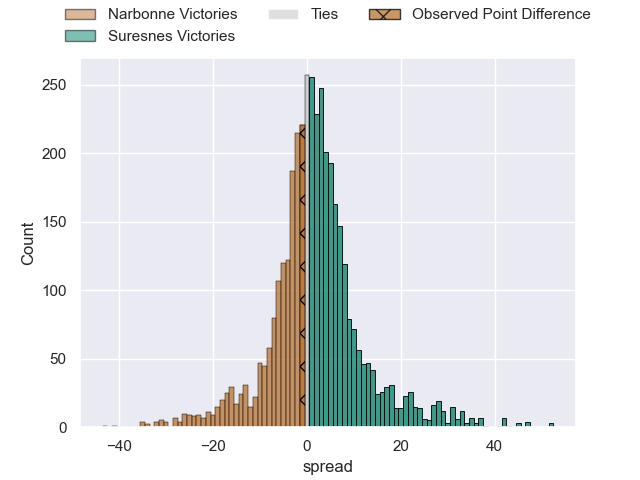
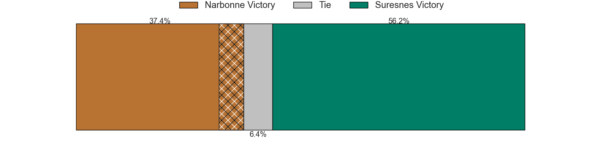
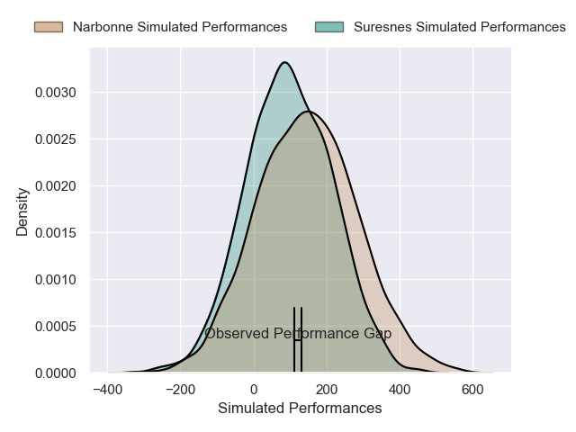
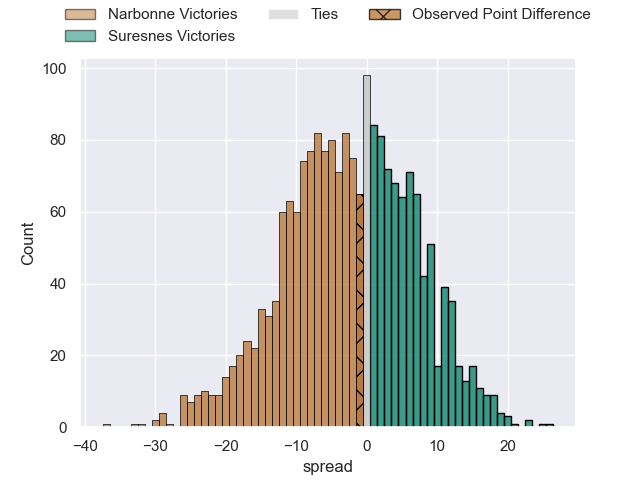

---  
layout: page  
title: Narbonne at Suresnes; 20-19  
date: 2024-12-14 18:00:00 -0500  
categories: "Nationale 2024" match review  
---
# Narbonne at Suresnes; 20-19

# Club Level Predictions

The first set of predictions treats a club as the smallest object, as the club develops its members, organizes a gameplan, and deploys its players as needed for each match. This club model has a prediction of 0.541, which translates to predicting Suresnes to win by 1.5.

Our Over/Under is 44.5 - and combined with the spread above, we have a predicted scoreline of 22 to 23

Each club has a rating and a rating deviation (similar to a Glicko rating), and expected performances can be generated. This allows for simulated matches and spreads like the ones below.
## Projected Performances - Club Model

## Projected Spreads - Club Model

## Projected Results - Club Model

# Player Level Predictions

Treating teams instead as an entity made up of the currently active players, I have ratings for each player in an altogether different system. These can be combined to form team ratings once teamsheets are announced, weighting starters a bit higher than the reserves. After the match is played, players can be weighted by their minutes on the field, allowing for an accurate measure of the team's composition. With these compiled team ratings, we can make predictions, measure inaccuracy, and update the individual player ratings.
## Prediction without Player Minutes: Suresnes by 1.7

Narbonne by 1.7 on a neutral pitch

## Projected Performances - Player Model

## Projected Spreads - Player Model

## Projected Results - Player Model

|   Away Minutes | Away Player       |   Away Percentile |   Number |   Home Percentile | Home Player             |   Home Minutes |
|---------------:|:------------------|------------------:|---------:|------------------:|:------------------------|---------------:|
|             30 | Théo Castinel     |             77.44 |        1 |             77.7  | Elias Coulibaly         |             25 |
|             22 | Clément Esteriola |              9.81 |        2 |             73.83 | Gauthier Brute de Remur |             80 |
|             25 | Chris Talakai     |             29.71 |        3 |             31.91 | Leandro Mario Assi      |             50 |
|             30 | Morgan Maga       |             40.66 |        4 |             30.17 | Sacha Yahi              |             69 |
|              7 | Marius Antonescu  |             11.58 |        5 |             26.34 | Yakine Mohamed Djebarri |             17 |
|             48 | Thibault Clauzade |             84.07 |        6 |             17.97 | Florian Desbordes       |             26 |
|             66 | Paul Belzons      |             14.82 |        7 |              8.18 | Simon Veyrac            |             70 |
|             80 | Grégoire Labit    |             44.74 |        8 |             77.96 | Lakisipone Lee          |             30 |
|             80 | Erwan Nicolas     |             57.48 |        9 |             19.77 | Thomas Lacroix          |             60 |
|             80 | Tom Chauvet       |             49.39 |       10 |             61.84 | Tanguy Lacoste          |             50 |
|             80 | Étienne Ducom     |             80.31 |       11 |             16.19 | Yohan Fournier          |             65 |
|             80 | Peter Betham      |             99.9  |       12 |             64.57 | Petero Tuwai            |             50 |
|             80 | Pierre Nueno      |             27.28 |       13 |              2.75 | JJ Taulagi              |             60 |
|             74 | Pierre-Hugo Ducom |             12.84 |       14 |             77.9  | Victor Barnier          |             80 |
|             80 | Boris Goutard     |              1.29 |       15 |              7.58 | Goulwen Gueho           |             32 |
|             32 | Gregory Fichten   |             18.69 |       16 |             42.52 | Yanis Trabelsi          |             80 |
|             80 | Gabriel Atlan     |             77.88 |       17 |            nan    | Ismael Martin           |             80 |
|             22 | Livai Tikoipau    |             22.83 |       18 |             20.09 | Nail Audoire            |             30 |
|             40 | Dennis Visser     |             38.47 |       19 |              1    | Nikita Bekov            |             55 |
|             80 | Luke Nakobukobua  |             92.76 |       20 |             70.83 | Marvin Woki             |             80 |
|             80 | Pierrick Nova     |             34.72 |       21 |             44.63 | Boaventura Almeida      |             80 |
|             22 | Gilles Bosch      |             10.61 |       22 |             15.61 | Théo Bachiri            |             80 |
|             80 | Hugo Clauzel      |            nan    |       23 |            nan    | nan                     |            nan |

